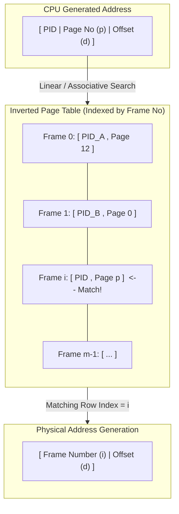

> [!definition] Inverted Page Table (Global Frame Table)
> An **Inverted Page Table** has exactly **one entry per physical frame of RAM**, rather than one entry per virtual page per process.
> * **Global Architecture**: A single unified inverted page table serves the operating system and all active processes simultaneously.
> * **Index**: The array index of the inverted page table corresponds directly to the **Physical Frame Number** ($\text{PFN}$).
> * **Entry Contents**: Each entry contains the identifier of the process owning the frame and its virtual page number:
>   $$\text{Entry} = [\text{Process ID } (\text{PID}) \mid \text{Virtual Page Number } (p)]$$

> [!formula] Size of Inverted Page Table
> $$\text{Size of Inverted Page Table} = \text{Total Physical Frames} \times \text{Entry Size} = \left(\frac{\text{PAS}}{\text{Page Size}}\right) \times \text{Entry Size}$$

> [!trap] Scaling Trap of Inverted Page Tables
> * The size of an inverted page table is **completely independent** of the Virtual Address Space ($\text{VAS}$) and the number of processes.
> * **False Statement**: *"The size of an inverted page table grows with the size of $\text{VAS}$."*
> * **Truth**: The size grows **only** if physical memory ($\text{PAS}$) increases or if the physical page size decreases.

> [!theorem] Comparison of Memory Access Speeds
> 1. **Base-Bound vs Single-Level Paging**: Base-Bound requires $0$ memory references for address translation (hardware registers only) and $1$ memory access for the operand; single-level paging requires $1$ translation access $+ 1$ operand access $= 2$ accesses. Hence, **Base-Bound is faster than single-level paging** (Statement: **True**).
> 2. **Inverted Page Table vs Single-Level Paging**: Inverted page tables require linear or hash-based searching across the table to locate the match; single-level paging uses direct indexed access ($O(1)$). Hence, pure inverted paging is slower without associative hardware/TLBs (Statement: **False**).
> 3. **Single-Level vs Multilevel Paging**: Single-level requires $1$ page table access, whereas $k$-level paging requires $k$ sequential page table memory reads. Hence, **single-level is strictly faster than multilevel** (Statement: **True**).
> 4. **Multilevel vs Inverted Paging**: Multilevel requires fixed $k$ lookups, while inverted paging requires search lookup which, without hardware TLB/hashing, can be slower; however, with hashing, performance varies. (Statement *"Multilevel is faster than inverted"*: **Generally True**, but depends on architecture).
