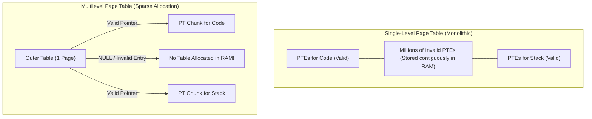

> [!definition] Sparse Allocation in Process Address Spaces
> In a typical process address space, valid code, data, and stack segments occupy tiny regions at opposite ends of the space, leaving massive unallocated address gaps between them.
> * Accesses to these unallocated gaps trigger segmentation faults (code errors).
> * In a single-level page table, **all** PTEs must be stored contiguously in RAM, even if they represent unallocated or invalid pages, leading to massive memory wastage.
> * In multilevel paging, entire intermediate and lower-level page tables for invalid regions are never allocated in RAM. Only the page table chunks that map actively used pages are loaded.

> [!question] Quantitative Memory Overhead: Single-Level vs Multilevel
> Consider a $32$-bit logical address space with $4\text{ KB}$ pages ($2^{12}\text{ B}$) and $\text{PTE} = 4\text{ B}$. The address split is $[10 \mid 10 \mid 12]$.
> * Total process size $= 2^{16}\text{ B} = 64\text{ KB}$ starting contiguously from address $0$.
> 
> **Single-Level Requirement**:
> * Total pages in $\text{VAS} = 2^{32} / 2^{12} = 2^{20}\text{ pages}$.
> * Monolithic Page Table Size $= 2^{20} \times 4\text{ B} = 4\text{ MB}$ (must reside entirely in RAM).
> 
> **Multilevel Paging Requirement**:
> * $\text{Useful pages} = \frac{2^{16}\text{ B}}{2^{12}\text{ B}} = 2^4 = 16\text{ pages}$.
> * Level 2 (Outer Table): Always requires $1$ full chunk $= 2^{10}\text{ entries} \times 4\text{ B} = 4\text{ KB}$.
> * Level 1 (Inner Table): $16$ pages require $16$ PTEs. Because each Level 1 chunk contains $2^{10} = 1024$ entries and the pages are contiguous, all $16$ entries fit inside **a single Level 1 chunk**.
> * Level 1 Chunk Size $= 2^{10} \times 4\text{ B} = 4\text{ KB}$.
> * $\text{Total Memory Used} = 4\text{ KB (Outer)} + 4\text{ KB (Inner)} = 8\text{ KB}$.
> 
> **Dramatic Reduction**: From $4\text{ MB}$ down to $8\text{ KB}$ in physical memory.
