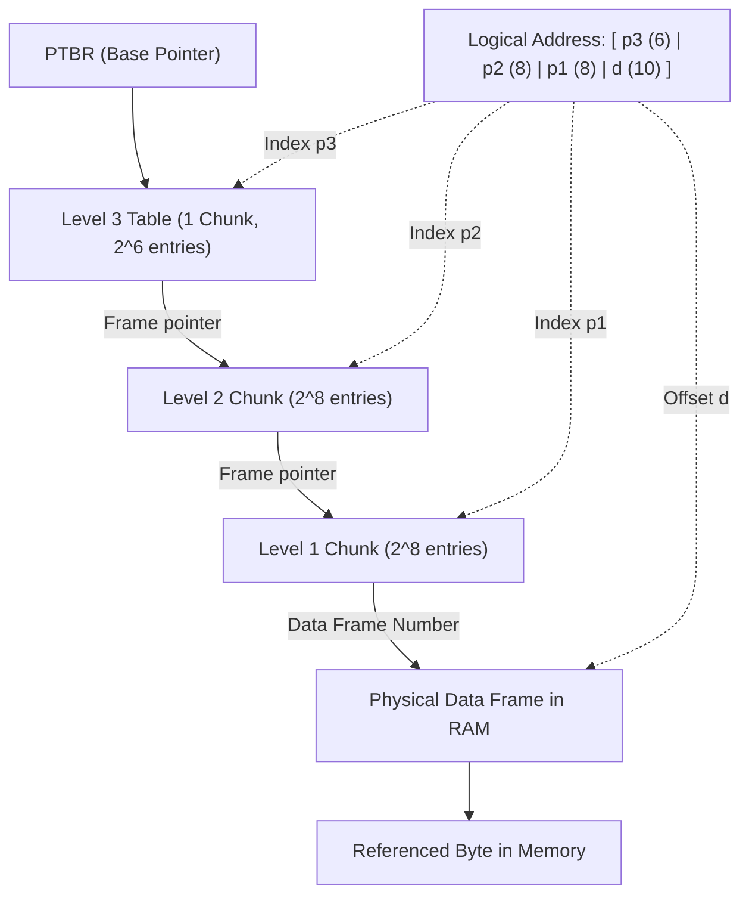

> [!theorem] Multilevel Address Translation Flow
> Let the Page Table Base Register ($\text{PTBR}$) hold the physical base address of the outermost page table (Level $k$).
> 1. Field $p_k$ indexes into the Level $k$ table at address $\text{PTBR} + p_k \times \text{PTE Size}$, yielding the physical base of a chunk at Level $k-1$.
> 2. Field $p_{k-1}$ indexes into that chunk, yielding the base of a chunk at Level $k-2$.
> 3. This traversal continues down to the innermost level, where $p_1$ indexes the innermost page table chunk to retrieve the Physical Frame Number ($\text{PFN}$) of the data page.
> 4. Physical Address is generated by concatenating $\text{PFN}$ with the original offset $d$:
>    $$\text{PA} = (\text{PFN} \times \text{Page Size}) + d$$

> [!question] Step-by-Step Index Arithmetic Example
> Given byte address $803$, chunk size $= 2^3 = 8\text{ entries/chunk}$, outer chunk size $= 2^5 = 32\text{ entries}$:
> $$803 = (100 \times 2^3) + 3 = [(3 \times 2^5 + 4) \times 2^3] + 3 = [(3 \times 32 + 4) \times 8] + 3$$
> * $803^{\text{rd}}$ byte resides in data page $100$ at offset $3$.
> * Entry for page $100$ resides in the $3^{\text{rd}}$ chunk of the intermediate table at offset $4$.
> * Entry for the $3^{\text{rd}}$ chunk resides in the outer table at offset $3$.

> [!question] Physical Address Resolution with Concrete Frame Values
> Given Virtual Address:
> $$\text{LA} = \mathtt{010100\; 00000010\; 00000101\; 0000001000}_2$$
> Translated to decimal components:
> * Level 3 Index: $010100_2 = 20_{10}$
> * Level 2 Index: $00000010_2 = 2_{10}$
> * Level 1 Index: $00000101_2 = 5_{10}$
> * Page Offset $d$: $0000001000_2 = 8_{10}$
> 
> Execution trace:
> 1. $\text{PTBR} = 999$ points to the Level 3 table. Entry at index $20$ contains Frame $150$.
> 2. Frame $150$ holds the target Level 2 chunk. Entry at index $2$ contains Frame $111$.
> 3. Frame $111$ holds the target Level 1 chunk. Entry at index $5$ contains Frame $121$.
> 4. Physical Address is computed directly:
>    $$\text{PA} = (121 \times 2^{10}) + 8$$

> [!question] Hexadecimal Quick Translation Trace
> Given $\text{VAS} = 32\text{ bits}$, $\text{LA} = \mathtt{0x12345678}$, using a $3$-level page table scheme where page size $= 2^{10}\text{ B}$ and the innermost page table yields frame number $\mathtt{0x134}$.
> What is the Physical Address?
> * Since page size $= 2^{10}\text{ B}$, the lower $10$ bits (or lower $2.5$ hex digits) represent the offset.
> * Because page offset remains untouched during translation, the lower bits are directly appended to the physical frame number:
>   $$\text{PA} = \mathtt{0x134} \mathbin{\Vert} \text{offset} = \mathtt{0x13478} \text{ (or } \text{Frame } \mathtt{0x134} \text{ with offset } \mathtt{0x678}\text{)}$$
