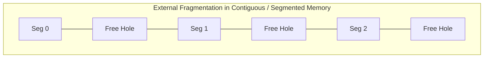

In variable-partition allocation and pure segmentation, allocating a segment requires free-space management techniques such as First Fit, Best Fit, or Worst Fit. Because processes allocate and deallocate dynamically sized blocks over time, memory develops non-contiguous holes, resulting in **External Fragmentation**.

*Total free memory might be sufficient for an incoming segment, but no single contiguous hole is large enough!*

To eliminate external fragmentation without paging, the operating system must employ **Compaction** (relocating active memory chunks into a contiguous block to coalesce free space).

> [!trap] Compaction Overhead
> While compaction reclaims wasted memory, it introduces heavy runtime memory-copy latency and memory-bus traffic. It is computationally prohibitive in high-performance computing systems.

### Core Idea of Paging
What if every allocated chunk is uniform in size? If both virtual space and physical space are partitioned into fixed-sized blocks, any free physical block can accommodate any virtual block.

> [!definition] Paging
> **Paging** is a modern, non-contiguous memory management scheme that divides:
> * **Logical Address Space ($LAS$):** into fixed-sized blocks called **Pages**.
> * **Physical Address Space ($PAS$ / Main Memory):** into fixed-sized blocks of the exact same size called **Frames**.
> 
> $$\text{Page Size} = \text{Frame Size}$$

* **External Fragmentation:** Completely **eliminated** because any available frame can be assigned to any page of any process.
* **Internal Fragmentation:** Present only within the final page of a process (bounded strictly to strictly less than $1\text{ Page}$). Kept minimal by configuring appropriate page sizes (typically $4\text{ KB}$).
* **Book Analogy:** Paging mirrors how a physical textbook functions:
  * Content is split into uniform *pages*.
  * An *index* (or table of contents) acts as the *page table*, mapping logical topic sections to physical book pages.
