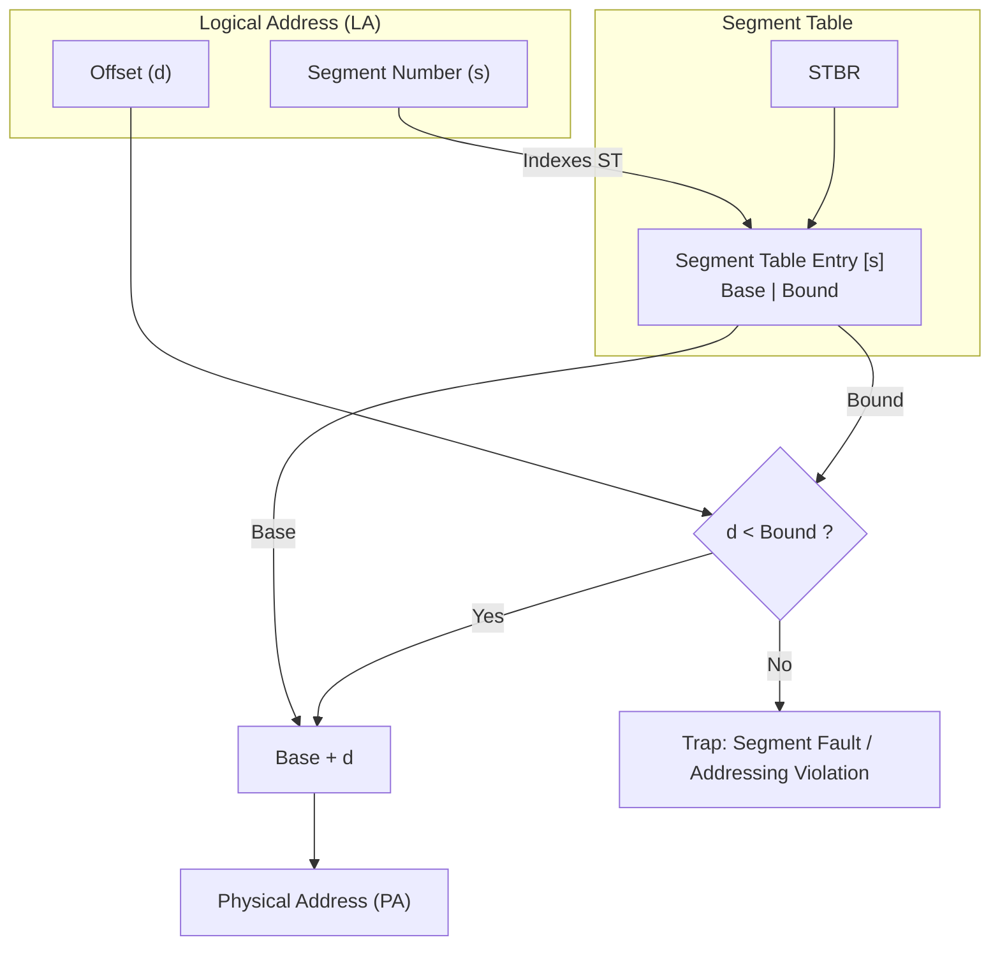
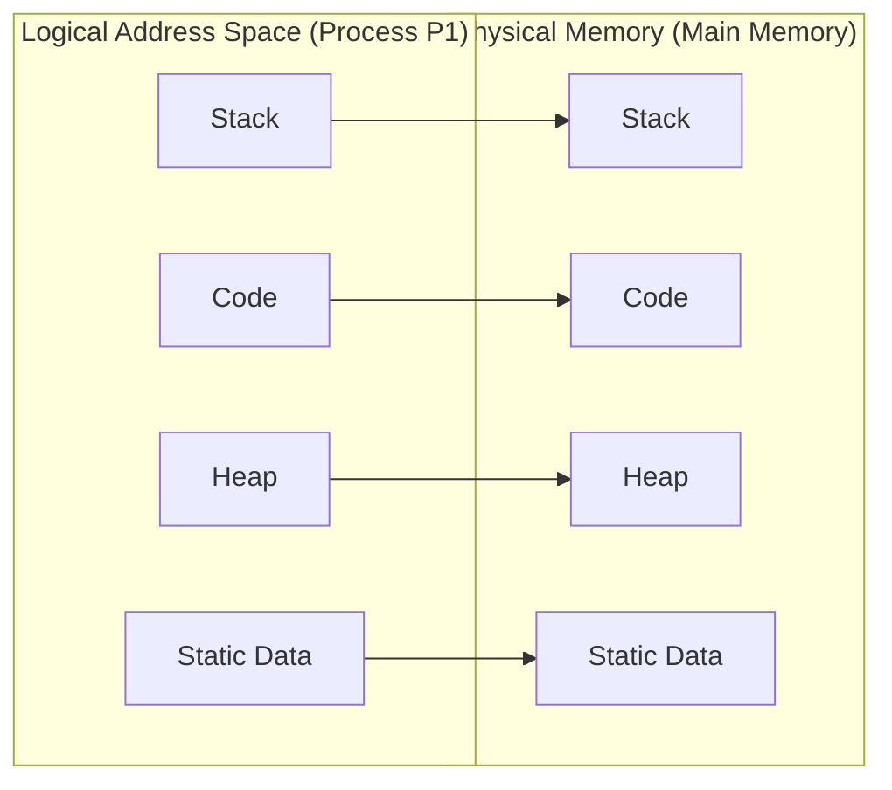

# Memory Management: Base & Bound and Segmentation

## Lecture & Conceptual Walkthrough

### 1. Introduction to Segmentation
In pure contiguous memory allocation using a single Base and Bound pair, an entire process image must reside as one monolithic block in Main Memory ($MM$). This introduces severe internal waste (allocating unused memory between stack and heap) and high external fragmentation.

> [!definition] Segmentation
> **Segmentation** is a memory management scheme that divides a process into variable-sized chunks called **segments** (each representing logical units such as code, heap, stack, or static data). These segments are stored **independently and non-contiguously** in Main Memory (not swapped to disk for normal translation).

Segmentation is a natural generalization of the classic Base & Bound mechanism:
* **Single Base & Bound:** Only $1$ segment per process; entire contiguous address space mapped via one pair of registers.
* **Segmentation:** Multiple segments per process; each individual segment possesses its own dedicated pair of $(\text{Base}, \text{Bound})$ registers.

---

### 2. Logical Address Breakdown and Hardware Architecture

A process possesses a **Segment Table** (or Segment Map) stored in memory. Each entry in the table holds segment-specific metadata:
* **Base Address:** The physical starting address of the segment in Main Memory.
* **Bound (or Limit):** The maximum permissible length (size) of the segment.
* **Protection/Permissions:** Read ($R$), Write ($W$), Execute ($X$) bits.

> [!property] Hardware Registers for Segmentation
> * **STBR (Segment Table Base Register):** Points to the starting physical address of the current process's Segment Table in Main Memory.
> * **STLR (Segment Table Length Register):** Specifies the total number of segments supported or used by the process.
> * On a context switch, the OS updates the STBR and STLR values to point to the incoming process's table.

#### Logical Address Structure
A Logical Address ($LA$) generated by the CPU is split into two distinct fields:
$$\text{Logical Address } (LA) = \langle s, d \rangle = \langle \text{Segment Number}, \text{Offset} \rangle$$

If the logical address space allows up to $2^n$ segments, then:
* The most significant $n$ bits represent the **Segment Number** ($s$).
* The remaining $(\text{Total Bits} - n)$ bits represent the internal **Offset** ($d$).

| Segment Number ($s$) | Offset ($d$) |
| :---: | :---: |
| $n$ bits (identifies segment) | Remaining bits (offset inside) |

For instance, given binary $LA = 01\,00011011_2$:
* The prefix $01_2$ selects segment index $1$.
* The suffix $00011011_2$ ($27_{10}$) specifies the byte offset within that segment.

---

### 3. Hardware Translation & Protection Mechanism

When the CPU issues a logical address $\langle s, d \rangle$:

1. The CPU checks if $s < \text{STLR}$. If not, a trap/addressing error occurs.
2. The hardware fetches the Segment Table Entry ($STE$) at address $\text{STBR} + s \times (\text{Entry Size})$.
3. **Bound Verification:** The offset $d$ is compared against the limit:
   $$d < \text{Bound}$$
4. If $d \ge \text{Bound}$, the CPU triggers an internal trap: **Segment Fault / Addressing Violation / Trap to OS**.
5. If $d < \text{Bound}$, the base address is added to the offset to produce the absolute physical address:
   $$\text{Physical Address } (PA) = \text{Base} + d$$

> [!formula] Segmentation Translation Mapping
> $$\text{Physical Address } (PA) = \text{Base}[s] + d \quad \iff \quad 0 \le d < \text{Bound}[s]$$



---

### 4. Non-Contiguous Process Allocation in Main Memory

A process with logical divisions (Stack, Heap, Static Data, Code) does not need to be arranged sequentially in physical memory:



Because segments are independent chunks, each can be mapped anywhere in $MM$. This eliminates internal fragmentation for statically sized segments (e.g., code, static variables) because we only allocate what is required.

---

### 5. Memory Allocation Trade-offs & Limitations

While segmentation provides logical separation and modular protection, dynamic segments (like Stack and Heap) present fundamental allocation challenges:

#### The Problem of Dynamic Growth (Stack & Heap)
Consider a process where $LA = 10000$ bytes, where $600\text{ B}$ is allocated to Code, $400\text{ B}$ to Data, and $9000\text{ B}$ remains available for dynamic Stack/Heap growth.
* **Option A (Pre-split fixed portions):** e.g., give $4500\text{ B}$ to Stack and $4500\text{ B}$ to Heap. If the stack needs $6000\text{ B}$ while the heap needs only $1000\text{ B}$, the stack overflows even though sufficient total space was reserved.
* **Option B (Conservative small initial allocation):** e.g., assign $500\text{ B}$ each. When a segment grows beyond its bound, the OS must find a larger free memory hole, copy/relocate the entire segment, and update its base and bound. This swapping/copying overhead degrades performance.
* **Option C (Shared contiguous pool):** Putting stack and heap adjacent brings back the classic contiguous allocation constraints.

#### External Fragmentation
> [!trap] External Fragmentation in Segmentation
> Because segments are variable-sized blocks allocated and deallocated over time, free memory gets fragmented into small, dispersed holes across physical memory. 
> 
> A situation arises where total free physical memory exceeds the size of a new segment, yet the segment cannot be loaded because **no single contiguous free block is large enough**.
> 
> *Compaction* (shifting segments to coalesce free space) is computationally prohibitive due to bus traffic and memory copy latency.

---

### 6. Summary Comparison: Base & Bound vs. Pure Segmentation

| Metric / Attribute | Single Base & Bound System | Pure Segmentation |
| :--- | :--- | :--- |
| **Segments per Process** | Exactly $1$ | Multiple ($\ge 1$) |
| **Address Generation** | Single continuous range ($0 \le VA < \text{Bound}$) | Divided into $\langle s, d \rangle$ or segmented domains |
| **Hardware Requirement** | $1$ Base register + $1$ Bound register | STBR, STLR, and a Segment Table per process |
| **Internal Waste** | High (allocates unallocated space between heap/stack) | Minimal within fixed segments |
| **External Fragmentation** | Present (variable process sizing) | Present (variable segment sizing) |
| **Protection Granularity** | Uniform for the entire process | Per-segment read/write/execute permissions |

---

## Classroom Practice Problems & Derivations

### Section 1: Single Base & Bound Mechanics

#### Question 1.1: Multi-Core Register Sizing
**Problem:** How many Base registers are required in a multi-core system with $4$ CPU cores?  
**Solution:**
A base register is part of the CPU core's hardware execution context. Therefore, each processing core requires its own active Base and Bound register.
$$\text{Number of Base Registers} = 4 \quad (\text{1 per CPU core})$$

---

#### Question 1.2: Memory Accesses per Instruction
**Problem:** Given $\text{Base} = 1000$, $\text{Bound} = 100$. How many memory accesses are required to execute the instruction:
```assembly
LOAD 10, R1
```
**Solution:**
The execution requires **$2$ memory accesses**:
1. **Instruction Fetch:** Fetching the instruction word itself from code space in main memory.
2. **Operand Access:** Fetching the data stored at virtual address $10$ (translates to physical address $\text{Base} + 10 = 1000 + 10 = 1010$).

---

#### Question 1.3: Translation and Bounds Check
**Problem:** Virtual Address $VA = 10$, $\text{Base} = 1000$, $\text{Bound} = 100$. Find the Physical Address ($PA$).  
**Solution:**
1. Check condition: $VA < \text{Bound} \implies 10 < 100$ (Valid).
2. Compute:
   $$PA = \text{Base} + VA = 1000 + 10 = 1010$$

---

#### Question 1.4: Cardinality of Legal Address Space
**Problem:** If $\text{Bound} = 100$, what is the total number of legal addresses, and what is their range?  
**Solution:**
* Permissible address range: $[0, \text{Bound} - 1] = [0, 99]$.
* Total count of legal addresses: **$100$ addresses**.

---

#### Question 1.5: Context Switch Register Misconfiguration
**Problem:** Consider the following process table:
* Process A: $\text{Base} = 100$, $\text{Bound} = 10$
* Process B: $\text{Base} = 1000$, $\text{Bound} = 20$
* Process C: $\text{Base} = 500$, $\text{Bound} = 50$

1. Find the legal physical address range for Process B.
2. When switching from Process A to Process B, the OS updates the Base register correctly to $1000$, but accidentally **forgets to update the Bound register** (leaving it at Process A's bound of $10$). What is the consequence?

**Solution:**
1. Process B has $\text{Base} = 1000$ and $\text{Bound} = 20$.
   $$\text{Legal PA range} = [1000, 1000 + 20 - 1] = [1000, 1019]$$
2. With $\text{Base} = 1000$ and $\text{Bound} = 10$:
   * Process B can only access physical addresses from $[1000, 1009]$.
   * If Process B attempts to access legitimate relative offsets from $[10, 19]$ (which should resolve to $[1010, 1019]$), the CPU sees offset $\ge 10$ and triggers an unexpected illegal memory trap/segmentation fault.

---

### Section 2: Explicit & Indexed Segmentation Examples

#### Question 2.1: Segment Translation with Table Lookup
**Problem:** Given the following Segment Table:

| Segment | Base | Limit / Bound |
| :--- | :--- | :--- |
| **Code** | $32\text{ KB}$ | $2\text{ KB}$ |
| **Heap** | $34\text{ KB}$ | $2\text{ KB}$ |

Find the Physical Address corresponding to:
1. $LA = 100$ in Code Segment
2. $LA = 4200$ (assuming segment selector prefix or linear offset into $4\text{ KB}$ segments)

**Solution:**
1. **For $LA = 100$ in Code:**
   * Offset $d = 100$.
   * Check bound: $100 < 2\text{ KB}$ ($2048\text{ B}$) $\implies$ Valid.
   * $PA = \text{Base} + d = 32\text{ KB} + 100 = 32\text{ KB} + 100\text{ B} = \mathbf{32868}$ (or represented as $32\text{ KB} + 100$).

2. **For $LA = 4200$:**
   * If segment size granularity is $4\text{ KB} = 4096\text{ B}$:
     $$\text{Segment Number } s = \lfloor 4200 / 4096 \rfloor = 1 \quad (\text{Heap})$$
     $$\text{Offset } d = 4200 - (1 \times 4096) = 104$$
   * Check bound: $104 < 2\text{ KB}$ ($2048\text{ B}$) $\implies$ Valid.
   * $PA = \text{Base}_{\text{Heap}} + d = 34\text{ KB} + 104 = 34\text{ KB} + 104\text{ B} = \mathbf{34920}$.

---

#### Question 2.2: Contiguous Virtual Address Mapping into Segment Table
**Problem:** A system maps logical address space into segments with boundaries defined by cumulative limits:

| Segment ($s$) | Base | Limit | Cumulative Virtual Address Range |
| :---: | :---: | :---: | :---: |
| **0** | $219$ | $600$ | $[0, 599]$ |
| **1** | $2300$ | $14$ | $[600, 613]$ |
| **2** | $90$ | $100$ | $[614, 713]$ |
| **3** | $1327$ | $580$ | $[714, 1293]$ |
| **4** | $1952$ | $96$ | $[1294, 1389]$ |

Find the following:
1. Physical address for $LA = 1000$.
2. Logical address that maps to Physical Address $PA = 1375$.
3. Physical address for $LA = 2400$.

**Solution:**
1. **Find $PA$ for $LA = 1000$:**
   * $LA = 1000$ falls within the range $[714, 1293]$, which belongs to **Segment 3**.
   * Internal offset $d = 1000 - 714 = 286$.
   * Validate against limit: $286 < 580$ (Valid).
   * $$PA = \text{Base}_3 + d = 1327 + 286 = \mathbf{1613}$$

2. **Find $LA$ for $PA = 1375$:**
   * For Segment 3, physical addresses span:
     $$[\text{Base}, \text{Base} + \text{Limit} - 1] = [1327, 1327 + 580 - 1] = [1327, 1906]$$
   * $PA = 1375$ falls inside Segment 3:
     $$\text{Offset } d = PA - \text{Base} = 1375 - 1327 = 48$$
   * Virtual starting point of Segment 3 is $714$:
     $$LA = 714 + d = 714 + 48 = \mathbf{762}$$

3. **Find $PA$ for $LA = 2400$:**
   * Total span of defined logical space ends at $1389$.
   * $LA = 2400 > 1389$. This address lies completely beyond the allocated range.
   * **Result:** **Addressing Error / Segmentation Trap**.

---

### Section 3: Reverse-Engineering Base and Bound

#### Question 3.1: Deducing Bounds from Observed Accesses
**Problem:** An unknown single segment translation mechanism observes the following virtual-to-physical memory events:
* $LA = 736 \longrightarrow PA = 14611$
* $LA = 597 \longrightarrow PA = 14472$
* $LA = 929 \longrightarrow \textbf{Segment Violation / Addressing Fault}$

Determine:
1. The exact Base address.
2. The strict algebraic range of the Bound register.

**Solution:**
1. **Finding the Base Address:**
   For any valid address:
   $$\text{Base} = PA - LA$$
   * Case 1: $14611 - 736 = 13875$
   * Case 2: $14472 - 597 = 13875$
   * Both cases match consistently: $\mathbf{\text{Base} = 13875}$.

2. **Deducing the Bound Range:**
   * Because $LA = 736$ was accepted as a valid address:
     $$\text{Bound} > 736$$
   * Because $LA = 929$ triggered a segment violation, the offset was not strictly less than the bound ($929 \not< \text{Bound}$):
     $$\text{Bound} \le 929$$
   * Combining both inequalities:
     $$\mathbf{736 < \text{Bound} \le 929}$$

---

### Section 4: Directional Segment Growth (Stack vs. Data)

#### Question 4.1: Bidirectional Growth and Valid Address Ranges
**Problem:** A system supports two segments within a $7$-bit Logical Address Space ($LA$ space $= 128\text{ B}$, with addresses $0$ to $127$):
* **Segment 0 (Positively growing: Code/Heap):** $\text{Base} = 0$, $\text{Bound} = 20\text{ B}$.
* **Segment 1 (Negatively growing: Stack):** $\text{Base} = 512$, $\text{Bound} = 20\text{ B}$.

Determine which of the following logical addresses are valid:
a) $29$  
b) $123$  
c) $10$  
d) $90$  
e) $508$  

**Solution:**
1. **Determine Valid Logical Ranges:**
   * **Segment 0 (Grows upwards from $0$):**
     Occupies the first $20$ bytes of logical address space:
     $$\text{Valid Range}_0 = [0, 19]$$
   * **Segment 1 (Grows downwards from top of $128\text{ B}$ address space):**
     Stack grows downward from the highest address ($127$). A size of $20\text{ B}$ covers the top $20$ bytes:
     $$\text{Valid Range}_1 = [128 - 20, 127] = [108, 127]$$
     *(Note: Physical mapping uses Base $512$, so physical address would compute downward as $512 - (128 - LA)$, but validity is checked at the logical boundary).*

2. **Evaluate the Candidates:**
   * **a) $LA = 29$:** Falls in neither $[0, 19]$ nor $[108, 127]$. $\implies$ **Invalid (No)**.
   * **b) $LA = 123$:** Falls within $[108, 127]$ (Stack segment). $\implies$ **Valid (Yes)**.
   * **c) $LA = 10$:** Falls within $[0, 19]$ (Code/Heap segment). $\implies$ **Valid (Yes)**.
   * **d) $LA = 90$:** Falls in neither range. $\implies$ **Invalid (No)**.
   * **e) $LA = 508$:** Exceeds maximum 7-bit logical address ($127$). While $508$ could be a valid Physical Address near base $512$, as a Logical Address it is out of range. $\implies$ **Invalid (No)**.

---

## Hard Questions & Tricky Scenarios
<!-- Reserved for personal manual additions -->