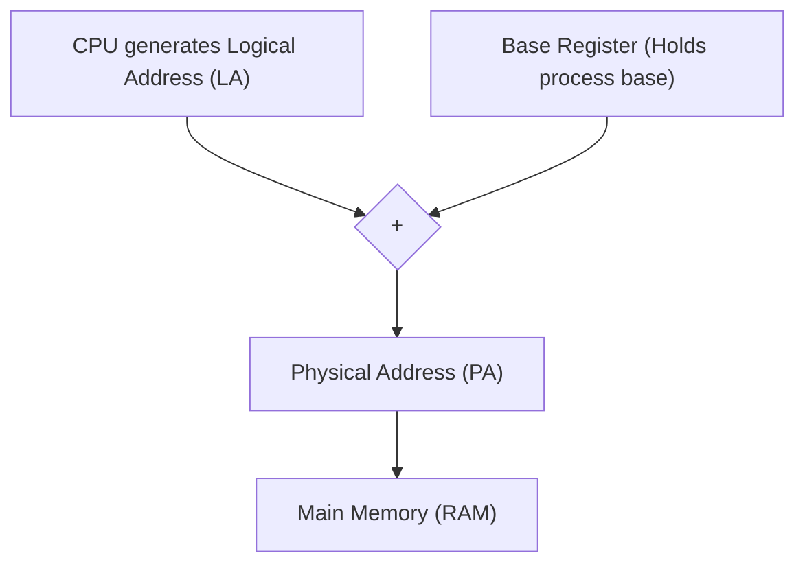
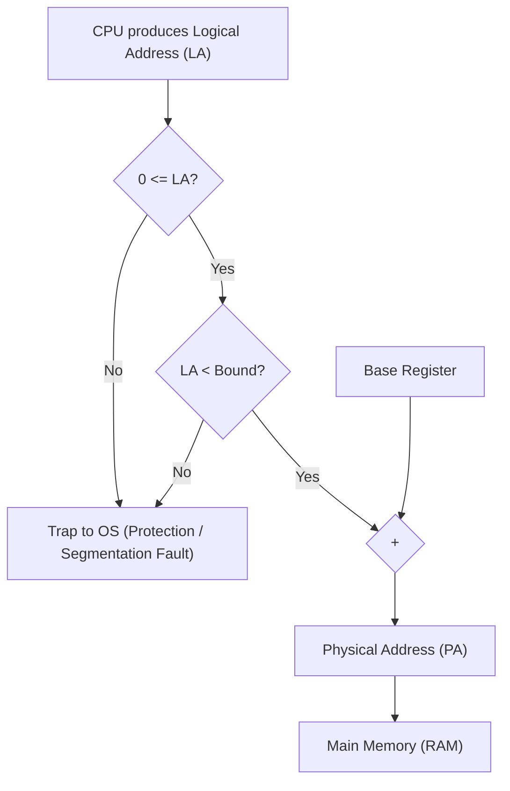

# Memory Management: Base & Limit Relocation to Segmentation

## Lecture & Conceptual Walkthrough

---

### 1. The Need for Dynamic Relocation

During the compilation and linking phases, a program has zero knowledge of the actual physical memory (RAM) layout or where it will ultimately reside at runtime. The compiler operates under the abstraction that the program owns the entire address space starting contiguously from address $0$ up to $N - 1$ bytes.

| Perspective | Memory Model | Address Space Scope |
|---|---|---|
| **Program / Compiler View** | Virtual / Logical contiguous block | Assumes sole ownership of range $[0,\; N - 1]$ |
| **Actual Physical Memory (RAM)** | Partitioned shared physical space | Split among OS Kernel, Process 1 ($P_1$), Process 2 ($P_2$), and free holes |

If processes were loaded directly into physical memory using hardcoded addresses generated at compile time (starting at $0$), multiprogramming would be completely impossible:
* Two programs could not reside simultaneously in main memory because their address references would clash at physical address $0$.
* The compiler cannot generate static physical addresses because it cannot predict *when* (after minutes, days, or decades) or *where* in available physical memory the OS loader will place the process.

To achieve multiprogramming, programs must be dynamically relocatable to arbitrary memory locations.

---

### 2. Contiguous Allocation with a Base Register

The simplest hardware relocation mechanism allocates each process as a single, contiguous block in main memory.

> [!property] Assumptions of the Pure Base Register Scheme
> 1. **Contiguous Allocation:** Each process must occupy a single contiguous range of physical addresses.
> 2. **Base Offset:** The process starts at a physical address given by a `Base Register`.
> 3. **Unique Base per Process:** Each process has its own unique base address.
> 4. **Hardware Storage:** The base address of the currently running process is held in a dedicated hardware CPU register (`Base Register`). When a process is descheduled, its base value is preserved in its Process Control Block (PCB) and restored during a context switch.

#### Address Translation with Base Register
The CPU executes instructions referencing a **Logical Address (LA)** (or Virtual Address). The memory controller requires a **Physical Address (PA)** to place on the system address bus.

> [!formula] Base Register Address Translation
> $$\text{Physical Address (PA)} = \text{Base Register} + \text{Logical Address (LA)}$$

#### Example Trace
Let Process $P_1$ have $\text{Base}(P_1) = 10\text{k} = 10240$, and Process $P_2$ have $\text{Base}(P_2) = 100\text{k} = 102400$.
* If $P_1$ executes an instruction accessing its logical address $0$, it maps to physical address:
  $$\text{PA} = 10\text{k} + 0 = 10\text{k}$$
* If $P_2$ executes an instruction accessing its $1024^{\text{th}}$ byte (logical address $1024$):
  $$\text{PA} = 100\text{k} + 1024$$

---

### 3. Logical Address vs. Physical Address

| Attribute | Logical Address (LA) | Physical Address (PA) |
|---|---|---|
| **Generator** | Generated by the CPU (Programmer / Compiler view). | Generated by hardware translation units (MMU). |
| **Visibility** | Visible to user programs (e.g., printed pointer values in C via `printf("%p", ptr)`). | Inaccessible and invisible to user-level code. |
| **Destination** | Internal to the CPU/instruction pipeline. | Transmitted onto the memory bus (MAR / RAM address pins). |
| **Multiprogramming Invariant** | Multiple processes can have identical logical addresses simultaneously (e.g., both $P_1$ and $P_2$ have a logical address $0x1000$). | All active locations in RAM map to strictly unique, non-overlapping physical addresses. |

---

### 4. Vulnerability: Lack of Memory Protection

In the pure base register approach, there is no boundary check. A process can supply an arbitrarily large logical address.

| Parameter | Example Value | Note |
|---|---|---|
| Process $P_1$ Base | $100$ | Physical start of $P_1$ |
| Process $P_1$ Expected Size | $300$ | Valid physical span: $[100,\; 400)$ |
| Process $P_2$ Base | $400$ | Physical start of $P_2$ |
| Faulty Instruction | `Load 450` | Generated Logical Address $LA = 450$ |
| Computed Target PA | $100 + 450 = 550$ | Maps directly into $P_2$'s allocated space ($550 \in [400,\; 700)$) |

> [!trap] Wild Pointer & Rogue Process Exploit
> Without bound checks, a buggy or malicious process can generate an out-of-range logical address, causing the adder hardware to compute a physical address that overwrites the operating system or other processes residing further up in RAM.

---

### 5. Base & Bound (Limit) Register Architecture

To resolve illegal inter-process memory access, a second hardware register called the **Bound Register** (or **Limit Register**) is introduced.

> [!definition] Bound / Limit Register
> The Bound register specifies the logical size of the process's address space. 
> * Valid logical address range: $[0,\; \text{Bound} - 1]$ (or $[0,\; \text{Bound})$).
> * Valid physical address range: $[\text{Base},\; \text{Base} + \text{Bound} - 1]$ (or $[\text{Base},\; \text{Base} + \text{Bound})$).

#### Complete Hardware Translation Flow (MMU)

1. CPU produces a Logical Address ($LA$).
2. The hardware verifies that $0 \le LA < \text{Bound}$.
   * If $LA < 0$ or $LA \ge \text{Bound}$, the hardware raises an internal interrupt: a **Trap to OS** (Protection Exception / Segmentation Fault), terminating or suspending the offending process.
1. If the address is within bounds, the hardware computes:
   $$\text{Physical Address (PA)} = \text{Base} + LA$$
2. The PA is sent directly down the physical address bus to RAM.

> [!definition] Memory Management Unit (MMU)
> The dedicated hardware block between the CPU core and the physical memory bus responsible for real-time address translation and bounds verification. Because translation occurs on every single memory access (instruction fetch, load, store), it must be implemented strictly in fast hardware logic.

---

### 6. Trade-off Analysis: Base & Bound Approach

#### Advantages
* **Dynamic Relocation:** Processes can be placed in any contiguous chunk of free RAM; the loader merely writes the allocated physical start address into the PCB/Base register.
* **Fast & Inexpensive Hardware Implementation:** Requires only two fast registers (Base, Bound), one comparator ($<$), and one adder ($+$).
* **Low Context Switch Overhead:** Saving and restoring process state requires preserving only two register values (Base and Bound) in the PCB.
* **Protection:** Guarantees isolation between user processes and protects the OS kernel space.

#### Disadvantages
* **Contiguous Allocation Requirement:** The entire process must be placed in a single contiguous block of physical RAM.
* **External Fragmentation:** Over time, allocating and deallocating variable-sized contiguous chunks leaves small, unusable holes scattered across physical memory.
* **Entire Process in Memory:** The complete process image must reside entirely in RAM before execution begins (a limitation later eliminated via Demand Paging).
* Size of process is fixed hence limit on dynamic memory that can be allocated.

---

### 7. Introduction to Segmentation

To eliminate the strict requirement of holding an entire process in a single contiguous block, memory management transitions to **Segmentation**.

> [!definition] Segmentation
> A memory management scheme that divides a process logically into variable-sized chunks called **Segments** (e.g., Code segment, Data segment, Stack segment, Heap segment). Each segment is placed independently and contiguously in available physical memory.

* Segmentation is a direct generalization of the Base & Bound scheme:
  * Pure Base & Bound: Exactly **one** base-bound pair per entire process.
  * Segmentation: **Multiple** base-bound pairs per process (one pair dedicated to each logical segment, stored inside a hardware-assisted Segment Table).

---

## Hard Questions & Tricky Scenarios
<!-- Reserved for personal manual additions -->