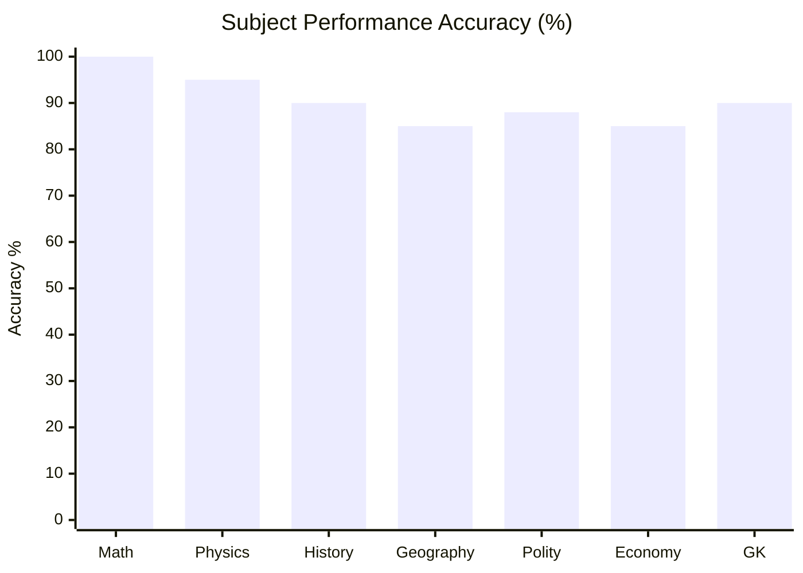
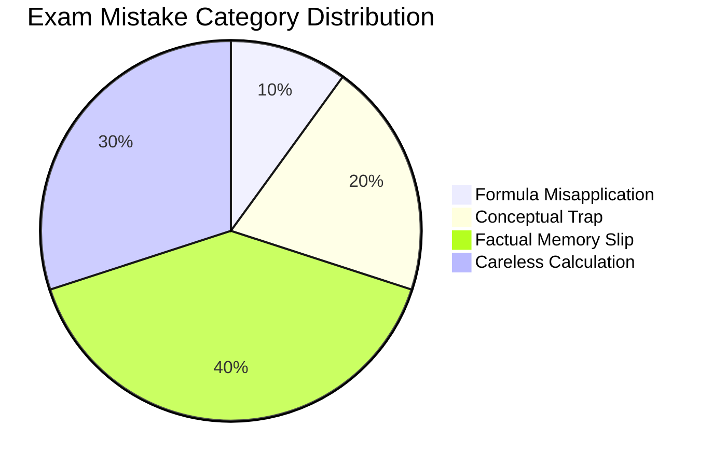

# Moc Cds

## 1. Elementary Mathematics
- **Subject Overview**: [Elementary Mathematics Subject Overview](/cds/math/math_overview)
- **Chapter Notes**:
  - [Ch 01. Number System](/cds/math/notes/numbers)
  - [Ch 02. Sequence and Series](/cds/math/notes/sequence_series)
  - [Ch 03. HCF and LCM of Numbers](/cds/math/notes/hcf_lcm)
  - [Ch 04. Modular Arithmetic & Remainders](/cds/math/notes/modular)
  - [Ch 05. Square Roots and Cube Roots](/cds/math/notes/roots)
  - [Ch 06. Time and Distance](/cds/math/notes/time_distance)
  - [Ch 07. Time and Work](/cds/math/notes/work)
  - [Ch 08. Percentage](/cds/math/notes/percentage)
  - [Ch 09. Simple Interest](/cds/math/notes/simple_interest)
  - [Ch 11. Profit and Loss](/cds/math/notes/profit_loss)
  - [Ch 12. Ratio and Proportion](/cds/math/notes/ratio_proportion)
  - [Ch 15. HCF and LCM of Polynomials](/cds/math/notes/polynomial_hcf_lcm)
  - [Ch 16. Rational Expressions](/cds/math/notes/rational_expressions)
  - [Ch 17. Linear Equations](/cds/math/notes/linear_equations)
  - [Ch 18. Quadratic Equations & Inequalities](/cds/math/notes/quadratic_equations)
  - [Ch 19. Set Theory](/cds/math/notes/set_theory)
  - [Ch 20. Measurements of Angles and Trigonometric Ratios](/cds/math/notes/trigonometry)
  - [Ch 21. Height and Distance](/cds/math/notes/heights)
  - [Ch 22. Heights and Distances](/cds/math/notes/heights_distances)
  - [Ch 23. Triangles](/cds/math/notes/triangles)
  - [Ch 24. Quadrilateral and Polygon](/cds/math/notes/quadrilateral)
  - [Ch 25. Circle](/cds/math/notes/circle)
  - [Ch 27. Surface Area and Volume of Solids](/cds/math/notes/solids)
  - [Ch 28. Statistics](/cds/math/notes/statistics)

---

## 2. Physics
- **Subject Overview**: [Physics Subject Overview](/cds/physics/physics_overview)
- **Master Formula Sheet**: [Master Physics Formulas & Definitions](/cds/physics/notes/formulas)
- **Chapter Notes**:
  - [Ch 01. Mechanics & Dynamics](/cds/physics/notes/mechanics)
  - [Ch 02. Gravitation & Rotational Motion](/cds/physics/notes/gravitation)
  - [Ch 03. Properties of Matter & Fluid Mechanics](/cds/physics/notes/properties_of_matter)
  - [Ch 04. Heat & Thermodynamics](/cds/physics/notes/heat_thermodynamics)
  - [Ch 05. Oscillations, SHM & Waves](/cds/physics/notes/waves_oscillations)
  - [Ch 06. Optics & Optical Instruments](/cds/physics/notes/optics)
  - [Ch 07. Electricity & Magnetism](/cds/physics/notes/electricity_magnetism)
  - [Ch 08. Modern Physics & Communication Systems](/cds/physics/notes/modern_physics)

---

## 3. Chemistry
- **Subject Overview**: [Chemistry Subject Overview](/cds/chemistry/chemistry_overview)
- **Chapter Notes**:
  - [Ch 01. Classification of Matter & Physical States](/cds/chemistry/notes/classification_of_matter)
  - [Ch 02. Atoms, Molecules & Atomic Structure](/cds/chemistry/notes/atoms_molecules)
  - [Ch 03. Chemical Reactions & Equations](/cds/chemistry/notes/chemical_reactions)
  - [Ch 04. Acids, Bases, Salts & Indicators](/cds/chemistry/notes/acids_bases_salts)
  - [Ch 05. Metals and Non-Metals](/cds/chemistry/notes/metals_nonmetals)
  - [Ch 06. Carbon and Its Compounds](/cds/chemistry/notes/carbon_compounds)
  - [Ch 07. Periodic Classification of Elements](/cds/chemistry/notes/periodic_classification)
  - [Ch 08. Applied & Industrial Chemistry](/cds/chemistry/notes/applied_chemistry)
  - [Ch 09. Common Names & Chemical Formulas](/cds/chemistry/notes/common_names)

---

## 4. History
- **Master Cheat Sheet**: [Ultimate Comprehensive History Cheat Sheet](/cds/history_cheatsheet)
- **Chapter Breakdown**:
  - [Ch 01. Ancient India (Pre-History to ~1200 AD)](/cds/history_cheatsheet#part-1-ancient-india-pre-history-to-1200-ad)
  - [Ch 02. Medieval India (750–1707 AD)](/cds/history_cheatsheet#part-2-medieval-india-7501707-ad)
  - [Ch 03. Modern India & Freedom Struggle (1707–1947 AD)](/cds/history_cheatsheet#part-3-modern-india--indian-national-movement-17071947-ad)
  - [Ch 04. World History (Revolutions, WWI & WWII)](/cds/history_cheatsheet#part-4-world-history)
  - [Ch 05. Art, Architecture & Culture Quick-Reference](/cds/history_cheatsheet#part-5-art-architecture--culture-quick-reference)

---

## 4. Geography
- **Subject Overview**: [Geography Subject Overview](/cds/geography/geography_overview)
- **Chapter Notes**:
  - [Ch 01. Physical & World Geography - Universe & Earth](/cds/geography/notes/universe_earth)

---

## 5. Indian Polity
- **Subject Overview**: [Indian Polity Subject Overview](/cds/polity/polity_overview)
- **Chapter Notes**:
  - [Ch 01. Indian Polity Master Cheat Sheet (Acts, Committees, Amendments, Articles)](/cds/polity/notes/polity_cheatsheet)

---

## 6. Indian Economy
- **Subject Overview**: [Indian Economy Subject Overview](/cds/economy/economy_overview)
- **Chapter Notes**:
  - [Ch 01. Indian Economy Master Cheat Sheet (Plans, Banking, HDI & Institutions)](/cds/economy/notes/economy_cheatsheet)

---

## 7. General Knowledge
- **Subject Overview**: [General Knowledge Subject Overview](/cds/gk/gk_overview)
- **Chapter Notes**:
  - [Ch 01. Indian General Knowledge (Firsts, Defense, Space, Awards & Honours)](/cds/gk/notes/gk)

---

## Performance Overview

---

## Navigation
- [SAGE Home](/index)
