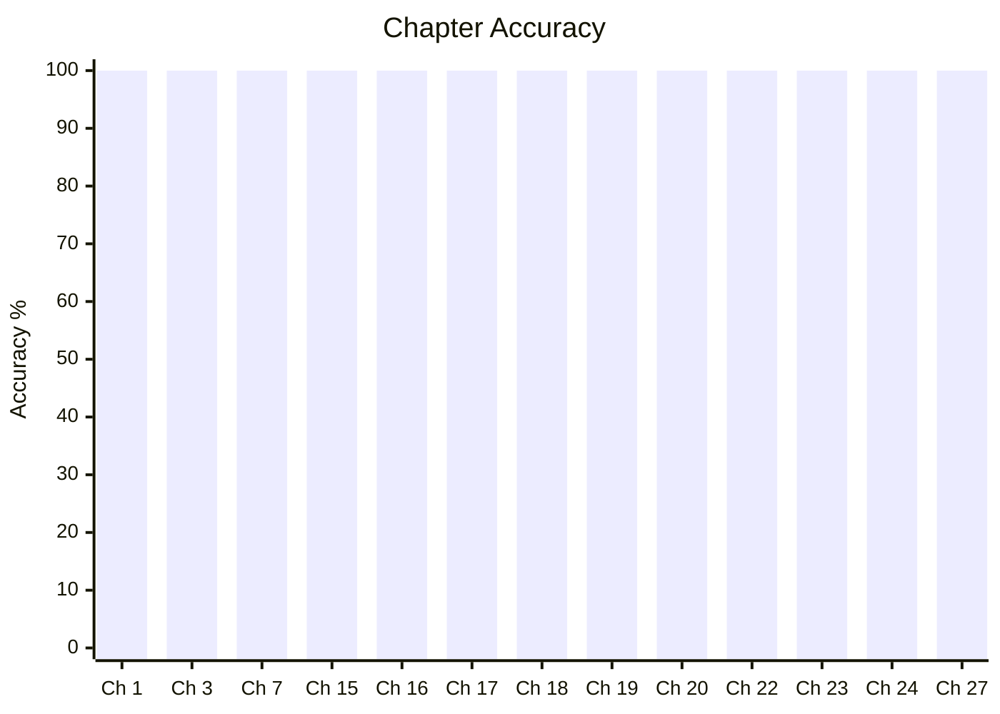
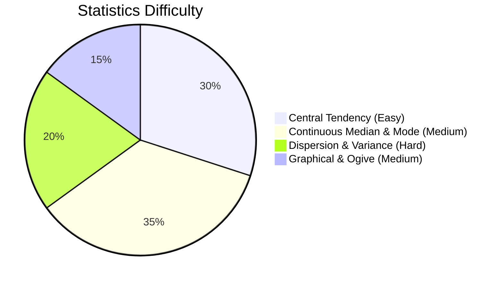

---
cssclasses:
  - dashboard
  - cols-4
---

![[attachments/banners/maths.webp|banner]]

- [[maths/Algebra|Algebra]]
- [[moc logic]]
- [[mocs/moc calculus]]
- [moc dm](padai/maths/moc%20dm.md)
- [moc la](moc%20la.md)
- [[mocs/moc probablity]]
- [[../../archive/maths/Basic Mathematics|Basic Mathematics]]
- [[cds/apti/notes/Number Theory|Number Theory]]
- [[cds/apti/notes/moc set theory]]
- [[mocs/moc graphs]]
- [[../../archive/combinatorics/moc combinatorics]]

## Unlinked & Topic Notes
- [[type conversion]]
- [[Catalan Number]]
- [[GATE PYQs — Conditional Probability & Bayes' Theorem]]
- [[Ax=b]]
- [[Cayley Hamilton Theorem]]
- [[Eigenvalues and Eigenvectors]]
- [[eigenvalues shortcuts]]
- [[eignevalues transformations]]
- [[go classes lecture notes linear algebra la]]
- [[Homogeneous Linear Systems]]
- [[linear independence]]
- [[LU decomopositon]]
- [[Matrix algebra]]
- [[rank]]
- [[solving linear equations]]
- [[span]]
- [[System of Linear Equations]]
- [[Vectors]]
- [[calculus theorems]]
- [[README]]
- [[Alternating Series Test]]
- [[Constant Rule]]
- [[Convergence Tests]]
- [[Convergence]]
- [[Critical Values]]
- [[Derivatives of Inverse Trignometric Functions]]
- [[Differential Equations]]
- [[Differentials]]
- [[Direct Comparison Test]]
- [[Exponential Rule]]
- [[First Derivative Test]]
- [[Function-Derived Solids]]
- [[Function-Related Integrals]]
- [[Homogeneous DEs]]
- [[Implicit Differentiation]]
- [[Integral Test]]
- [[Integration Tricks]]
- [[Integration by Parts]]
- [[Integration]]
- [[Intermediate Value Theorem]]
- [[Interval Theorems]]
- [[L'Hopital's Rule]]
- [[Limit Comparison Test]]
- [[Limits]]
- [[Logarithmic Rule]]
- [[Mean Value Theorem]]
- [[Mistakes]]
- [[Optimization]]
- [[Parametric Equations]]
- [[Points of Inflection]]
- [[Power Rule]]
- [[Product Rule]]
- [[Quotient Rule]]
- [[Ratio Test]]
- [[Related Rates]]
- [[Reverse Logarithmic Rule]]
- [[Reverse Power Rule]]
- [[Series Representation of an Integral]]
- [[Series]]
- [[Solid of Revolution]]
- [[U-Substitution]]
- [[Useful Integrals]]
- [[nth Term Test]]
- [[p-Series Test]]
- [[Limits 1]]
- [[polynomial_hcf_lcm]]
- [[rational_expressions]]
- [[linear_equations]]
- [[set_theory]]
- [[quadratic_equations]]
- [[statistics]]
- [[roots]]
- [[ratio_proportion]]
- [[algebraic_operations]]
- [[decimals]]
- [[cds aptitude formulas]]
- [[crt]]
- [[wilson]]
- [[modular_cheatsheet]]
- [[poly_euclidean_division]]
- [[rational_simplification]]
- [[cyclic_rational_identities]]
- [[set_operations]]
- [[cartesian_product]]
- [[trig_identities]]
- [[complementary_angles_height]]
- [[centers]]
- [[height_broken_pole]]
- [[height_3d_perpendicular_distance]]
- [[special_parallelograms]]
- [[stat_measures_central_tendency]]
- [[stat_median_mode_continuous]]
- [[stat_variance_dispersion]]
- [[ap_properties]]
- [[gp_properties]]
- [[hp_am_gm_hm]]
- [[roots_methods]]
- [[cd_property]]
- [[circle_locus]]
- [[remainder_factor_theorem]]
- [[successive_percentage]]
- [[income_expenditure_savings]]
- [[long_division_method]]
- [[var4]]
- [[var5]]
- [[var7]]
- [[var9]]
- [[var10]]
- [[var11]]
- [[var13]]
- [[var16]]
- [[var20]]
- [[var21]]
- [[var23]]
- [[var_ratio1]]
- [[var25]]
- [[var26]]
- [[q11]]
- [[q13]]
- [[q15]]
- [[q16]]
- [[q20]]
- [[q27]]
- [[q28]]
- [[q30]]
- [[q31]]
- [[q32]]
- [[q33]]
- [[q34]]
- [[q35]]
- [[q36]]
- [[q37]]
- [[q15_rational]]
- [[q19_telescoping]]
- [[q20_system]]
- [[q64]]
- [[q59]]
- [[q145]]
- [[q3_heights]]
- [[q5_heights]]
- [[q9_heights]]
- [[q2_tri]]
- [[q44]]
- [[q45]]
- [[q46]]
- [[q47]]
- [[q1_quad]]
- [[q2_quad]]
- [[q28_2]]
- [[q28_3]]
- [[q28_4]]
- [[q28_5]]
- [[q28_6]]
- [[q110]]
- [[q111]]
- [[q112]]
- [[q5_1]]
- [[q1_circle]]
- [[q2_circle]]
- [[q3_circle]]
- [[q48]]
- [[q49]]
- [[q146]]
- [[q147]]
- [[q148]]
- [[q113]]
- [[q114]]
- [[q115]]
- [[q116]]
- [[q117]]
- [[q118]]
- [[q119]]
- [[q120]]
- [[q_dec1]]
- [[q_dec2]]
- [[q_dec3]]
- [[q5_3]]
- [[defense_and_space]]
- [[q1]]
- [[biology_overview]]
- [[volume formulas]]

---
## Overview & Guidance
# Elementary Mathematics

## Topics & Notes

- [ ] [Ch 1. Number System](/cds/math/notes/numbers)
- [x] [Ch 2. Sequence and Series](/cds/math/notes/sequence_series)
- [x] [Ch 3. HCF and LCM of Numbers](/cds/math/notes/hcf_lcm)
- [x] [Ch 3. Modular Arithmetic & Remainders](/cds/math/notes/modular)
- [x] [Ch 4. Decimal Fractions](/cds/math/notes/decimals)
- [x] [Ch 5. Square Roots and Cube Roots](/cds/math/notes/roots)
- [ ] [Ch 6. Time and Distance](/cds/math/notes/time_distance)
- [ ] [Ch 7. Time and Work](/cds/math/notes/work)
- [ ] [Ch 8. Percentage](/cds/math/notes/percentage)
- [ ] [Ch 9. Simple Interest](/cds/math/notes/simple_interest)
- [ ] [Ch 11. Profit and Loss](/cds/math/notes/profit_loss)
- [ ] [Ch 12. Ratio and Proportion](/cds/math/notes/ratio_proportion)
- [x] [Ch 15. HCF and LCM of Polynomials](/cds/math/notes/polynomial_hcf_lcm)
- [x] [Ch 16. Rational Expressions](/cds/math/notes/rational_expressions)
- [ ] [Ch 17. Linear Equations](/cds/math/notes/linear_equations)
- [ ] [Ch 18. Quadratic Equations & Inequalities](/cds/math/notes/quadratic_equations)
- [x] [Ch 19. Set Theory](/cds/math/notes/set_theory)
- [ ] [Ch 20. Measurements of Angles and Trigonometric Ratios](/cds/math/notes/trigonometry)
- [ ] [Ch 21. Height and Distance](/cds/math/notes/heights)
- [ ] [Ch 22. Heights and Distances](/cds/math/notes/heights_distances)
- [ ] [Ch 23. Triangles](/cds/math/notes/triangles)
- [ ] [Ch 24. Quadrilateral and Polygon](/cds/math/notes/quadrilateral)
- [ ] [Ch 25. Circle](/cds/math/notes/circle)
- [ ] [Ch 12. Ratio and Proportion](/cds/math/notes/ratio_proportion)
- [ ] [Ch 27. Surface Area and Volume of Solids](/cds/math/notes/solids)
- [ ] [Ch 28. Statistics](/cds/math/notes/statistics)

## Variations

- [Set Theory & General Variations](/cds/math/notes/variations/vars)
- [Ch 2 Sequence and Series Variations](/cds/math/notes/variations/vars)
- [Ch 6 Variations (Transitive Race Deficit, Boat Navigation Invariant)](/cds/math/notes/variations/var32)
- [Ch 7 Variations (Dynamic Fatigue, Staggered Wages, Torricelli Leak)](/cds/math/notes/variations/var24)
- [Ch 9 Simple Interest Variations](/cds/math/notes/variations/var30)
- [Ch 14 Variations (Symmetric Reciprocal High Power Sums)](/cds/math/notes/variations/var25)
- [Trigonometry Variations](/cds/math/notes/variations/var19)
- [Generalised Multi-Point Complementary Elevation](/cds/math/notes/variations/var20)
- [Elliptic Cloud Reflection in Spherical Lake](/cds/math/notes/variations/var21)
- [Moving Aircraft Angular Acceleration & Speed](/cds/math/notes/variations/var22)
- [Ch 23 Variations (Median, Thales, Apollonius)](/cds/math/notes/variations/var17)
- [Ch 24 Variations (Trapezium Diagonals, Midpoint Quads, n-gon Intersections)](/cds/math/notes/variations/var23)
- [Ch 25 Variations (Common Tangents, Annulus Chords, Ptolemy's Theorem)](/cds/math/notes/variations/var24)
- [Ch 27 Variations (Water Flow, Submersion, Cone Inscribed Sphere)](/cds/math/notes/variations/var27)
- [Ch 28 Variations (Ogives Intersection, Weighted Power Means, Subgroup Variance)](/cds/math/notes/variations/var28)

## Performance Overview

---

## Navigation
- [CDS Dashboard](/cds/cds_overview)
