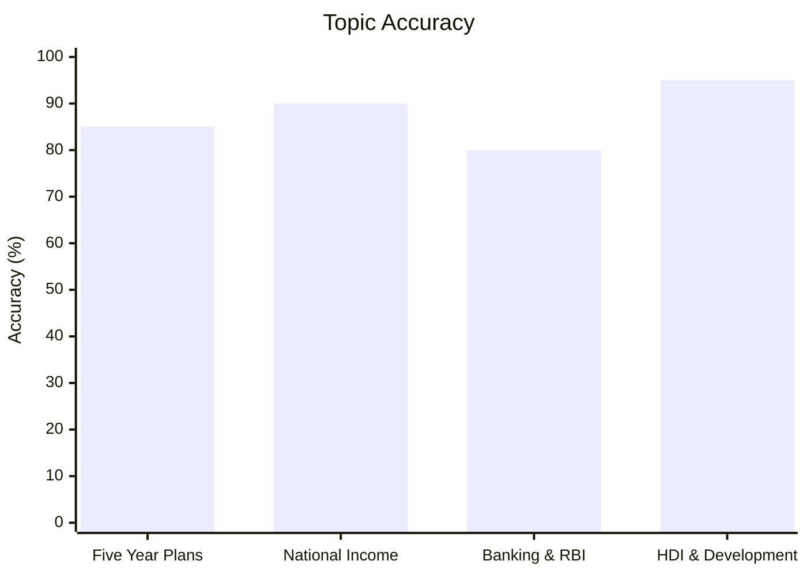
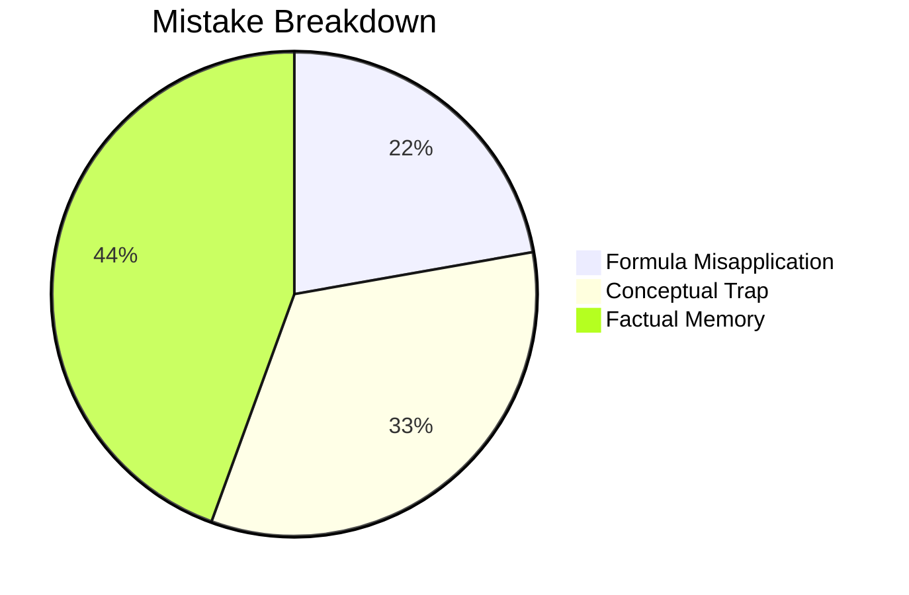

---
cssclasses:
  - dashboard
  - cols-4
tags:
  - cds
  - economy
  - moc
---

![[attachments/banners/economy.webp|banner]]

CDS ECONOMICS MODULE

- 💵 Money & Monetary Systems
  - [[cds/humanities/money|Money — Evolution, Types & Supply]]

- 🏦 Banking & Financial Institutions
  - [[cds/humanities/banking|Banking — History, Structure & Regulation]]

- 📊 National Income & Economics Scope
  - National Income (GDP/GNP/NNP/PCI/PDI) *(Pending backfill)*
  - Fiscal Policy & Union Budget *(Pending)*
  - Inflation & Price Indices *(Pending)*

## Unlinked & Topic Notes
- [[economy_overview]]
- [[economy_cheatsheet]]
- [[polity_cheatsheet]]
- [[money]]

---
## Overview & Guidance
# Indian Economy

## Topics & Notes
- [Indian Economy Cheat Sheet (Names, Events, Plans & Institutions)](/cds/economy/notes/economy_cheatsheet)

## Performance Overview

## Navigation
- [CDS Overview Dashboard](/cds/cds_overview)
