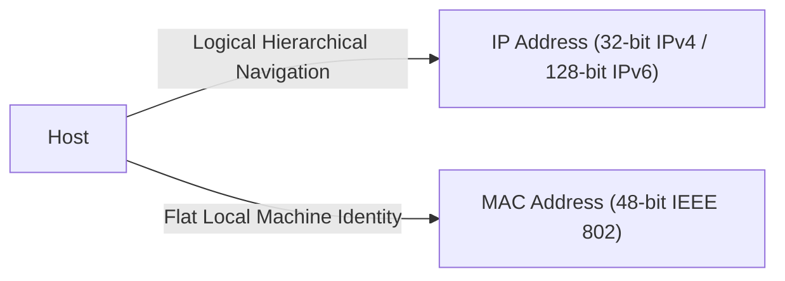

## Addressing and Routing Mechanics

Every network interface maintains two primary identifiers operating across different layers: a MAC address and an IP address[cite: 1].

> [!definition] MAC and IP Addresses
> * **MAC Address (Link Layer)**: A 48-bit flat physical address hardcoded into the Network Interface Card (NIC)[cite: 1]. Example: `A3:34:45:BF:92:C2`[cite: 1]. It identifies a physical adapter within a local broadcast domain and does not contain topological or hierarchical subnet information[cite: 1].
> * **IP Address (Network Layer)**: A logical, hierarchically structured address (e.g., slash CIDR notation `/24`) assigned to a host based on its network location[cite: 1].
## Dual Addressing Necessity

A single identifier cannot replace both **MAC** and **IP** addresses because **Global Routing** and **Local Link Access** have conflicting requirements:
* **Global Routing:** Requires a **Hierarchical** address (Prefix Aggregation) to keep global routing tables small and scalable.
* **Local Hardware Switching:** Requires a **Permanent, Flat** hardware address hardcoded into the NIC for local frame delivery, media access, and bootstrapping.

---

### Why Single-Address Architectures Fail

#### 1. Using ONLY a Dynamic Hierarchical Address (No MAC)
* **Bootstrapping Paradox:** A new device has no IP yet. When a DHCP server grants an IP, it cannot direct the frame to the specific physical network card without a low-level hardware identity listening on the wire.
* **Hardware Overhead:** Local switches operate at Layer 2. Processing dynamic, variable-length Layer 3 (IP) headers for every local hop in hardware is far more expensive than switching fixed 48-bit MAC addresses.

#### 2. Using ONLY a Fixed Flat Address (No IP)
* **Routing Table Explosion:** MAC addresses are flat (assigned arbitrarily by manufacturers) and lack topological hierarchy.
* **No Prefix Aggregation:** Without hierarchical prefixes, global routers cannot group routes by network. Internet routing tables would need billions of individual entries for every device on Earth, causing memory collapse.

---

### Core Summary

> [!KEY-TAKEAWAY]
> - **IP cannot replace MAC:** IP is hiearcical, meant for small router table. Hardware needs an invariant local identifier to receive initial configuration (DHCP) and handle Layer 2 hardwares.
> - **MAC cannot replace IP:** MAC is flat and non-summarizable. Global routing relies on hierarchical prefix aggregation to keep routing tables scalable.

### Routing vs. Forwarding

| Process                 | Plane                  | Timing & Complexity                         | Core Operation                                                                                                                                                |
| :---------------------- | :--------------------- | :------------------------------------------ | :------------------------------------------------------------------------------------------------------------------------------------------------------------ |
| **Routing**[cite: 1]    | Control Plane[cite: 1] | Background / Long-term computation[cite: 1] | The end-to-end process of determining path trajectories and constructing the routing table[cite: 1].                                                          |
| **Forwarding**[cite: 1] | Data Plane[cite: 1]    | Real-time per-packet processing[cite: 1]    | The physical transfer of an arriving packet from an input link interface to the appropriate output link interface using the lookup/forwarding table[cite: 1]. |
