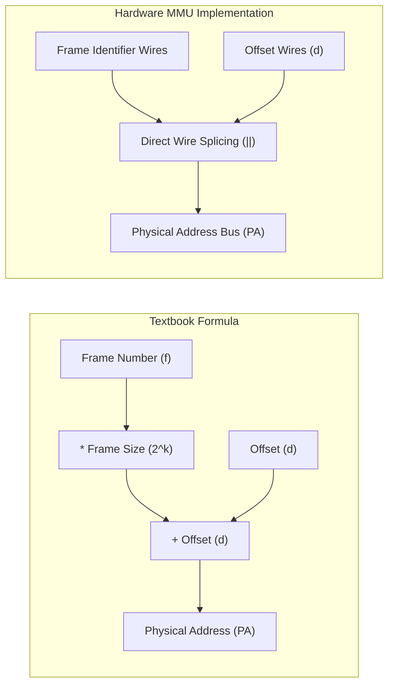
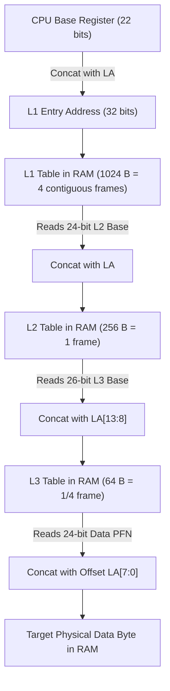

## 1. Mathematical Formulas for Address Translation 🧮

### Abstract Definition
The mathematical mapping from a **Logical Address (LA)** to a **Physical Address (PA)** in a paged virtual memory system is[cite: 1]:

$$\text{PA} = (\text{Frame Number} \times \text{Frame Size}) + \text{Offset} \text{[cite: 1]}$$

Where:
* $\text{Frame Size} = \text{Page Size} = 2^k \text{ Bytes} \implies k \text{ offset bits}$[cite: 1]
* $\text{Page Number } (p) = \text{LA} \mathbin{/\!/} 2^k$ (integer division / quotient)[cite: 1]
* $\text{Page Offset } (d) = \text{LA} \mathbin{\%} 2^k$ (modulo / remainder)[cite: 1]
* $\text{Frame Number } (f) = \text{PageTable}[p]$[cite: 1]

---

## 2. The Arithmetic vs. Hardware Reality: Why Shifts Replace Multipliers ⚙️

While textbooks formulate translation as multiplication and addition, hardware **never** uses an arithmetic multiplier or adder circuit for power-of-two page sizes[cite: 1, 2].

### 1. Multiplication by $2^k$ is a Left-Shift ($\ll k$)
Multiplying an unsigned binary number by $2^k$ is physically equivalent to left-shifting by $k$ bit positions:
$$\text{Frame Number} \times 2^k = \text{Frame Number} \ll k = [\,\text{Frame Bits}\,] \;\Vert{}\; [\,\underbrace{00\dots0}_{k\text{ zeros}}\,]$$
The multiplication merely creates a field of $k$ trailing zeros[cite: 1].

### 2. Addition is Equivalent to Bit Concatenation ($\Vert{}$)
Since the offset $d < 2^k$, its binary representation occupies strictly the lower $k$ bits with all upper bits being zero[cite: 1]:

$$\begin{array}{rl}   & [\,\text{Frame Bits}\,] \;\Vert{}\; [\,000\dots0_2\,] \\ + & [\,\underbrace{00\dots0}_{\text{upper zeros}}\,] \;\Vert{}\; [\,\text{Offset Bits } d\,] \\ \hline = & [\,\text{Frame Bits}\,] \;\Vert{}\; [\,\text{Offset Bits } d\,] \end{array}$$

Because no addition occurs between active $1$-bits, there is **zero carry-propagation delay**[cite: 2]. The MMU implements translation simply by placing the output wires of the table lookup next to the offset wires from the virtual address bus[cite: 1, 2].

---

## 3. Why Power-of-2 Sizes Enable Concatenation Even When Chunk Sizes Differ 🧩

A common misconception is that bit concatenation only works when every page table chunk matches the full physical frame size[cite: 2]. 

As long as a table chunk size is a **power of 2 ($2^k$)**, it starts on a naturally aligned boundary in physical RAM[cite: 1, 2]. Consequently, its starting byte address ends in $k$ zeros, allowing pure concatenation[cite: 1, 2].

| Attribute | Power-of-2 Chunk ($2^k$ Bytes)[cite: 1] | Non-Power-of-2 Chunk (e.g., $300\text{ B}$)[cite: 2] |
| :--- | :--- | :--- |
| **Boundary Alignment** | Multiples of $2^k$ (trailing $k$ bits are `0`)[cite: 1] | Arbitrary multiples (bit pattern irregular) |
| **PTE Storage** | Truncated chunk ID (omits $k$ trailing zeros)[cite: 1, 2] | Full unaligned physical byte address[cite: 1, 2] |
| **MMU Logic** | **Bit Concatenation** (wire splicing, zero latency)[cite: 1, 2] | **Arithmetic Multiplier + Adder** (ALU delay)[cite: 1, 2] |
| **Memory Allocation** | May leave power-of-2 internal gaps[cite: 1, 2] | Densely packed; requires heap-style free lists |

---

## 4. Comprehensive End-to-End Walkthrough: Multilevel Addressing with Unequal Chunks 🔍

### Architectural Setup
* **Virtual Address (VA):** $32\text{ bits}$[cite: 1]
* **Physical Address (PA):** $32\text{ bits}$[cite: 1]
* **VA Structure:** $[10 \mid 8 \mid 6 \mid 8]$
  * $L_1$ Index: $10\text{ bits}$
  * $L_2$ Index: $8\text{ bits}$
  * $L_3$ Index: $6\text{ bits}$
  * In-page Offset: $8\text{ bits} \implies \text{Page Frame Size} = 2^8\text{ B} = 256\text{ B}$[cite: 1]
* **Page Table Entry (PTE) Size:** $1\text{ Byte} = 2^0\text{ B}$ across all levels

---

### Step-by-Step Hardware Addressing Breakdown

#### Step 1: Root Table ($L_1$) Access
* **Footprint:** $2^{10}\text{ entries} \times 1\text{ B} = 1024\text{ B} = 2^{10}\text{ B}$.
* **Frame Allocation:** $\frac{1024\text{ B}}{256\text{ B}} = 4\text{ contiguous physical frames}$ allocated via the Buddy Allocator.
* **Base Register Storage:** The block is aligned to a $1024\text{ B}$ boundary; the lowest $10$ bits of its base address are `0`. The CPU Page Table Base Register stores the upper $32 - 10 = \mathbf{22\text{ bits}}$.
* **Hardware Assembly:**
  $$\text{Address of } L_1\text{ Entry} = [\,\text{22 Base Bits from Register}\,] \;\|\; [\,\text{10 Index Bits from VA}\,] \implies \mathbf{32\text{ bits}} \text{[cite: 1]}$$

#### Step 2: Middle Table ($L_2$) Access
* **Footprint:** $2^8\text{ entries} \times 1\text{ B} = 256\text{ B} = 2^8\text{ B}$.
* **Frame Allocation:** Exactly $1$ full physical frame ($256\text{ B}$).
* **$L_1$ PTE Storage:** Needs an 8-bit offset; stores the upper $32 - 8 = \mathbf{24\text{ bits}}$ (the standard Frame Number / PFN)[cite: 1].
* **Hardware Assembly:**
  $$\text{Address of } L_2\text{ Entry} = [\,\text{24 Base Bits from } L_1\text{ PTE}\,] \;\|\; [\,\text{8 Index Bits from VA}\,] \implies \mathbf{32\text{ bits}} \text{[cite: 1]}$$

#### Step 3: Innermost Table ($L_3$) Access (Sub-Frame Chunk)
* **Footprint:** $2^6\text{ entries} \times 1\text{ B} = 64\text{ B} = 2^6\text{ B}$.
* **Frame Allocation:** Fits into $\frac{1}{4}$ of a standard $256\text{ B}$ physical frame[cite: 1]. The OS packs up to four $64\text{ B}$ tables into one frame without collision[cite: 1].
* **$L_2$ PTE Storage:** Because the $64\text{ B}$ block is naturally aligned to $64$, its lowest $6$ bits are `0`[cite: 1]. The parent $L_2$ PTE stores the upper $32 - 6 = \mathbf{26\text{ bits}}$[cite: 1].
* **Hardware Assembly:**
  $$\text{Address of } L_3\text{ Entry} = [\,\text{26 Base Bits from } L_2\text{ PTE}\,] \;\|\; [\,\text{6 Index Bits from VA}\,] \implies \mathbf{32\text{ bits}} \text{[cite: 1]}$$

#### Step 4: Final Data Byte Access
* **Target:** User data page frame of size $256\text{ B} = 2^8\text{ B}$[cite: 1].
* **$L_3$ PTE Storage:** Stores the physical frame number identifying the $256\text{ B}$ frame: $32 - 8 = \mathbf{24\text{ bits}}$[cite: 1, 2].
* **Hardware Assembly:**
  $$\text{Target Physical Address} = [\,\text{24 Frame Bits from } L_3\text{ PTE}\,] \;\|\; [\,\text{8 Offset Bits from VA}\,] \implies \mathbf{32\text{ bits}} \text{[cite: 1]}$$