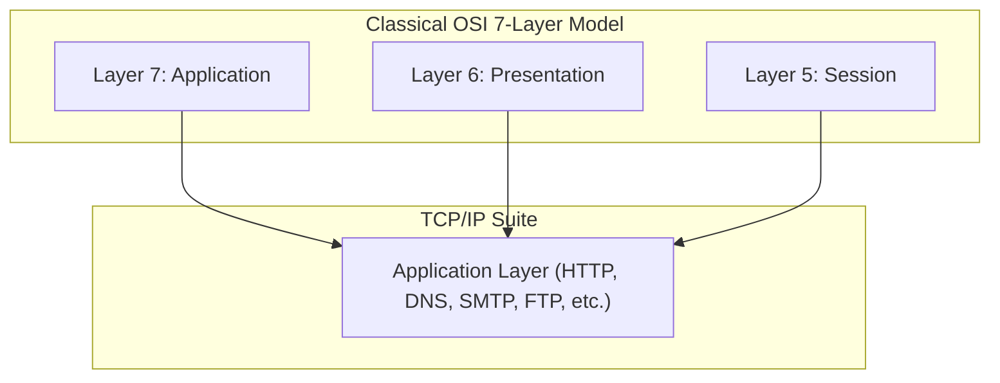

The Application Layer is the topmost layer in the networking stack (Internet and OSI reference models)[cite: 1]. It serves as an abstraction layer providing standard communication services and shared protocols directly to end-user applications[cite: 1].

> [!definition] Application Layer
> The **Application Layer** specifies the shared interface methods and protocols implemented by end hosts to facilitate inter-process network communication[cite: 1]. As the closest layer to the end user, users and user-space applications interact directly with application-layer protocols[cite: 1].

### OSI vs. Internet Architecture Consolidation
* In the classical 7-layer OSI model, distinct session-management and presentation-conversion tasks are divided among the Session Layer (Layer 5), Presentation Layer (Layer 6), and Application Layer (Layer 7)[cite: 1].
* Modern TCP/IP architectures collapse these responsibilities: the TCP/IP Application Layer incorporates all session initiation/management, data representation, encryption, compression, and high-level interface functions[cite: 1].

