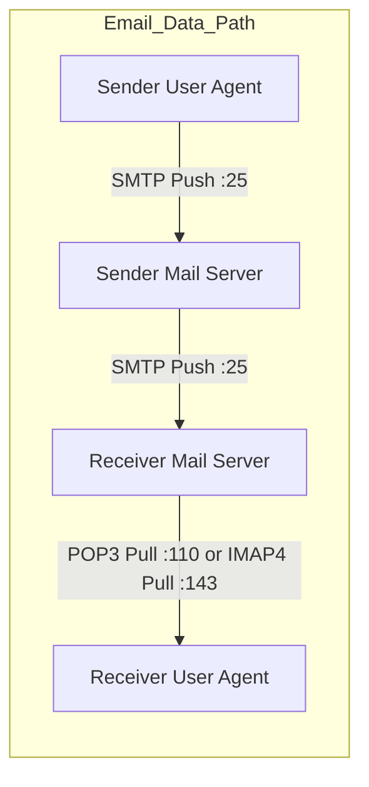

> [!definition]
> **Application Layer Protocols** define the formatting, operational commands, and transport-port mappings for distributed client-server communication[cite: 2].

| Protocol | Purpose | Underlying Transport | Default Port(s) | Operational State / Connection |
| :--- | :--- | :--- | :--- | :--- |
| **HTTP 1.0** | Web browsing | TCP | Port 80[cite: 1, 2] | Stateless; Non-persistent (1 TCP conn per item)[cite: 2] |
| **HTTP 1.1** | Web browsing | TCP | Port 80[cite: 1, 2] | Stateless; Persistent with pipelining[cite: 2] |
| **FTP** | File Transfer | TCP | **Port 21 (Control)**[cite: 1, 2]  **Port 20 (Data)**[cite: 1, 2] | Stateful; **Out-of-band** architecture[cite: 2] |
| **SMTP** | Mail relay / pushing | TCP | Port 25[cite: 1, 2] | Stateful; Push-only (7-bit ASCII standard)[cite: 2] |
| **POP3** | Mail download / retrieve | TCP | Port 110[cite: 2] | Pull protocol; Deletes from server on pull[cite: 1, 2] |
| **IMAP4** | Mail access / synchronization | TCP | Port 143[cite: 2] | Pull protocol; Supports server-side folders/sync[cite: 1, 2] |
| **DNS** | Domain name resolution | UDP / TCP | Port 53[cite: 2] | UDP for queries; TCP for zone transfers[cite: 2] |
| **DHCP** | Dynamic IP assignment | UDP | **Port 67 (Server)**[cite: 2]  **Port 68 (Client)**[cite: 2] | BootP broadcast exchange |
| **Telnet** | Unencrypted remote terminal | TCP | Port 23[cite: 1, 2] | Insecure remote CLI session[cite: 1] |
| **SSH** | Secure remote shell | TCP | Port 22[cite: 1] | Encrypted tunnel terminal session[cite: 1] |

> [!theorem]
> **Out-of-Band Architecture of FTP:**  
> Unlike HTTP and SMTP (which send control headers and user data over the same TCP link, termed **In-Band**), FTP splits its operations across two distinct channels[cite: 2]:  
> 1. A persistent **Control Connection** on TCP Port 21 that stays open throughout the session[cite: 2].  
> 2. Dynamic, temporary **Data Connections** on TCP Port 20, spawned and torn down for each file payload[cite: 2].

> [!trap]
> - **SMTP** is exclusively a **Push protocol**; client user agents use it to send mail, and servers use it to relay mail across the internet[cite: 2]. It cannot pull mail down to a client[cite: 2].
> - **POP3 / IMAP4** are **Pull protocols** designed specifically for end-user mail retrieval[cite: 2].

> [!question]
> **Q:** Which pair of application-layer protocols utilizes **out-of-band** control signaling and supports **server-side multi-device folder synchronization**, respectively?  
> (A) HTTP and POP3  
> (B) FTP and IMAP4  
> (C) SMTP and IMAP4  
> (D) FTP and POP3  
>
> **Answer:** **(B)**  
> **Explanation:**  
> - **FTP** uses out-of-band signaling with separate ports: Port 21 for commands and Port 20 for data[cite: 2].  
> - **IMAP4** maintains mail on the server and provides folder synchronization across multiple user devices (unlike POP3, which downloads and removes mail locally)[cite: 1, 2].
