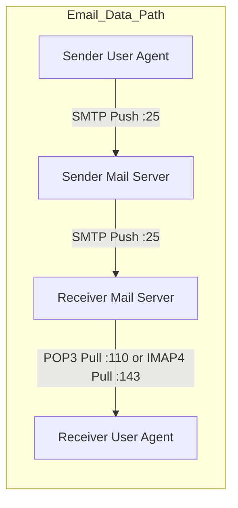

- **[[HTTP]]** (7:00)
- **[[DNS]]** (22:00)
- **[[SMTP and POP3]]** (20:00)
- **[[FTP]]** (6:00)
- [[port numbers]]

| **Port**    | **Protocol**    | **Purpose / Keyword Link**                 | **Memory Anchor**                                     |
| ----------- | --------------- | ------------------------------------------ | ----------------------------------------------------- |
| **20**      | **FTP Data**    | Delivering the actual payload payload      | 20 minutes to download files                          |
| **21**      | **FTP Control** | Directing and commanding the connection    | Must be **21** to be in control                       |
| **22**      | **SSH**         | **S**ecure **S**hell terminal              | **SS** $\rightarrow$ **22** (twin keys)               |
| **23**      | **Telnet**      | Old unencrypted remote terminal            | 1 step past SSH ($22 + 1 = 23$)                       |
| **25**      | **[[SMTP]]**    | **S*anta **M**ail **T**o **P**eople (Push) | Christmas Day mail (**Dec 25**)                       |
| **53**      | **[[DNS]]**     | Resolves hostnames to IP addresses         | **5** (Domain) + **3** (DNS) = **53**                 |
| **67 / 68** | **[[DHCP]]**    | Dynamic address assignment                 | Consecutive numbers **67** (Server) & **68** (Client) |
| **80**      | **[[HTTP]]**    | Standard unencrypted Web browsing          | Around the world in **80** clicks                     |
| **110**     | **[[POP3]]**    | Pulls and deletes mail from server         | **P-O-P** visually flips into **1-1-0**               |
| **143**     | **[[IMAP4]]**   | Synchronized server-side mail access       | **1-4-3** (_I Love Mail Synchronization_)             |

> [!theorem]
> **Out-of-Band Architecture of FTP:**  
> Unlike HTTP and SMTP (which send control headers and user data over the same TCP link, termed **In-Band**), FTP splits its operations across two distinct channels[cite: 2]:  
> 1. A persistent **Control Connection** on TCP Port 21 that stays open throughout the session[cite: 2].  
> 2. Dynamic, temporary **Data Connections** on TCP Port 20, spawned and torn down for each file payload[cite: 2].

> [!trap]
> - **SMTP** is exclusively a **Push protocol**; client user agents use it to send mail, and servers use it to relay mail across the internet[cite: 2]. It cannot pull mail down to a client[cite: 2].
> - **POP3 / IMAP4** are **Pull protocols** designed specifically for end-user mail retrieval[cite: 2].

> [!question]
> **Q:** Which pair of application-layer protocols utilizes **out-of-band** control signaling and supports **server-side multi-device folder synchronization**, respectively?  
> (A) HTTP and POP3  
> (B) FTP and IMAP4  
> (C) SMTP and IMAP4  
> (D) FTP and POP3  
>
> **Answer:** **(B)**  
> **Explanation:**  
> - **FTP** uses out-of-band signaling with separate ports: Port 21 for commands and Port 20 for data[cite: 2].  
> - **IMAP4** maintains mail on the server and provides folder synchronization across multiple user devices (unlike POP3, which downloads and removes mail locally)[cite: 1, 2].
