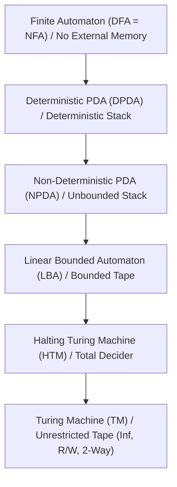

> [!definition]
> The **Computational Hierarchy of Automata** categorizes formal machines by their storage capabilities and head movement models[cite: 1]:
>
> $$\text{FA} < \text{DPDA} < \text{NPDA (PDA)} < \text{LBA} < \text{HTM (Decider)} < \text{TM}$$[cite: 1]

> [!theorem]
> ### Machine Equivalence and Memory Invariants
> 1. **DFA vs NFA:**
>    $\text{Power(DFA)} = \text{Power(NFA)}$[cite: 1]. Every NFA has an equivalent DFA via subset construction[cite: 1].
> 2. **DPDA vs NPDA:**
>    $\text{Power(DPDA)} < \text{Power(NPDA)}$[cite: 1]. Non-determinism strictly increases pushdown automata power[cite: 1].
>    - Example: Inherent ambiguous languages or even palindromes $L = \{w w^R\}$ require NPDA (guessing the midpoint) and cannot be recognized by any DPDA[cite: 1].
> 3. **Turing Machine Equivalences:**
>    - $\text{DTM} \cong \text{NTM}$ (Non-determinism does not increase TM language recognition power)[cite: 1].
>    - $\text{Multi-tape TM} \cong \text{Single-tape TM}$[cite: 1].
>    - $\text{Two-stack PDA} \cong \text{Turing Machine}$[cite: 1].
>    - $\text{Finite Automaton} + 2 \text{ stacks} \cong \text{Turing Machine}$[cite: 1].
> 4. **Degradation Restrictions on TM:**
>    - Read-only tape $\implies$ Machine degrades to a **Finite Automaton**[cite: 1].
>    - Unidirectional head $\implies$ Machine degrades to a **Finite Automaton**[cite: 1].
>    - Bounded tape (linearly bounded to input length) $\implies$ Machine degrades to an **LBA (Context-Sensitive)**[cite: 1].

> [!formula]
> ### Memory Architecture by Automaton Class
> | Automaton | Memory Structure | Bound / Capacity | Access Head | Recognized Language Class |
> | :--- | :--- | :--- | :--- | :--- |
> | FA | Finite Control States only[cite: 1] | 0 (No external memory)[cite: 1] | Read-only, 1-way[cite: 1] | Regular Languages[cite: 1] |
> | DPDA | 1 External Stack[cite: 1] | Infinite (LIFO)[cite: 1] | Read-only input, LIFO stack[cite: 1] | Deterministic CFLs (DCFL)[cite: 1] |
> | NPDA | 1 External Stack (Non-det)[cite: 1]| Infinite (LIFO)[cite: 1] | Read-only input, LIFO stack[cite: 1] | Context-Free Languages (CFL)[cite: 1] |
> | LBA | Linear Bounded Tape[cite: 1] | $k \cdot |w|$ (Bounded)[cite: 1] | Read/Write, 2-way[cite: 1] | Context-Sensitive (CSL)[cite: 1] |
> | HTM | Infinite Tape (Always Halts)[cite: 1]| Unbounded[cite: 1] | Read/Write, 2-way[cite: 1] | Recursive Languages (Decidable)[cite: 1] |
> | TM | Infinite Tape[cite: 1] | Unbounded[cite: 1] | Read/Write, 2-way[cite: 1] | Recursively Enumerable (RE)[cite: 1] |

$$\text{Regular} \subset \text{DCFL} \subset \text{CFL} \subset \text{CSL} \subset \mathbf{\text{Recursive (Decidable)}} \subset \mathbf{\text{RE (Recognizable)}}$$
- Every **Recursive** language is automatically a subset of **Recursively Enumerable (RE)** languages.
    
- Since **Recursive $\subset$ RE**, every language that is Decidable (Recursive) is by definition also **Recognizable (RE)**.
    
- Therefore, if a language $L$ is recursive, **$L$ is recognizable**
> [!trap]
> **Empty Stack vs Final State Acceptance:**
> - For **NPDA (General PDA)**: Acceptance by final state $\equiv$ Acceptance by empty stack[cite: 1]. Both recognize all Context-Free Languages[cite: 1].
> - For **DPDA**: Empty stack acceptance is **strictly weaker** than final state acceptance[cite: 1]. A language accepted by a DPDA via empty stack must satisfy the *prefix-free property* ($w \in L \implies w x \notin L \text{ for } x \ne \epsilon$).

> [!question]
> **IOCL CBT Practice Question:**
> An automaton composed of a finite state control unit linked to two independent, unbounded LIFO stacks has computational power equivalent to:
> (A) Pushdown Automata
> (B) Linear Bounded Automata
> (C) Turing Machine
> (D) Finite Automata
>
> **Answer:** (C)
> **Step-by-Step Explanation:**
> 1. A single stack enables tracking one LIFO data stream (Context-Free power)[cite: 1].
> 2. Two independent stacks can simulate an infinite two-way tape: Stack 1 holds the tape symbols to the left of the head, and Stack 2 holds the tape symbols to the right of the head[cite: 1].
> 3. Shifting the read/write head left or right corresponds to popping from one stack and pushing onto the other[cite: 1].
> 4. Therefore, an FA with 2 stacks is computationally equivalent to a Turing Machine[cite: 1].
