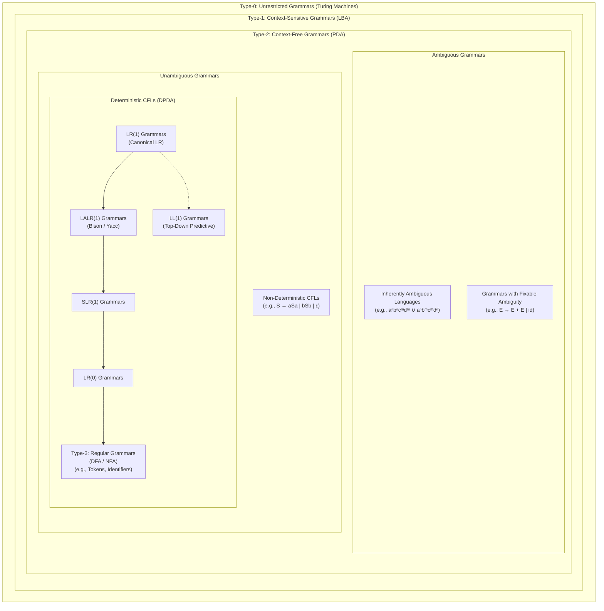

> [!definition]
> - **Bottom-Up Parser**: Shifts input symbols onto a parse stack until a valid RHS pattern matches a production, then **reduces** the handle to its LHS non-terminal (Reverse of Rightmost Derivation in reverse, RMD).
> - **Handle**: A substring matching the RHS of a production whose reduction represents one step along the reverse of an RMD.

```mermaid
flowchart BT
    LR0["LR(0)\n(No Lookahead)"] --> SLR1["SLR(1)\n(Follow-Based Lookahead)"]
    SLR1 --> LALR1["LALR(1)\n(Merged Core Lookahead)"]
    LALR1 --> CLR1["CLR(1) / LR(1)\n(Full Context Lookahead)"]
    LL1["LL(1) (Top-Down)"] -.->|Weaker than CLR(1)| CLR1
```


> [!theorem]
> **The Expressive Power Hierarchy**:
> $$\mathcal{L}(LR(0)) \subset \mathcal{L}(SLR(1)) \subset \mathcal{L}(LALR(1)) \subset \mathcal{L}(CLR(1))$$
> - Every $LL(1)$ grammar without $\epsilon$-productions is an $LR(1)$ grammar.
> - For unambiguous grammars: CLR(1) can parse all unambiguous deterministic context-free languages.
> - Table Size: Number of states in $LR(0) = \text{States in } SLR(1) = \text{States in } LALR(1) < \text{States in } CLR(1)$.

| Parser Family | Parsing Style | Derivation | Lookahead | Parsing Table Construction Base | Conflict Types Possible |
| :--- | :--- | :--- | :--- | :--- | :--- |
| **$LL(1)$** | Top-Down | LMD | 1 symbol | First and Follow sets | First-First, First-Follow |
| **$LR(0)$** | Bottom-Up | Reverse RMD | 0 symbols | $LR(0)$ Item Collections | Shift-Reduce, Reduce-Reduce |
| **$SLR(1)$** | Bottom-Up | Reverse RMD | 1 symbol ($\text{FOLLOW}$) | $LR(0)$ Items + Follow of LHS | Shift-Reduce, Reduce-Reduce |
| **$LALR(1)$** | Bottom-Up | Reverse RMD | 1 symbol (Lookaheads) | Merged $LR(1)$ cores | Reduce-Reduce (never SR) |
| **$CLR(1)$** | Bottom-Up | Reverse RMD | 1 symbol (Full context) | Canonical $LR(1)$ Items | Shift-Reduce, Reduce-Reduce |

> [!trap]
> Merging states with identical $LR(0)$ cores to form $LALR(1)$ from $CLR(1)$ **can NEVER introduce a Shift-Reduce (SR) conflict**. However, it **CAN introduce a Reduce-Reduce (RR) conflict**.

> [!question]
> Which of the following statements regarding Bottom-Up parsers is strictly FALSE?
> - (A) $CLR(1)$ parsers have more states than $LALR(1)$ parsers for the same grammar.
> - (B) If a grammar has an SR conflict in $LALR(1)$, then it must also have an SR conflict in $CLR(1)$.
> - (C) Merging states to construct $LALR(1)$ can introduce an SR conflict where none existed in $CLR(1)$.
> - (D) $SLR(1)$ places reduction entries only under the $\text{FOLLOW}$ of the non-terminal being reduced.
>
> **Correct Option**: **(C)**
> **Explanation**: Core merging in $LALR(1)$ cannot create SR conflicts because shifts depend solely on the next input terminal regardless of lookaheads. It can only combine distinct lookaheads of two different reduction items, potentially triggering an RR conflict.
