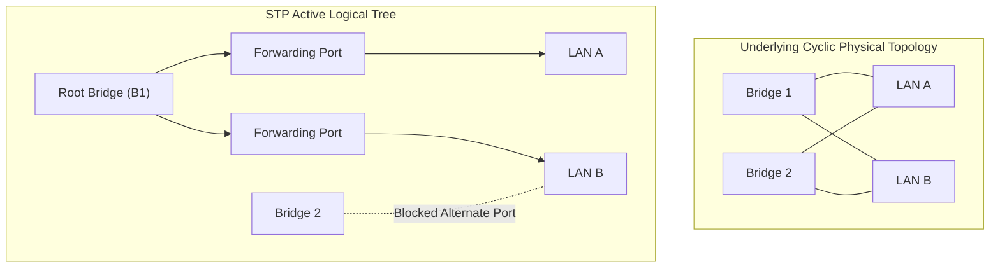

## Transparent Bridging and Spanning Tree Protocol (STP)

Redundant physical links between bridges prevent network disconnection during link failures, but introduce **bridging loops** that cause broadcast storms and duplicate frame deliveries[cite: 1].

> [!definition] STP Elements (IEEE 802.1D)
> 1. **Root Bridge**: The single logical center of the spanning tree, elected as the bridge with the lowest Bridge Identifier (Bridge ID = Priority + MAC address)[cite: 1].
> 2. **Root Port (RP)**: Present on every non-root bridge; the single port providing the lowest path cost to the root bridge[cite: 1].
> 3. **Designated Bridge**: For each LAN segment, the bridge offering the minimum path cost to the root bridge[cite: 1].
> 4. **Designated Port (DP)**: The port through which the designated bridge connects to that LAN segment[cite: 1].
> 5. **Blocked / Alternate Port**: All ports that are neither Root Ports nor Designated Ports are placed into a blocking state to eliminate loops[cite: 1].

### Port Roles and Forwarding Rules

* **Forwarding State**: All Root Ports and Designated Ports[cite: 1].
* **Blocking State**: All redundant, non-designated ports[cite: 1]. Blocked ports discard incoming data traffic but continue listening to Bridge Protocol Data Units (BPDUs) to enable rapid failover[cite: 1].
