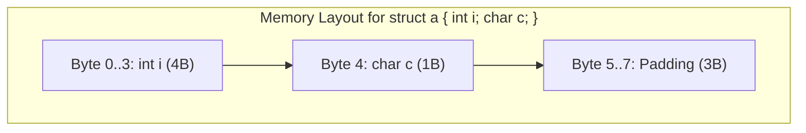

> [!definition] Natural Memory Alignment
> To minimize memory bus cycles and optimize CPU cache access, modern computer architectures enforce **data alignment**[cite: 1]:
> * Every primitive variable of size $S$ bytes must start at a memory address that is evenly divisible by $S$ ($\text{Address} \pmod S == 0$)[cite: 1].
> * If the next available memory byte is not a multiple of $S$, the compiler inserts unused spacer bytes called **padding**[cite: 1].

### Primary Alignment Rules

1. **Member Alignment Rule:** Every individual member inside a structure must begin at an offset divisible by its own individual size:
   * `char` (1 Byte): Aligns to any byte ($0, 1, 2, 3, \dots$)[cite: 1].
   * `short` (2 Bytes): Aligns to even addresses ($0, 2, 4, 6, \dots$)[cite: 1].
   * `int` / `float` (4 Bytes): Aligns to multiples of 4 ($0, 4, 8, 12, \dots$)[cite: 1].
   * `long` / `double` / `pointers` (8 Bytes on 64-bit systems): Aligns to multiples of 8 ($0, 8, 16, 24, \dots$)[cite: 1].
2. **Total Structure Alignment Rule:** The total size of the entire `struct` must be a multiple of the size of the **largest individual member**[cite: 1].
   * Trailing padding bytes are appended to the end of the structure to satisfy this requirement so that arrays of this structure preserve natural alignment across consecutive elements[cite: 1].

