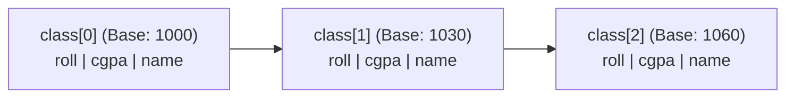

> [!definition] Array of Structures
> An **array of structures** is a contiguous collection where each element is an entire structure record[cite: 1].
> * Unlike primitive arrays (e.g., `int a[10]`, where `a` decays to a pointer to an `int`), for an individual structure variable `struct book b1`, `b1` is **not** a pointer—it represents the entire compound memory block[cite: 1].
> * An array of structures `struct book b[10]` decays to a pointer of type `struct book *`[cite: 1].

```c
struct book {
    char title[20];
    float pages;
};

/* Array declaration and aggregate initialization */
struct book b2[3] = {
    {"C Programming", 205.0},
    {"OS Concepts", 305.5},
    {"Algorithms", 405.0}
};
```

### Pointers to Arrays of Structures and Pointer Arithmetic



Given:
```c
typedef struct {
    int roll;
    float cgpa;
    char name[22];
} std;

std class[10];
std *ptr = class; /* ptr points to class[0] at address 1000 */
```

* **Pointer Scale Invariant:** Adding an integer $k$ to a structure pointer scales by the size of the entire structure:
  $$\text{Target Address} = ptr + k \times \text{sizeof}(\text{std})$$
* **Access expressions for element 0:**
  $$ptr\to roll \equiv (*ptr).roll \equiv class[0].roll \text{[cite: 1]}$$
* **Access expressions for element 1:**
  $$(ptr + 1)\to roll \equiv (*(ptr + 1)).roll \equiv class[1].roll \text{[cite: 1]}$$
* **Evaluation of `(ptr++)->roll`:**
  Postfix `++` returns the original value of `ptr`, evaluates `ptr->roll`, and as a side effect increments `ptr` by $\text{sizeof}(\text{std})$ to point to the next structure index in the array[cite: 1].
* **Evaluation of `++ptr->roll` vs. `++(ptr->roll)`:**
  Since `->` has higher precedence than prefix `++`, `++ptr->roll` parses as `++(ptr->roll)`, directly incrementing the numerical value of `roll` inside the currently pointed structure[cite: 1].
