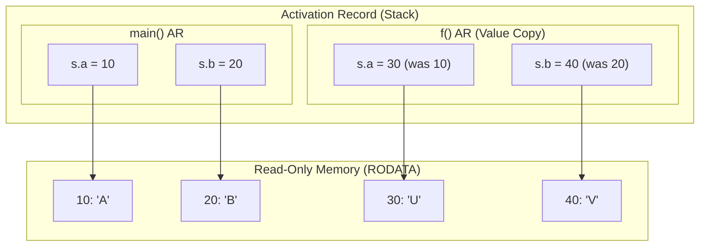

> [!question] Pointer Members and Stack vs. Read-Only Memory
> Consider the execution trace and memory layout of the following structure containing pointer members[cite: 1]:
> 
> ```c
> typedef struct {
>     char *a;
>     char *b;
> } S;
> 
> void f(S s) {
>     s.a = "U";
>     s.b = "V";
>     printf("%s, %s\n", s.a, s.b);
> }
> 
> int main() {
>     S s = {"A", "B"};
>     printf("%s, %s\n", s.a, s.b);
>     f(s);
>     printf("%s, %s\n", s.a, s.b);
>     return 0;
> }
> ```
> 
> **Step-by-Step Trace:**
> 1. In `main()`, `s` is initialized such that `s.a` points to `"A"` (address 10 in Read-Only String Literal Memory) and `s.b` points to `"B"` (address 20)[cite: 1].
> 2. First `printf`: outputs `A, B`[cite: 1].
> 3. `f(s)` is invoked. In C, structures are passed by **value**[cite: 1]. A copy of `s` is allocated in the activation record (stack frame) of `f`[cite: 1].
> 4. Inside `f()`, the local copy's pointers are updated: `s.a` points to `"U"` (address 30) and `s.b` points to `"V"` (address 40)[cite: 1].
> 5. Second `printf` (inside `f`): outputs `U, V`[cite: 1].
> 6. `f()` terminates, popping its activation record[cite: 1]. The caller's `s` inside `main()` remains completely untouched[cite: 1].
> 7. Third `printf` (inside `main`): outputs `A, B`[cite: 1].
> 
> **Output:**
> ```text
> A, B
> U, V
> A, B
> ```


