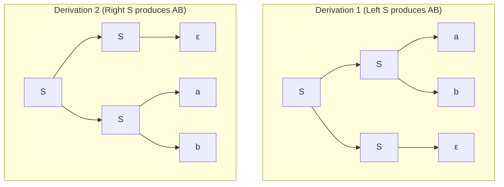

w> [!definition]
> - **Ambiguous Grammar:** A Context-Free Grammar (CFG) is ambiguous if there exists at least one string $w \in L(G)$ for which there can be derived[cite: 1]:
>   - More than one distinct Parse Tree (Derivation Tree)[cite: 1], or
>   - More than one distinct Leftmost Derivation (LMD)[cite: 1], or
>   - More than one distinct Rightmost Derivation (RMD)[cite: 1].

> [!theorem]
> ### Structural Signatures of Ambiguity
> 1. **Immediate Self-Adjacency:**
>    Any grammar with productions of the form $S \to SS \mid \dots$ where $S$ can also derive $\epsilon$ ($S \to \epsilon$) is **guaranteed to be ambiguous**[cite: 1].
>    *(Reason: Deriving any string $w$ can be done either from the left non-terminal via $S \to (w)(\epsilon)$ or from the right non-terminal via $S \to (\epsilon)(w)$, yielding two distinct parse trees[cite: 1].)*
> 2. **Dangling Else & Algebraic Expressions:**
>    $E \to E + E \mid E * E \mid \text{id}$ is ambiguous due to lack of specified precedence and associativity.

> [!formula]
> ### Palindrome Grammar Reference Summary
> | Production Form | Terminal Set | Set Generated | Proof / Notes |
> | :--- | :--- | :--- | :--- |
> | $S \to aSa \mid bSb \mid a \mid b$ | Base: $a, b$ | **Odd-length Palindromes**[cite: 1] | Minimum string has length 1 ($a$ or $b$); grows by $+2$[cite: 1] |
> | $S \to aSa \mid bSb \mid \epsilon$ | Base: $\epsilon$ | **Even-length Palindromes**[cite: 1] | Minimum string is $\epsilon$ (length 0); grows by $+2$[cite: 1] |
> | $S \to aSa \mid bSb \mid a \mid b \mid \epsilon$ | Base: $a, b, \epsilon$ | **All Palindromes**[cite: 1] | Generates union of odd and even palindromes[cite: 1] |

> [!trap]
> **The "Starts and Ends with Same Symbol" Trap:**
> Do not confuse $S \to aSa \mid bSb \mid a \mid b$ with the language *"strings that start and end with the same symbol"*[cite: 1]:
> - The grammar guarantees **internal nested mirror equality** ($w = w^R$, e.g., $a b b a$)[cite: 1].
> - A string like $a a b$ starts and ends with $a$, but cannot be generated by this grammar[cite: 1].
> - The grammar generates **strictly odd-length palindromes**[cite: 1].

> [!question]
> **IOCL CBT Practice Question:**
> Which of the following grammars generates precisely the language $L = \{w \in \{a, b\}^* \mid |w| \pmod 2 \ne 0 \text{ and } w = w^R\}$?
> (A) $S \to aSa \mid bSb \mid \epsilon$
> (B) $S \to aSa \mid bSb \mid a \mid b$
> (C) $S \to aSb \mid bSa \mid a \mid b$
> (D) $S \to aaS \mid bbS \mid \epsilon$
>
> **Answer:** (B)
> **Step-by-Step Explanation:**
> 1. Condition: $|w| \pmod 2 \ne 0 \implies$ Odd length[cite: 1]; $w = w^R \implies$ Palindrome[cite: 1].
> 2. Minimum odd palindrome strings are $a$ and $b$ (length 1)[cite: 1].
> 3. Expansions add matching pairs at both ends ($aSa$ or $bSb$), ensuring the length increases by 2 each time ($1 \to 3 \to 5 \dots$)[cite: 1].
> 4. Option (B) matches these criteria[cite: 1]. Option (A) generates only even-length palindromes ($\epsilon, aa, bb, \dots$)[cite: 1].
