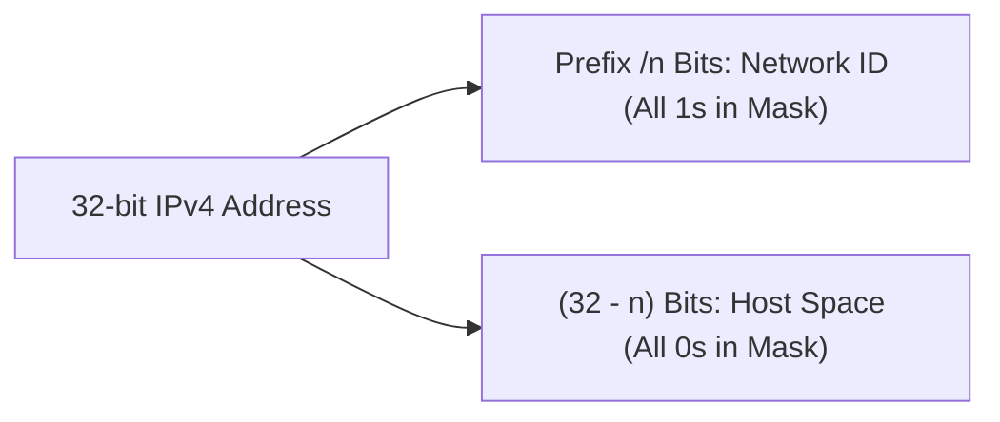

> [!definition]
> **Classless Inter-Domain Routing (CIDR)** replaces class-based boundaries with an arbitrary prefix notation `/n`, where $n$ indicates the number of continuous masked network bits[cite: 1, 2].

> [!formula]
> Given an IP block in notation $W.X.Y.Z/n$:
> 1. $\text{Host Bits } (h) = 32 - n$[cite: 1]
> 2. $\text{Total IP Addresses} = 2^{32 - n} = 2^h$[cite: 1]
> 3. $\text{Usable Host Addresses} = 2^{32 - n} - 2$[cite: 1]
> 4. $\text{Block Size} = 256 - \text{Interesting Octet Mask Value}$
> 5. **Subnet ID Extraction:**
>    $$\text{Subnet ID} = \text{IP Address } \mathbf{AND} \text{ Subnet Mask}$$

| CIDR Prefix | Subnet Mask (Last Non-Zero Octet) | Usable Hosts ($2^h - 2$) |
| :--- | :--- | :--- |
| **/24** | `... .0` | $2^8 - 2 = 254$ |
| **/25** | `... .128` | $2^7 - 2 = 126$ |
| **/26** | `... .192` | $2^6 - 2 = 62$[cite: 1] |
| **/27** | `... .224` | $2^5 - 2 = 30$[cite: 1] |
| **/28** | `... .240` | $2^4 - 2 = 14$ |
| **/29** | `... .248` | $2^3 - 2 = 6$ |
| **/30** | `... .252` | $2^2 - 2 = 2$ |

> [!trap]
> The first address ($\text{Host bits} = \text{all } 0$) and the last address ($\text{Host bits} = \text{all } 1$) cannot be assigned to interfaces[cite: 1, 2]. The last **assignable host** has its host bits as all $1$s followed by a final $0$[cite: 1].

> [!question]
> **Q:** Given the CIDR block `192.168.10.144/27`, what is the last usable IP address that can be assigned to a host?  
> (A) `192.168.10.159`  
> (B) `192.168.10.158`  
> (C) `192.168.10.160`  
> (D) `192.168.10.157`  
>
> **Answer:** **(B)**  
> **Explanation:**  
> 1. Prefix is $/27 \implies 32 - 27 = 5\text{ host bits}$[cite: 1]. Subnet increment $= 2^5 = 32$.  
> 2. Look at 4th octet: $144_{10} = 10010000_2$.  
>    The first 3 bits belong to the network ($100$), and the remaining 5 bits are host bits ($10000$)[cite: 1].  
> 3. Subnet Base NID $= 10000000_2 = 128$[cite: 1].  
>    Next Subnet Base $= 128 + 32 = 160$.  
>    Direct Broadcast Address (all host bits 1) $= 10011111_2 = 159$[cite: 1].  
> 4. Last assignable host address is $\text{DBA} - 1$:  
>    $$192.168.10.(159 - 1) = \mathbf{192.168.10.158}$$[cite: 1]
