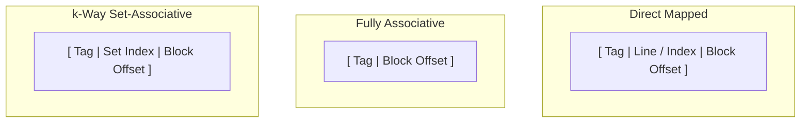

> [!definition]
> Cache mapping determines how blocks from Main Memory are assigned to lines within the faster, smaller Cache memory.
> - **Direct Mapped**: Each memory block maps to exactly one cache line.
> - **Fully Associative**: A memory block can map to any line in the cache.
> - **$k$-Way Set-Associative**: Cache lines are grouped into sets of $k$ lines. A memory block maps to a specific set, but can occupy any line within that set.

> [!formula]
> **Universal Address Bit Equations**:
> - Physical Address Bits: $N = \log_2(\text{Main Memory Size in bytes})$
> - Block Offset Bits: $w = \log_2(\text{Block Size in bytes})$
> - Total Cache Lines: $C_L = \frac{\text{Cache Size}}{\text{Block Size}}$
>
> **Direct Mapping**:
> - Line Bits: $r = \log_2(C_L)$
> - Tag Bits: $t = N - (r + w)$
> - Hardware Comparators: $1$
>
> **Fully Associative Mapping**:
> - Line / Index Bits: $0$
> - Tag Bits: $t = N - w$
> - Hardware Comparators: $C_L$
>
> **$k$-Way Set-Associative Mapping**:
> - Total Sets: $S = \frac{C_L}{k} = \frac{\text{Cache Size}}{k \times \text{Block Size}}$
> - Set Index Bits: $d = \log_2(S)$
> - Tag Bits: $t = N - (d + w)$
> - Hardware Comparators: $k$ (each of width $t$)
> - Tag Directory Size: $C_L \times (\text{Tag Bits} + \text{Status Bits})$

| Mapping Type | Line/Set Bits | Tag Bits Formula | Hardware Comparators | Conflict Misses |
| :--- | :--- | :--- | :--- | :--- |
| **Direct** | $\log_2(C_L)$ | $N - (\log_2 C_L + w)$ | $1$ | High (Thrashing) |
| **$k$-Way Set-Assoc** | $\log_2(S)$ | $N - (\log_2 S + w)$ | $k$ | Very Low |
| **Fully Assoc** | $0$ | $N - w$ | $C_L$ | Zero |

> [!trap]
> In $k$-way set-associative caches, the number of hardware comparators needed equals **$k$** (the set size/associativity), **NOT** the total number of sets $S$ or total cache lines $C_L$.

> [!question]
> A byte-addressable computer has 16 GB of main memory and a 512 KB 4-way set-associative cache with a block size of 64 bytes. What is the size of the Tag field in bits?
> - (A) 15 bits
> - (B) 17 bits
> - (C) 19 bits
> - (D) 21 bits
>
> **Correct Option**: **(B)**
> **Step-by-Step Calculation**:
> 1. Total Physical Address bits $N$:
>    $$16\text{ GB} = 2^4 \times 2^{30}\text{ B} = 2^{34}\text{ B} \implies N = 34\text{ bits}$$
> 2. Block offset bits $w$:
>    $$64\text{ B} = 2^6\text{ B} \implies w = 6\text{ bits}$$
> 3. Total cache lines $C_L$:
>    $$C_L = \frac{512\text{ KB}}{64\text{ B}} = \frac{2^{19}\text{ B}}{2^6\text{ B}} = 2^{13}\text{ lines}$$
> 4. Total sets $S$ (for $k = 4 = 2^2$):
>    $$S = \frac{2^{13}}{2^2} = 2^{11}\text{ sets} \implies d = 11\text{ bits}$$
> 5. Tag bits $t$:
>    $$t = N - (d + w) = 34 - (11 + 6) = 34 - 17 = \mathbf{17\text{ bits}}$$
