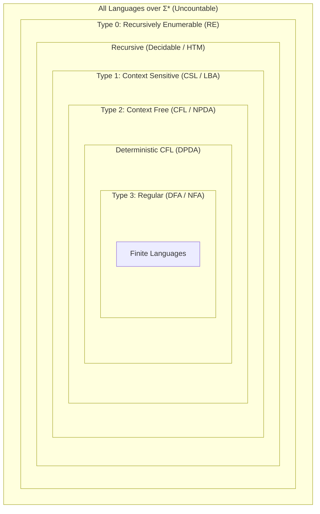

> [!definition]
> The **Chomsky Hierarchy** organizes formal languages into four nested types:
>
> $$\text{Regular (Type 3)} \subset \text{DCFL} \subset \text{CFL (Type 2)} \subset \text{CSL (Type 1)} \subset \text{Recursive (Decidable)} \subset \text{RE (Type 0)}$$

> [!theorem]
> ### Cross-Language Operation Invariants
> 1. **Interaction with Regular Languages:**
>    - Regular languages act as an algebraic sponge under intersection:
>      $$\text{CFL} \cap \text{Regular} = \text{CFL}$$
>      $$\text{DCFL} \cap \text{Regular} = \text{DCFL}$$
> 2. **Operations Between a Language and Its Complement:**
>    If $L_1$ is Regular and $L_2$ is Non-Regular, their union ($L_1 \cup L_2$), intersection ($L_1 \cap L_2$), and concatenation ($L_1 \cdot L_2$) **may be either Regular or Non-Regular**.
>    - *Counterexample (Regular Union):* Let $L_1 = (a+b)^*$ (Regular) and $L_2 = \{a^n b^n\}$ (Non-regular) $\implies L_1 \cup L_2 = (a+b)^*$ (Regular).
>    - *Counterexample (Regular Intersection):* Let $L_1 = \phi$ (Regular) and $L_2 = \{a^n b^n\}$ (Non-regular) $\implies L_1 \cap L_2 = \phi$ (Regular).
>    - *Counterexample (Regular Concatenation):* Let $L_1 = \phi$ (Regular) and $L_2 = \{a^n b^n\}$ (Non-regular) $\implies L_1 \cdot L_2 = \phi$ (Regular).
>    - **Rule:** A statement claiming that an operation between a Regular and a Non-Regular language is *necessarily Non-Regular* is **False**.

> [!formula]
> ### Master Closure Property Matrix
> | Operation | Regular (Type 3) | DCFL | CFL (Type 2) | CSL (Type 1) | Recursive | RE (Type 0) |
> | :--- | :---: | :---: | :---: | :---: | :---: | :---: |
> | Union ($L_1 \cup L_2$) | Yes | **No** | Yes | Yes | Yes | Yes |
> | Intersection ($L_1 \cap L_2$) | Yes | **No** | **No** | Yes | Yes | Yes |
> | Complement ($\overline{L}$) | Yes | **Yes** | **No** | Yes | **Yes** | **No** |
> | Concatenation ($L_1 L_2$) | Yes | **No** | Yes | Yes | Yes | Yes |
> | Kleene Closure ($L^*$) | Yes | **No** | Yes | Yes | Yes | Yes |
> | Intersection with Reg | Yes | Yes | Yes | Yes | Yes | Yes |
1. **Regular $\to$ "The Sponge / The Chad":**
    
    - **ALL YES** for everything (Union, Concat, Star, Complement, Intersection).
        
2. **DCFL $\to$ "The Lonely Complement":**
    
    - Only **Complement is YES**.
        
    - Everything else ($\cup, \cap, \cdot, *$) is **NO**.
        
3. **CFL $\to$ "UCK vs. IC":**
    
    - **UCK** (Union, Concat, Kleene Star) is **YES**.
        
    - **IC** (Intersection, Complement) is **NO**.

|**Type**|**Operations**|**Acronym**|**Closed?**|
|---|---|---|---|
|**Grammar Operations**|**J**oin (Concat), **U**nion, **S**tar, **T**urn (Reversal)|**JUST**|**YES**|
|**Logic / Set Operations**|**N**egate (Complement), **O**verlap (Intersection)|**NO**|**NO**|

1. **Recursive $\to$ "The Decider / Clean Brain":**
    
    - **ALL YES** for everything (Union, Concat, Star, Complement, Intersection).
        
2. **RE (Type 0) $\to$ "The Loop Trap":**
    
    - **ALL YES, EXCEPT Complement** (Complement is **strictly NO** because an infinite loop cannot be inverted).
> [!trap]
> **The Complement Asymmetry Traps:**
> 3. **CFL Complement Trap:** CFLs are **not closed** under complement. However, DCFLs are **strictly closed** under complement.
> 4. **RE Complement Theorem:**
>    - If $L$ is Recursive $\implies \overline{L}$ is strictly Recursive.
>    - If $L$ is RE and $\overline{L}$ is also RE $\implies L$ is **strictly Recursive (Decidable)**.
>    - If $L$ is RE but not Recursive (e.g., $A_{\text{TM}}$) $\implies \overline{L}$ is **strictly Non-RE**.

> [!question]
> **IOCL CBT Practice Question:**
> If language $L_1$ is regular and language $L_2$ is context-free, which of the following statements is unconditionally guaranteed to be true?
> (A) $L_1 \cap L_2$ is always regular
> (B) $L_1 \cap L_2$ is always context-free
> (C) $L_1 \cup L_2$ is always regular
> (D) $L_2 - L_1$ is not context-free
>
> **Answer:** (B)
> **Step-by-Step Explanation:**
> 5. By the cross-product construction of a PDA with a DFA, a Pushdown Automaton can track its stack while simulating DFA state transitions using its finite control.
> 6. Thus, the intersection of any Context-Free Language with a Regular Language is guaranteed to be a Context-Free Language ($L_{\text{CFL}} \cap L_{\text{REG}} = L_{\text{CFL}}$).
> 7. The result may be regular (e.g., if $L_1 = \phi$), but it is always context-free because every regular language is also context-free.
> 8. Therefore, statement (B) is guaranteed to hold.
