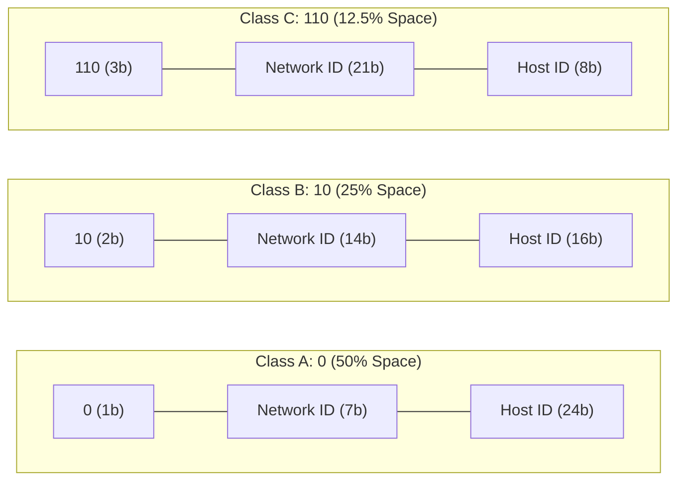

> [!definition] Classful Addressing
> In classful addressing, the entire $32$-bit IPv4 address space ($2^{32}$ total addresses) is partitioned into five distinct classes: Class A, Class B, Class C, Class D, and Class E.
> * The leading bits of the first byte determine both the class and the division boundary between Network ID and Host ID.
> * The leading bit patterns form a prefix-free Huffman-style code, ensuring mutually exclusive and unambiguous classification.

> [!theorem] Classful Allocation Matrix

| Class       | Fixed Leading Bits | 1st Byte Decimal Range | Network ID Bits          | Host ID Bits  | Total Networks                    | Total Addresses per Network        | Usable Hosts per Network |
| :---------- | :----------------- | :--------------------- | :----------------------- | :------------ | :-------------------------------- | :--------------------------------- | :----------------------- |
| **Class A** | `0`       | $0 - 127$     | $8$             | $24$ | $2^7 = 128$              | $2^{24} = 16{,}777{,}216$ | $2^{24} - 2$    |
| **Class B** | `10`      | $128 - 191$   | $16$            | $16$ | $2^{14} = 16{,}384$      | $2^{16} = 65{,}536$       | $2^{16} - 2$    |
| **Class C** | `110`     | $192 - 223$   | $24$            | $8$  | $2^{21} = 2{,}097{,}152$ | $2^8 = 256$               | $2^8 - 2 = 254$ |
| **Class D** | `1110`    | $224 - 239$   | N/A (Multicast) | N/A  | $1$ Group Space          | $2^{28}$ addresses        | N/A             |
| **Class E** | `1111`    | $240 - 255$   | N/A (Reserved)  | N/A  | $1$ Reserved Space       | $2^{28}$ addresses        | N/A             |

 Quick Recall Matrix

|  Prefix  | Octet Value | Primary $O(1)$ Anchor             | Secondary Mental Hook      |
| :------: | :---------: | :-------------------------------- | :------------------------- |
|  **10**  |   **128**   | **Class B**                       | Standard MSB value ($2^7$) |
| **110**  |   **192**   | **Common Home Router IP** Class C | `192.168.x.x` prefix       |
| **1110** |   **224**   | **Class D Multicast Base**        | 4 22                       |
| **1111** |   **240**   | **Class E Experimental Base**     | 2 4 0                      |

---

> [!trap] Class D and E Purpose
> Class D addresses are reserved for **multicast groups** and do not define standard host IDs. Class E addresses are reserved for **future/experimental use**. Neither class is assigned to individual network host interfaces.
