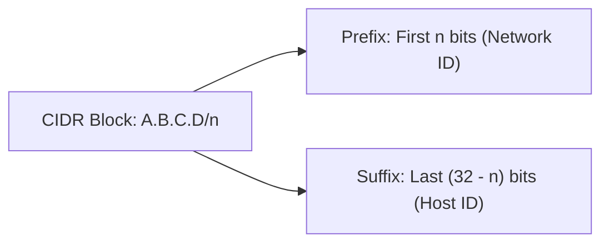

> [!definition] Classless Inter-Domain Routing (CIDR)
> Classless addressing abolishes rigid class boundaries ($/8$, $/16$, $/24$), allowing variable-length network prefixes to match exact organization requirements[cite: 1, 2].
> * Network blocks are defined in slash (slash notation) format: `A.B.C.D/n`.
> * $n$ specifies the exact number of contiguous leading bits assigned to the **Network Prefix**.
> * The remaining $32 - n$ bits specify the **Host ID**.

> [!formula] CIDR Block Sizing
> For an address block defined with prefix length $n$:
> 1. $\text{Host Bits } h = 32 - n$
> 2. $\text{Total IP Addresses} = 2^{32 - n} = 2^h$
> 3. $\text{Total Usable Host Addresses} = 2^{32 - n} - 2 = 2^h - 2$
> 4. $\text{Network Address} = \text{Set all } (32 - n) \text{ host bits to } 0$
> 5. $\text{Direct Broadcast Address} = \text{Set all } (32 - n) \text{ host bits to } 1$

> [!trap] Why Classful Addressing Failed
> Classful addressing resulted in massive address waste:
> * Class A allocated $2^{24} - 2 \approx 16.7\text{ million}$ hosts per company (far too large, leaving millions unused).
> * Class C allocated only $2^8 - 2 = 254$ hosts (too small for mid-sized organizations).
> * There was no middle ground, creating rapid exhaustion of Class B address spaces.
