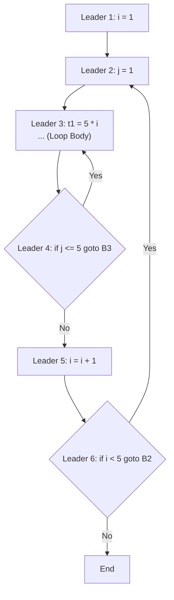

> [!definition]
> - **Basic Block**: A maximal sequence of consecutive 3AC instructions where control enters **exclusively at the first statement** (the Leader) and leaves **exclusively at the final statement**, with no intervening branch targets.
> - **Control Flow Graph (CFG)**: A directed graph whose nodes are basic blocks and whose edges represent control transfers.

> [!formula]
> **Leader Identification Algorithm**:
> 1. **Rule 1**: The first instruction of the 3AC program is a Leader.
> 2. **Rule 2**: Any statement that is the target of a conditional or unconditional branch (`goto L`) is a Leader.
> 3. **Rule 3**: Any statement that immediately follows a conditional or unconditional branch is a Leader.



> [!theorem]
> **High-Yield Classical Optimizations**:
> - **Constant Folding**: Evaluating expressions with known compile-time constants (e.g., $x = 3 * 4 \to x = 12$).
> - **Constant / Copy Propagation**: Propagating assigned constants or variables to subsequent uses (e.g., $x = 3; \; y = x + 2 \to y = 3 + 2 \to 5$).
> - **Strength Reduction**: Replacing computationally expensive operations with cheaper hardware equivalents (e.g., $x * 2 \to x + x$ or $x \ll 1$; division $x / 8 \to x \gg 3$).
> - **Common Subexpression Elimination (CSE)**: Identifying identical expressions using Directed Acyclic Graphs (DAGs) and reusing the precomputed result.
> - **Loop Invariant Computation (Code Motion)**: Hoisting statements whose operands remain unchanged across iterations outside of the loop header.
> - **Loop Unrolling**: Expanding the loop body to reduce branching overhead and index arithmetic at the expense of code size.
> - **Dead Code Elimination**: Removing computations whose results are never read on any subsequent execution path.

> [!trap]
> In Strength Reduction, replacing multiplication by a constant power of two with a left-shift ($x * 2^k \to x \ll k$) is valid for unsigned integers, but requires signed bit extension verification for signed types.

> [!question]
> Identify the optimizations applicable to the following intermediate code fragment:
> ```c
> for (i = 0; i < 100; i++) {
>     x = 5 * 2;
>     A[i] = x * i;
> }
> ```
> - (A) Dead Code Elimination and Inlining only
> - (B) Constant Folding, Code Motion (Loop Invariant), and Strength Reduction
> - (C) Register Renaming and Peephole Reordering
> - (D) Loop Jamming only
>
> **Correct Option**: **(B)**
> **Explanation**:
> 1. `x = 5 * 2` folds to `x = 10` (**Constant Folding**).
> 2. `x = 10` is constant across loop iterations, allowing it to be hoisted before the loop header (**Code Motion**).
> 3. Inside the array index calculation, `10 * i` can be calculated by successive additions ($+10$) across iterations (**Strength Reduction on Induction Variable**).
