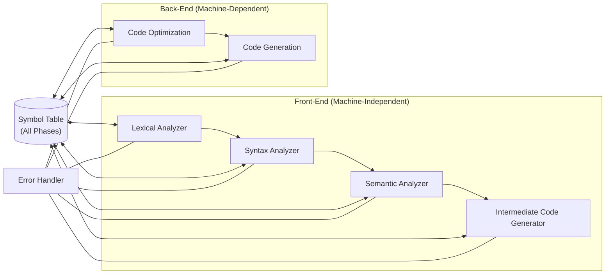

> [!definition]
> A **Compiler** translates a High-Level Language (which can perform multiple operations in a single statement) into a Low-Level Language (which performs at most one operation per statement).

| Phase | Formal Model | Input | Output | Primary Function | Common Errors Detected |
| :--- | :--- | :--- | :--- | :--- | :--- |
| **Lexical Analyzer** | DFA / Regular Grammar | Character stream | Token stream | Token recognition, strip comments/whitespace | Invalid character, malformed identifier |
| **Syntax Analyzer** | DPDA / Context-Free Grammar | Token stream | Parse tree | Verifies grammatical structure | Missing parenthesis, unbalanced syntax |
| **Semantic Analyzer** | Attribute Grammar | Parse tree | Annotated parse tree | Verifies program meaning, types, and scope | Type mismatch, undeclared variable |
| **Intermediate Code Gen** | Syntax-Directed Translation | Annotated parse tree | 3AC / SSA / Postfix / DAG | Bridges front-end and back-end for portability | Memory bounds (static checks) |
| **Code Optimization** | Control & Data Flow Graphs | Raw 3AC | Optimized 3AC | Enhances time and space efficiency | Unreachable dead code blocks |
| **Code Generation** | Dynamic Programming / Matchers | Optimized 3AC | Assembly / Machine Code | Register allocation and instruction scheduling | Hardware resource exhaustion |

> [!theorem]
> **Symbol Table Invariant**: The Symbol Table stores metadata (identifier names, types, scope, address bounds). It is a shared data structure accessed across **all six phases** of compilation.

> [!question]
> Which phase of the compiler is primarily modeled using a Deterministic Pushdown Automaton (DPDA)?
> - (A) Lexical Analyzer
> - (B) Syntax Analyzer
> - (C) Semantic Analyzer
> - (D) Code Optimizer
>
> **Correct Option**: **(B)**
> **Explanation**: The Syntax Analyzer (Parser) analyzes Context-Free Grammars (specifically deterministic subsets like LL or LR) and is mathematically modeled as a DPDA. The Lexical Analyzer is modeled as a DFA.
