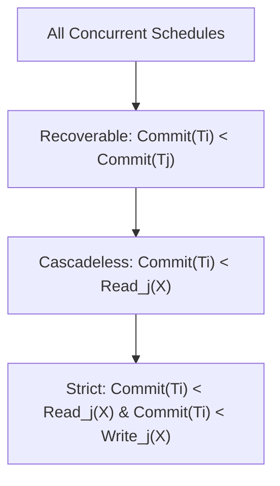
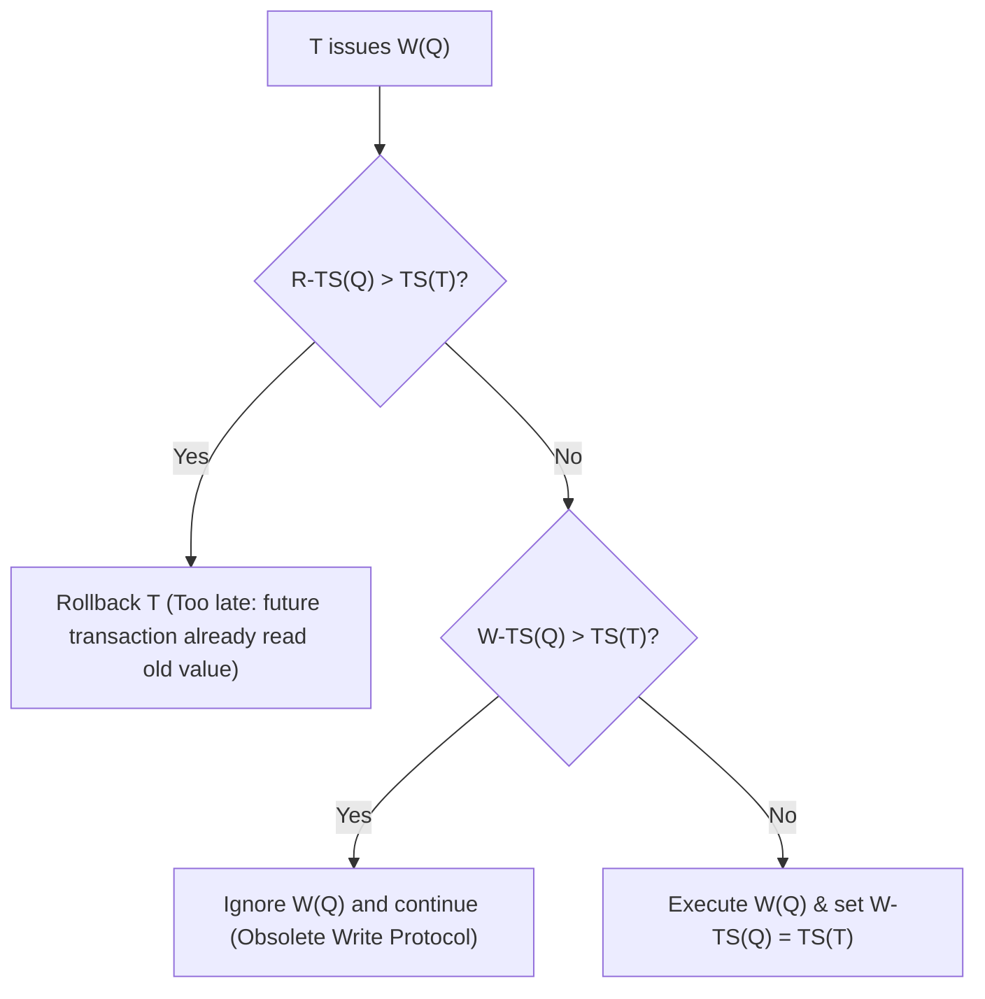

> [!definition]
> * **Two-Phase Locking Protocol (2PL):** A transaction acquires locks during its growing phase and releases locks during its shrinking phase[cite: 2]. Once the first lock is released, no new lock can be requested[cite: 2].
> * **Lock Point:** The point in execution where a transaction holds its final required lock[cite: 2].
> * **Basic TS Ordering:** Serializability order is determined strictly by transaction startup timestamps $TS(T)$[cite: 2].

| Protocol              | Guarantees Serializability          | Guarantees Strict Recoverable                    | Deadlock Free                       | Starvation Free |
| :-------------------- | :---------------------------------- | :----------------------------------------------- | :---------------------------------- | :-------------- |
| **Basic 2PL**         | Yes (Conflict)[cite: 2]             | No[cite: 2]                                      | No[cite: 2]                         | No[cite: 2]     |
| **Strict 2PL**        | Yes (Conflict)[cite: 2]             | Yes (holds Exclusive locks till commit)[cite: 2] | No[cite: 2]                         | No[cite: 2]     |
| **Rigorous 2PL**      | Yes (Conflict)[cite: 2]             | Yes (holds All locks till commit)[cite: 2]       | No[cite: 2]                         | No[cite: 2]     |
| **Conservative 2PL**  | Yes (Conflict)[cite: 2]             | No[cite: 2]                                      | Yes (Pre-claims all locks)[cite: 2] | No[cite: 2]     |
| **Basic TS Ordering** | Yes (Conflict)[cite: 2]             | No[cite: 2]                                      | Yes[cite: 2]                        | No[cite: 2]     |
| **Thomas Write Rule** | Yes (View Serializability)[cite: 2] | No[cite: 2]                                      | Yes[cite: 2]                        | No[cite: 2]     |

> [!theorem]
> **Thomas Write Rule Logic:**
> When transaction $T$ issues $W(Q)$:
> 1. If $R\text{-}TS(Q) > TS(T)$: Rollback $T$[cite: 2].
> 2. If $W\text{-}TS(Q) > TS(T)$: **Ignore the write operation** and continue execution (obsolete write protocol)[cite: 2].
> 3. Otherwise: Execute $W(Q)$, and set $W\text{-}TS(Q) = TS(T)$[cite: 2].

> [!question]
> **PSU CBT Practice Drill:**
> Which of the following concurrency control protocols guarantees View Serializability without strictly ensuring Conflict Serializability, while remaining Deadlock-Free[cite: 2]?
> (A) Strict 2PL[cite: 2]
> (B) Conservative 2PL[cite: 2]
> (C) Thomas Write Rule Timestamp Ordering[cite: 2]
> (D) Rigorous 2PL[cite: 2]
>
> **Step-by-Step Resolution:**
> 1. 2PL variants enforce conflict serializability by constraining graph precedence[cite: 2].
> 2. Conservative 2PL prevents deadlocks, but guarantees conflict serializability[cite: 2].
> 3. Thomas Write Rule allows obsolete writes to be bypassed, producing schedules that are view serializable but not conflict serializable, while remaining deadlock-free since transactions never wait for locks[cite: 2].
>
> **Correct Answer:** (C)[cite: 2]

---
tags:
  - database
  - concurrency-control
  - transactions
  - gate-cs
  - system-design
aliases:
  - Concurrency Control & Recovery
---

# 🗄️ Database Concurrency Control & Recovery

## 1. 🎯 Foundational Concepts & Terminology

### 🧹 Dirty Read
* **Etymology / Word Link:** **"Dirty"** = *unwashed, uncommitted, draft state*.
* **Definition:** Occurs when transaction $T_j$ reads data modified by an uncommitted transaction $T_i$:
  $$W_i(X) \dots R_j(X)$$
* **Risk:** If $T_i$ aborts, $T_j$ has processed data that technically never existed in persistent storage.

---

### 🛟 Recoverable Schedule
* **Etymology / Word Link:** **"Recoverable"** = *can the system cleanly recover after a crash without corrupting committed state?*
* **Definition:** If $T_j$ reads data written by $T_i$, then $T_i$ must commit **before** $T_j$ commits:
  $$W_i(X) < R_j(X) \implies C_i < C_j$$
* **Intuition:** Once a transaction commits, its operations cannot be undone (Durability). Forcing $C_i < C_j$ guarantees that if $T_i$ aborts, $T_j$ is still active and can safely be aborted too.

---

### 🌊 Cascadeless Schedule (Avoids Cascading Aborts - ACA)
* **Etymology / Word Link:** **"Cascadeless"** = *stopping the falling domino chain reaction before it starts*.
* **Definition:** A transaction only reads **committed** data values:
  $$W_i(X) < R_j(X) \implies C_i < R_j(X)$$
* **Intuition:** Because no transaction ever reads uncommitted drafts, the failure of $T_i$ requires rolling back **only** $T_i$.

---

### 🔒 Strict Schedule
* **Etymology / Word Link:** **"Strict"** = *rigid, non-negotiable boundaries on mutations*.
* **Definition:** No transaction can **read** OR **write** an item until the previous writer commits or aborts:
  $$W_i(X) < (R_j(X) \lor W_j(X)) \implies (C_i \lor A_i) < (R_j(X) \lor W_j(X))$$
* **Intuition:** Prevents undo conflicts during rollbacks. Restoration requires only copying the uncommitted item's "before-image" without fear of clashing with intermediate writes.

---

### 🪜 The Invariant Hierarchy

$$\text{Strict} \subset \text{Cascadeless} \subset \text{Recoverable} \subset \text{All Concurrent Schedules}$$

> [!WARNING] **The Classic Trap: Independence of Serializability & Recoverability**
> A schedule can be **Conflict Serializable** yet completely **Irrecoverable**!
> 
> *Example:* $W_1(X); R_2(X); C_2; C_1$
> * Precedence graph: $T_1 \rightarrow T_2$ (acyclic $\implies$ Conflict Serializable).
> * Commit ordering: $C_2 < C_1$ after $T_2$ read from $T_1$ ($\implies$ **Irrecoverable**).

---

## 2. 🔐 Lock Types & Two-Phase Locking (2PL)

### 🔑 Lock Modes
1. **Shared Lock ($S$-Lock) 📖:**
   * **Word Link:** *Shared* = multiple readers can coexist simultaneously.
   * **Compatibility:** Allows concurrent readers ($S$ with $S$), blocks writers.
2. **Exclusive Lock ($X$-Lock) 🚫:**
   * **Word Link:** *Exclusive* = shuts out all other parties.
   * **Compatibility:** Required for writes; denies both read ($S$) and write ($X$) requests from other transactions.

---

### 📈 Two-Phase Locking (2PL) Protocol
* **Phase 1: Growing Phase 📈:** Transaction acquires locks; releases zero locks.
* **The Lock Point 🎯:** The exact moment when the transaction holds its final required lock (peak of the growing phase).
* **Phase 2: Shrinking Phase 📉:** Transaction releases locks; can **never** request new locks.

> **Guarantee:** Any schedule following 2PL is guaranteed to be **Conflict Serializable**. The serialization order is defined strictly by the relative order of transactions' **Lock Points**.

---

### 🤼 The 2PL Variants

| Variant | Distinctive Locking Rule | Serialization Guarantee | Strict Recoverability? | Deadlock-Free? |
| :--- | :--- | :--- | :--- | :--- |
| **Basic 2PL** ⚙️ | Release locks anytime during Phase 2. | Conflict Serializable | ❌ No | ❌ No |
| **Strict 2PL** 🚧 | Holds all **Exclusive ($X$) locks** until commit/abort. | Conflict Serializable | ✅ Yes | ❌ No |
| **Rigorous 2PL** ⛓️ | Holds **ALL locks ($S$ and $X$)** until commit/abort. | Conflict Serializable | ✅ Yes | ❌ No |
| **Conservative 2PL** 🛡️ | Pre-claims **all** required locks upfront prior to execution. | Conflict Serializable | ❌ No | ✅ Yes |

> [!NOTE] **Strict 2PL vs. Rigorous 2PL**
> * **Strict 2PL:** Shared locks can drop early. Thus, the *Lock Point order* may not match the visible *Commit order*.
> * **Rigorous 2PL:** No locks are released until commit. Thus, **Lock Point $\equiv$ Commit Point**, guaranteeing that equivalent serial order matches commit order directly.

---

## 3. 👁️ Conflict vs. View Serializability

* **Conflict Serializability ⚔️:**
  * Preserves the execution order of all pairs of conflicting operations ($R-W$, $W-R$, $W-W$ on the same item).
  * Tested via the **Precedence Graph** (acyclic $\implies$ conflict serializable).
* **View Serializability 👁️:**
  * Requires identical **read sources** (who read what) and identical **final writes** as some serial schedule.
  * More relaxed: allows blind writes ($W_j(X)$ without reading) to reorder conflict steps without corrupting anyone's view.
  * Hierarchy: $\text{Conflict Serializable} \subset \text{View Serializable}$.

---

## 4. ⏰ Timestamp Ordering & The Thomas Write Rule

### 🏷️ Timestamp Definitions
* $TS(T)$: Unique creation timestamp of transaction $T$ (smaller = older).
* $R\text{-}TS(Q)$: Largest timestamp of any transaction that successfully read $Q$.
* $W\text{-}TS(Q)$: Largest timestamp of any transaction that successfully wrote $Q$.

---

### ✍️ Thomas Write Rule Logic

When transaction $T$ issues a write $W(Q)$:

* **The Obsolete Write Protocol 🗑️:** If $W\text{-}TS(Q) > TS(T)$, a younger transaction has already updated $Q$. Because no transaction in the interim read the older value, $T$'s write is obsolete.
* **Crucial Result:** Thomas Write Rule yields schedules that are **View Serializable but NOT Conflict Serializable**, and it remains completely **Deadlock-Free** (transactions abort rather than wait).

---

## 5. 📝 Practice Analysis Drill

**Schedule $S$:**
$$R_1(X); W_1(X); R_1(Y); R_2(X); W_2(X); C_2; C_1$$

1. **Dirty Read Check:** $T_1$ writes $X$ at step 2 ($W_1(X)$). $T_2$ reads $X$ at step 4 ($R_2(X)$) before $T_1$ commits. $\implies T_2$ reads dirty data from $T_1$.
2. **Commit Order Check:** $T_2$ commits at step 6 ($C_2$), while $T_1$ commits at step 7 ($C_1$).
3. **Recoverability Rule:** Requires $C_1 < C_2$ when $T_2$ reads uncommitted data from $T_1$.
4. **Verdict:** Because $C_2 < C_1$, **Schedule $S$ is Irrecoverable**.