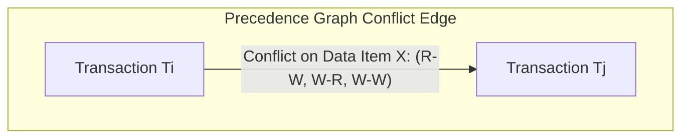

> [!definition]
> * **Conflict Equivalent:** Two schedules $S_1$ and $S_2$ are conflict equivalent if $S_2$ can be obtained from $S_1$ by a series of swaps of consecutive non-conflicting operations[cite: 2].
> * **Conflicting Operations:** Two operations $I_i, I_j$ conflict if and only if[cite: 2]:
>   1. They belong to different transactions ($T_i \neq T_j$)[cite: 2].
>   2. They access the same data item $Q$[cite: 2].
>   3. At least one of them is a write operation ($W(Q)$)[cite: 2].
> * **Conflict Serializable:** A schedule is conflict serializable if it is conflict equivalent to some serial schedule[cite: 2].

> [!theorem]
> **Precedence Graph (Serialization Graph) Test:**
> Construct directed graph $G = (V, E)$ where vertices $V$ represent active transactions[cite: 2].
> An edge $T_i \rightarrow T_j$ is drawn if $T_i$ executes an operation that conflicts with an operation executed later by $T_j$ on the same item:
> 1. $R_i(A)$ before $W_j(A)$[cite: 2]
> 2. $W_i(A)$ before $R_j(A)$[cite: 2]
> 3. $W_i(A)$ before $W_j(A)$[cite: 2]
>
> **Theorem:** A schedule $S$ is conflict serializable **if and only if** its precedence graph contains **no directed cycles**[cite: 2].
> The equivalent serial execution order corresponds to the **Topological Sort** of $G$[cite: 2].

> [!question]
> **PSU CBT Practice Drill:**
> Given two transactions $T_1$ and $T_2$ and schedule:
> $$S_1: R_1(A); R_2(A); R_2(B); W_1(A); W_2(B); W_1(B)$$[cite: 1]
> Determine whether $S_1$ is conflict serializable[cite: 1].
>
> **Step-by-Step Resolution:**
> 1. Identify active transactions: $V = \{T_1, T_2\}$[cite: 1].
> 2. Conflict analysis on item $A$:
>    * $R_2(A)$ occurs before $W_1(A) \implies$ Edge $T_2 \rightarrow T_1$[cite: 1, 2].
> 3. Conflict analysis on item $B$:
>    * $R_2(B)$ occurs before $W_1(B) \implies$ Edge $T_2 \rightarrow T_1$[cite: 1, 2].
>    * $W_2(B)$ occurs before $W_1(B) \implies$ Edge $T_2 \rightarrow T_1$[cite: 1, 2].
> 4. Analyze graph edges:
>    * Precedence Graph contains only edge $T_2 \rightarrow T_1$[cite: 1, 2].
>    * No back edge $T_1 \rightarrow T_2$ exists[cite: 1, 2].
> 5. Cycle check: The graph is acyclic[cite: 1, 2].
>
> **Equivalent Serial Schedule:** $T_2 \rightarrow T_1$ (Conflict Serializable)[cite: 1, 2]
