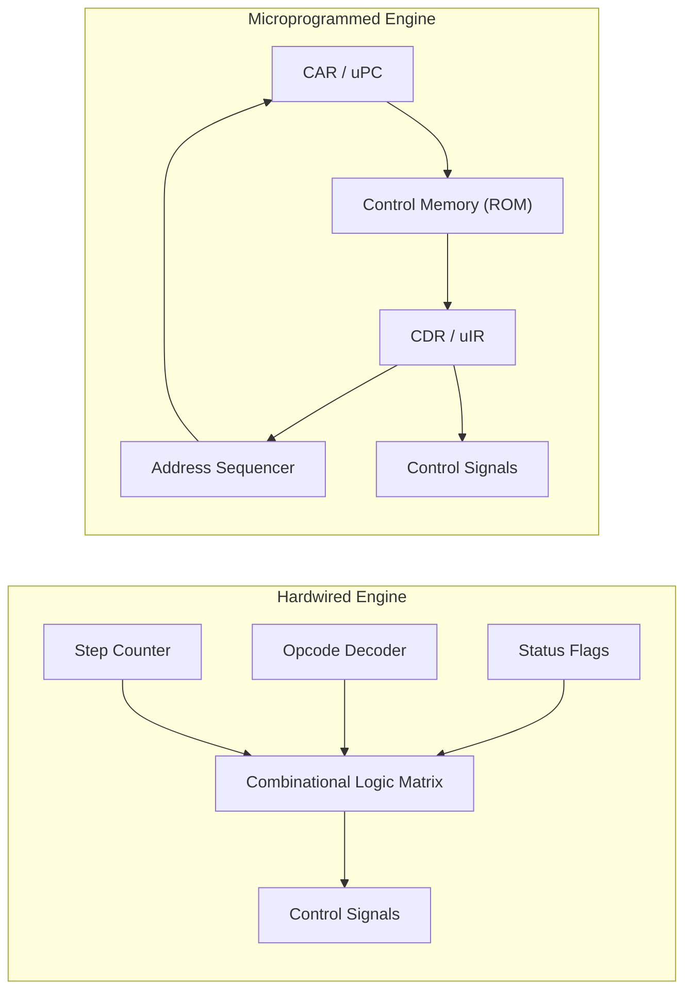

> [!definition]
> - **Hardwired Control Unit**: Direct combinatorial logic (gates, decoders, step counters) producing control signals. Optimized for speed (RISC).
> - **Microprogrammed Control Unit**: Generates control signals by executing microinstructions fetched sequentially from a dedicated internal ROM called **Control Memory (CM)**. Optimized for complex CISC instruction sets.

| Comparison Metric | Hardwired Control | Microprogrammed Control |
| :--- | :--- | :--- |
| **Execution Velocity** | Ultra-Fast (Clock cycle latency) | Slower (Control memory fetch overhead) |
| **Implementation Core** | Combinational Logic (SOP Gates / PLA) | Firmware / Control Memory (ROM) |
| **Modification / Upgrade** | Extremely difficult (Requires resilicon) | Simple (Update ROM microcode) |
| **Instruction Set Type** | RISC | CISC, Mainframes |
| **Instruction Size** | Typically $< 100$ instructions | Typically $> 100$ instructions |
| **Control Word Length** | None | 20 to 400 bits |

> [!formula]
> **Microprogramming Formats**:
> 1. **Horizontal Microprogramming**:
>    - **1 bit per control signal**.
>    - No decoders required.
>    - Maximal parallel execution.
>    - Very wide control words (long microinstructions).
> 2. **Vertical Microprogramming**:
>    - Control signals are grouped into $k$ mutually exclusive fields.
>    - $N$ control signals require $\lceil \log_2(N + 1) \rceil$ bits per field.
>    - Highly compact words, but requires decoders, lowering operational speed.

> [!trap]
> In vertical microprogramming, remember the **idle state pattern**: when encoding $N$ mutually exclusive control signals into a decoder field, $N + 1$ states are required (the $+1$ accounts for "No Operation / Inactive"). Hence, bits needed = $\lceil \log_2(N + 1) \rceil$.

> [!question]
> A vertical microprogrammed control unit supports 32 distinct, mutually exclusive control signals for an ALU, and 16 mutually exclusive signals for register gating. What is the minimum total number of control bits needed in the microinstruction format for these two fields?
> - (A) 10 bits
> - (B) 11 bits
> - (C) 12 bits
> - (D) 48 bits
>
> **Correct Option**: **(B)**
> **Step-by-Step Calculation**:
> 1. For ALU signals: $32$ signals $+$ $1$ inactive state $= 33$ states.
>    $$\text{Bits} = \lceil \log_2(33) \rceil = 6\text{ bits}$$
> 2. For Register gating: $16$ signals $+$ $1$ inactive state $= 17$ states.
>    $$\text{Bits} = \lceil \log_2(17) \rceil = 5\text{ bits}$$
> 3. Total bits $= 6 + 5 = \mathbf{11\text{ bits}}$.
