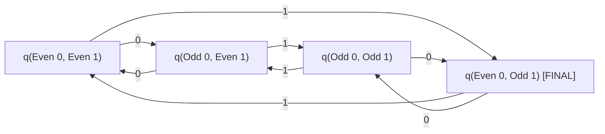

> [!definition]
> Modulo-counting DFAs track numerical properties (counts, remainders, divisibility) of input symbols using equivalence classes of congruence relations[cite: 1]. Each distinct remainder tuple represents an invariant internal state of the automaton[cite: 1].

> [!formula]
> ### Divisibility & Grid State Formula
> For a language $L$ defined over $\Sigma = \{0, 1\}$ or $\{a, b\}$ constrained by simultaneous divisibility:
> $$L = \{w \mid n_a(w) \pmod m = k_1 \land n_b(w) \pmod n = k_2\}$$
> The minimum number of DFA states required is given by the Cartesian product grid[cite: 1]:
> $$\text{States}_{\text{min}} = m \times n$$
>
> - **Even / Odd Cases ($m = 2, n = 2$):**
>   - Even number of $0$'s $\implies n_0(w) \pmod 2 = 0$ (2 outcomes: 0 or 1)[cite: 1].
>   - Odd number of $1$'s $\implies n_1(w) \pmod 2 = 1$ (2 outcomes: 0 or 1)[cite: 1].
>   - Total minimal states:
>   $$\text{States} = 2 \times 2 = 4\text{ states}$$[cite: 1]

> [!theorem]
> The Cartesian product structure $Q = Q_A \times Q_B$ is invariant to the final acceptance criteria[cite: 1]. Whether accepting:
> - Even $0$'s and Odd $1$'s[cite: 1]
> - Even $0$'s and Even $1$'s[cite: 1]
> - Odd $0$'s and Odd $1$'s[cite: 1]
> The transition graph remains identical (4 states)[cite: 1]; only the designation of the final state set $F$ changes[cite: 1].

> [!question]
> **IOCL CBT Practice Question:**
> What is the minimum number of states in a DFA accepting strings over $\Sigma = \{0, 1\}$ such that the number of $0$'s is divisible by 3 and the number of $1$'s is divisible by 5?
> (A) 8
> (B) 15
> (C) 16
> (D) 30
>
> **Answer:** (B)
> **Step-by-Step Explanation:**
> 1. Remainder states for $n_0(w) \pmod 3 \in \{0, 1, 2\} \implies 3$ states[cite: 1].
> 2. Remainder states for $n_1(w) \pmod 5 \in \{0, 1, 2, 3, 4\} \implies 5$ states[cite: 1].
> 3. Because operations on $0$ and $1$ are independent, the minimal DFA requires the full cross product:
>    $$\text{States} = 3 \times 5 = 15\text{ states}$$[cite: 1]
