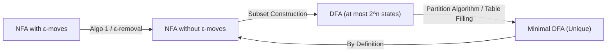

> [!definition]
> - **DFA (Deterministic Finite Automaton):** Defined by 5-tuple $(Q, \Sigma, \delta, q_0, F)$ where the transition function is strictly single-valued: $\delta: Q \times \Sigma \to Q$.
> - **NFA (Non-deterministic Finite Automaton):** Allows transitions to sets of states: $\delta: Q \times \Sigma \to 2^Q$ (or $\delta: Q \times (\Sigma \cup \{\epsilon\}) \to 2^Q$).
> - **Equivalence:** NFAs and DFAs have identical expressive computational power; both recognize precisely the family of Type-3 Regular Languages.

> [!theorem]
> ### State Count Theorems & Invariants
> 1. **NFA to DFA Upper Bound:**
>    An $n$-state NFA converts via the Powerset / Subset Construction algorithm to a DFA having at most $2^n$ reachable states:
>    $$\text{Max DFA States} = 2^n$$
> 2. **DFA Minimization Upper Bound:**
>    Given a DFA already possessing $n$ states, the maximum possible number of states in its minimal equivalent DFA is **$n$ states**.
>    *(If the given DFA is already minimal, zero states merge, preserving all $n$ states.)*
> 3. **Uniqueness:**
>    For any given regular language, the minimal DFA is **strictly unique** (up to state isomorphism), whereas multiple distinct minimal NFAs can exist.

> [!formula]
> ### High-Yield State Count Reference Table
> | Condition / Pattern over $\{a, b\}$ | Min NFA States | Min DFA States | PSU Traps / Notes |
> | :--- | :--- | :--- | :--- |
> | Length $|w| = n$ | $n + 1$ | $n + 2$ | DFA requires 1 dead / trap state |
> | Length $|w| \le n$ | $n + 1$ | $n + 2$ | DFA requires 1 dead / trap state |
> | Length $|w| \ge n$ | $n + 1$ | $n + 1$ | No dead state needed (self-loops at final) |
> | Starts with symbol '$a$' | $2$ | $3$ | Trap state on first symbol '$b$' |
> | $n^{\text{th}}$ symbol from begin is '$a$' | $n + 1$ | $n + 2$ | Strict length tracking |
> | $n^{\text{th}}$ symbol from end is '$a$' | $n + 1$ | $2^n$ | **Exponential blowup** in DFA |
> | String contains substring of length $k$ | $k + 1$ | $k + 1$ | KMP matching structure |

> [!trap]
> **The NFA vs DFA Question Stem Trap:**
> - When asked: *"An NFA has $n$ states, what is the maximum number of states in equivalent DFA?"* $\implies \mathbf{2^n}$.
> - When asked: *"A DFA has $n$ states, what is the maximum number of states in its minimal equivalent DFA?"* $\implies \mathbf{n}$.
> Do not mark $2^n$ or $n-1$ when starting from an existing DFA.

> [!question]
> **IOCL CBT Practice Question:**
> Consider an NFA with 8 states accepting a language $L$. What are the maximum possible states in an equivalent minimized DFA?
> (A) 8
> (B) 16
> (C) 256
> (D) 128
>
> **Answer:** (C)
> **Step-by-Step Explanation:**
> 1. Subset construction converts an $n$-state NFA to a DFA with at most $2^n$ states.
> 2. With $n = 8$, the powerset yields $|2^Q| = 2^8 = 256$ possible state subsets.
> 3. If no two subset states are equivalent under indistinguishability partitioning, the minimized DFA retains all 256 states.
