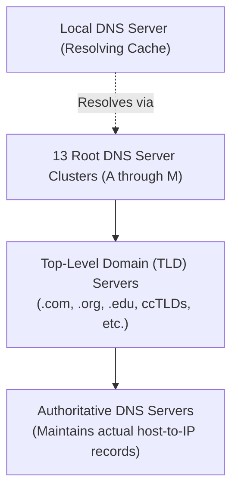

The Domain Name System (DNS) is an essential directory lookup service that translates human-memorable hostnames into machine-routable IP addresses[cite: 1].

> [!definition] Domain Name System (DNS)
> **DNS** is a distributed, hierarchical database system running over UDP/TCP port 53 that provides mapping between symbolic hostnames and numeric IP addresses[cite: 1].
> 
> * **Humans prefer**: Hostnames (e.g., `google.com`) because they are intuitive, easy to remember, and decouple domain identity from physical network renumbering[cite: 1].
> * **Routers and Switches prefer**: Fixed-length numerical IP addresses (e.g., 32-bit IPv4 or 128-bit IPv6) to optimize packet routing lookups[cite: 1].

### Core Services Provided by DNS
1. **Hostname-to-IP Translation**: Maps fully qualified domain names (FQDNs) to numeric IP addresses[cite: 1].
2. **Host Aliasing**: Provides canonical names for hosts that maintain one or more mnemonic alias names (via CNAME resource records)[cite: 1].
3. **Mail Server Aliasing**: Identifies and prioritizes mail exchange servers designated to receive incoming mail for a domain (via MX resource records)[cite: 1].
4. **Load Distribution**: Maps a single canonical domain name across a replicated cluster of distinct IP addresses, rotating returned addresses round-robin to balance server traffic[cite: 1].

### Hierarchical Server Structure

* **Root DNS Servers**: The apex of the DNS hierarchy[cite: 1]. There are 13 logical root server addresses (replicated globally across hundreds of physical instances using anycast)[cite: 1].
* **Top-Level Domain (TLD) Servers**: Manage top-level domains[cite: 1]. Categorized into:
  * Generic TLDs (gTLDs): `.com`, `.org`, `.net`, `.edu`[cite: 1].
  * Country-Code TLDs (ccTLDs): `.in`, `.uk`, `.us`, `.jp`[cite: 1].
  * Infrastructure/Inverse TLDs: `.arpa`[cite: 1].
* **Authoritative DNS Servers**: Maintained by organizations or service providers; holds the definitive mapping records for specific registered hostnames[cite: 1].
* **Local DNS Server**: Provided to client hosts during network configuration (e.g., via DHCP)[cite: 1]. Acts as an intermediary proxy cache handling queries on behalf of client hosts[cite: 1].
