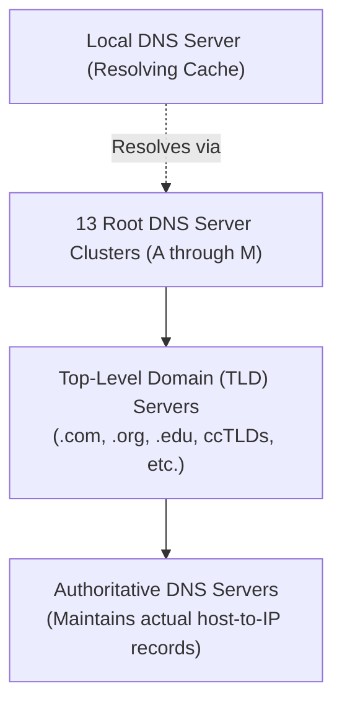

The Domain Name System (DNS) is an essential directory lookup service that translates human-memorable hostnames into machine-routable IP addresses[cite: 1].
- **[[DNS]]** (22:00)

> [!definition] Domain Name System (DNS)
> **DNS** is a distributed, hierarchical database system running over UDP/TCP port 53 that provides mapping between symbolic hostnames and numeric IP addresses[cite: 1].
> 
> * **Humans prefer**: Hostnames (e.g., `google.com`) because they are intuitive, easy to remember, and decouple domain identity from physical network renumbering[cite: 1].
> * **Routers and Switches prefer**: Fixed-length numerical IP addresses (e.g., 32-bit IPv4 or 128-bit IPv6) to optimize packet routing lookups[cite: 1].

### Core Services Provided by DNS
1. **Hostname-to-IP Translation**: Maps fully qualified domain names (FQDNs) to numeric IP addresses[cite: 1].
2. **Host Aliasing**: Provides canonical names for hosts that maintain one or more mnemonic alias names (via CNAME resource records)[cite: 1].
3. **Mail Server Aliasing**: Identifies and prioritizes mail exchange servers designated to receive incoming mail for a domain (via MX resource records)[cite: 1].
4. **Load Distribution**: Maps a single canonical domain name across a replicated cluster of distinct IP addresses, rotating returned addresses round-robin to balance server traffic[cite: 1].
### 1. The Core Analogy: The "White Pages" Phonebook & Corporate Reception

To understand all 4 core services together, imagine DNS is a massive **Corporate City Directory**:

  

Plaintext

```
+-----------------------------------------------------------------------------------+
| 1. Hostname-to-IP Translation : Looking up a person's real phone number           |
| 2. Host Aliasing (CNAME)      : Looking up nicknames that point to legal names    |
| 3. Mail Server Aliasing (MX)  : The dedicated mailroom dock for corporate letters |
| 4. Load Distribution          : A call-center rotation answering the main line    |
+-----------------------------------------------------------------------------------+
```

### 2. Service 1: Hostname-to-IP Translation (The Baseline Lookup)

- **The Core Job:** Translates human-friendly Fully Qualified Domain Names (FQDNs) into machine-routable binary/numeric IP addresses (IPv4 or IPv6).
    
      
    
- **The Analogy:** You open the city phone directory, search for `"John Doe"`, and find his actual dialing number: `555-0199`.
    
      
    
- **Concrete Example:**
    
      
    - You type `google.com` into your browser.
        
          
        
    - Your computer does not know where to send the packets.
        
          
        
    - DNS returns an **`A` record** (Address) containing `142.250.190.46` (or an `AAAA` record for IPv6). Your OS can now target that numeric address.
        
          
        

### 3. Service 2: Host Aliasing (CNAME Records)

- **The Core Job:** Gives convenient nicknames (aliases) to a complex or true server name (the canonical name).
    
      
    
- **The Analogy (The Legal Name vs. Stage Nicknames):**
    
      
    - Dwayne Johnson's real, canonical name is **Dwayne Douglas Johnson**.
        
          
        
    - But people call him **"The Rock"**, **"Scorpion King"**, or **"Dwayne"**.
        
          
        
    - If you look up "The Rock" in the directory, the book says: _"That's just a stage name for Dwayne Douglas Johnson; go look up Dwayne Douglas Johnson to get his phone number."_
        
          
        
- **Why Networks Need This:**
    
      
    - A company's actual bare-metal server machine might be named something ugly and specific like `server-us-east-cluster4-node12.aws.amazon.com` (this is the **canonical name**).
        
          
        
    - Nobody wants to type that!
        
          
        
    - They create **`CNAME` (Canonical Name) records** so that `[www.mywebsite.com](https://www.mywebsite.com)` or `ftp.mywebsite.com` simply point to `server-us-east-cluster4-node12.aws.amazon.com`.
        
          
        
    - If the company moves to a new machine next year, they change the canonical target once, and all aliases immediately redirect to the new machine without reconfiguring every client.
        
          
        

### 4. Service 3: Mail Server Aliasing (MX Records)

- **The Core Job:** Directs incoming email addressed to a simple domain name to the dedicated, specialized mail exchange server handling email traffic for that domain.
    
      
    
- **The Analogy (The Corporate Front Desk vs. The Delivery Mailroom):**
    
      
    - If you want to visit a company's office in person (HTTP web browsing), you walk through the **Front Glass Doors** (`[www.company.com](https://www.company.com)`).
        
          
        
    - But if FedEx delivers 500 mail envelopes, they don't dump them on the reception sofa. They deliver them to the **Loading Dock / Mailroom in the back** (`mail.company.com`).
        
          
        
- **Why Networks Need This:**
    
      
    - When you email `boss@apple.com`, the domain is just `apple.com`.
        
          
        
    - But the computer serving web pages for `apple.com` is **not** the computer running the SMTP email inbox!
        
          
        
    - The sending mail server asks DNS: _"Give me the **`MX` (Mail Exchange)** record for `apple.com`!"_
        
          
        
          
        
    - DNS returns:
        
          
        - `mail1.apple.com (Priority 10)`
            
              
            
        - `mail2.apple.com (Priority 20)`
            
              
            
    - This allows a domain to separate web traffic from email traffic cleanly, while providing fallback backup mail servers if the primary goes down.
        
          
        

### 5. Service 4: Load Distribution (Round-Robin DNS)

- **The Core Job:** Balances traffic across a pool of redundant web servers by rotating a list of multiple IP addresses for a single domain name.
    
      
    
- **The Analogy (The Bank Teller Line):**
    
      
    - You walk into a bank that has 3 tellers working behind the counter (Server 1, Server 2, Server 3).
        
          
        
    - A greeter at the door stands there:
        
          
        - Customer 1 arrives $\to$ sent to Teller 1.
            
              
            
        - Customer 2 arrives $\to$ sent to Teller 2.
            
              
            
        - Customer 3 arrives $\to$ sent to Teller 3.
            
              
            
        - Customer 4 arrives $\to$ sent back to Teller 1.
            
              
            
- **Concrete Example:**
    
      
    - A popular website like `netflix.com` cannot run on one machine. It has three servers:
        
          
        - `1.1.1.1`
            
              
            
        - `2.2.2.2`
            
              
            
        - `3.3.3.3`
            
              
            
    - All three IPs are attached to `netflix.com` in the DNS database.
        
          
        
    - When User A queries `netflix.com`, DNS replies with: `[1.1.1.1, 2.2.2.2, 3.3.3.3]`.
        
          
        
    - When User B queries a millisecond later, DNS **rotates the order (Round-Robin)**: `[2.2.2.2, 3.3.3.3, 1.1.1.1]`.
        
          
        
    - Because client browsers pick the first IP in the list, the traffic load is automatically split evenly across all three server machines without needing an expensive hardware load balancer!
        
          
        

### Quick Recall Cheat Sheet

|**DNS Service**|**Record Type**|**Everyday Analogy**|**What It Achieves**|
|---|---|---|---|
|**Hostname-to-IP**|**`A` / `AAAA`**|Looking up a friend's phone number|Lets machines find each other via IP addresses.|
|**Host Aliasing**|**`CNAME`**|Looking up a celebrity's stage name|Gives friendly nicknames to ugly/long true server hostnames.|
|**Mail Server Aliasing**|**`MX`**|Dedicated corporate loading dock for mail|Routes emails to dedicated mail servers instead of web servers.|
|**Load Distribution**|Multiple **`A`** records|Round-robin bank teller assignment|Spreads traffic evenly across identical server clusters.|

### Hierarchical Server Structure



* **Root DNS Servers**: The apex of the DNS hierarchy[cite: 1]. There are 13 logical root server addresses (replicated globally across hundreds of physical instances using anycast)[cite: 1].
* **Top-Level Domain (TLD) Servers**: Manage top-level domains[cite: 1]. Categorized into:
  * Generic TLDs (gTLDs): `.com`, `.org`, `.net`, `.edu`[cite: 1].
  * Country-Code TLDs (ccTLDs): `.in`, `.uk`, `.us`, `.jp`[cite: 1].
  * Infrastructure/Inverse TLDs: `.arpa`[cite: 1].
* **Authoritative DNS Servers**: Maintained by organizations or service providers; holds the definitive mapping records for specific registered hostnames[cite: 1].
* **Local DNS Server**: Provided to client hosts during network configuration (e.g., via DHCP)[cite: 1]. Acts as an intermediary proxy cache handling queries on behalf of client hosts[cite: 1].
