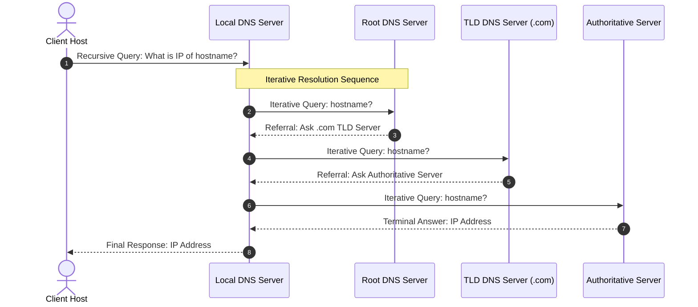
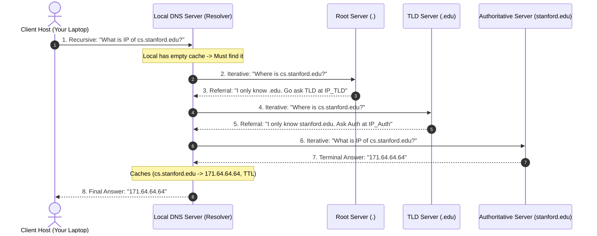

When a host queries DNS to resolve a domain name, resolution proceeds through two distinct algorithmic methods depending on server capability and configuration[cite: 1].

> [!definition] Recursive vs. Iterative Query Resolution
> * **Recursive Query**: The queried DNS server assumes complete responsibility for obtaining the final IP address mapping on behalf of the client, communicating with other servers as needed and returning only the terminal answer (or an error) back to the requester[cite: 1].
> * **Iterative Query**: The queried server does not resolve the full request; instead, if it does not hold the exact record, it returns a referral containing the IP address of the next-level name server down the hierarchy that is closer to the answer[cite: 1].

### Hybrid Resolution Flow
In standard network deployments, the client host makes a **recursive query** to its Local DNS Server[cite: 1]. The Local DNS Server then executes a series of **iterative queries** up and down the global DNS hierarchy until the authoritative server is queried[cite: 1].





> [!trap] DNS Server Caching
> Intermediate DNS servers cache retrieved mappings locally along with a Time-To-Live (TTL) value[cite: 1]. If a cached entry is valid, the Local DNS Server answers subsequent queries directly without traversing the Root or TLD servers, bypassing root-level bottlenecks[cite: 1].

### 1. The Real-Life Analogy: The Detective & The Informants

To understand the hierarchy and query types, imagine you are looking for **Alice's home address** (`www.cs.stanford.edu`):

  

- **You (Client Host):** The busy citizen who needs the address.
    
      
    
- **Your Personal Secretary (Local DNS Server / Resolver):** You hand the request to your assistant: _"Find me Alice's address, and only come back to me when you have the final answer."_
    
      
    
- **The Global Council (Root Servers):** Old librarians who don't know Alice, but know who runs the **`.edu` registry**.
    
      
    
- **The Department Office (TLD Servers):** The `.edu` registrar who doesn't know Alice, but knows where **Stanford University's directory** lives.
    
      
    
- **Stanford's CS Registrar (Authoritative Server):** The official office holding Alice's exact, signed student file with her actual house number.
    
      
    

### 2. The DNS Hierarchy (Top to Bottom)

The domain name hierarchy is read from **right to left** (from the general root to the specific machine):

  

```
                       [ . ]  Root DNS Servers (13 logical clusters: A to M)
                                 │
                   ┌─────────────┴─────────────┐
             [ .com ]                      [ .edu ]  TLD (Top-Level Domain) Servers
                 │                             │
         [ amazon.com ]                [ stanford.edu ]
                 │                             │
      [ Auth: aws.amazon.com ]     [ Auth: cs.stanford.edu ]  Authoritative Servers
```

1. **Root DNS Servers (`.`):**
    
      
    - The apex of the entire system.
        
          
        
    - There are **13 logical root cluster addresses** (named `a.root-servers.net` through `m.root-servers.net`), distributed across hundreds of global physical servers using **Anycast routing**.
        
          
        
    - _What they know:_ They only know where the **TLD servers** are (e.g., who handles `.com`, `.org`, `.edu`, `.in`).
        
          
        
2. **Top-Level Domain (TLD) Servers:**
    
      
    - Manage broad suffixes: **gTLDs** (`.com`, `.net`, `.edu`), **ccTLDs** (`.in`, `.uk`), or infrastructure (`.arpa`).
        
          
        
    - _What they know:_ They know where the **Authoritative servers** for specific registered domains live (e.g., who runs `google.com` or `stanford.edu`).
        
          
        
3. **Authoritative DNS Servers:**
    
      
    - Run by the actual organization, hosting provider, or cloud (e.g., Cloudflare, Route53).
        
          
        
    - _What they know:_ They hold the **actual, definitive `A` / `AAAA` records** mapping hostnames to IP addresses.
        
          
        
4. **Local DNS Server (The Resolver / Recursive Cache):**
    
      
    - Configured on your machine via DHCP (e.g., your ISP's router, Google's `8.8.8.8`, or Cloudflare's `1.1.1.1`).
        
          
        
    - Acts as your proxy; it is **not** part of the formal namespace tree, but does all the legwork on behalf of your laptop.
        
          
        

### 3. Recursive vs. Iterative: The Core Distinction

|**Query Type**|**The Query Style**|**What the Server Does**|**Everyday Analogy**|
|---|---|---|---|
|**Recursive**|_"Find it for me completely."_|Assumes **total responsibility**; keeps querying others until it gets the final answer or fails, then hands you the result.|**Delegating to your personal assistant:** You give them the task, sit back, and wait for them to finish.|
|**Iterative**|_"Do you know this? If not, who should I ask next?"_|Returns the answer **or a referral** (the IP address of the next server down the chain). Never asks on your behalf.|**Getting directions from strangers:** A policeman says _"I don't know that house, but ask the gas station clerk down the block."_ You must walk to the gas station yourself.|

### 4. Which is Preferred and What is Actually Used?

**The Internet uses a HYBRID MODEL: Recursive at the edge, Iterative across the core.**

  

  

Code snippet

```
sequenceDiagram
    autonumber
    actor Host as Client Host (Your Laptop)
    participant Local as Local DNS Server (Resolver)
    participant Root as Root Server (.)
    participant TLD as TLD Server (.edu)
    participant Auth as Authoritative Server (stanford.edu)

    Host->>Local: 1. Recursive: "What is IP of cs.stanford.edu?"
    Note over Local: Local has empty cache -> Must find it
    Local->>Root: 2. Iterative: "Where is cs.stanford.edu?"
    Root-->>Local: 3. Referral: "I only know .edu. Go ask TLD at IP_TLD"
    Local->>TLD: 4. Iterative: "Where is cs.stanford.edu?"
    TLD-->>Local: 5. Referral: "I only know stanford.edu. Ask Auth at IP_Auth"
    Local->>Auth: 6. Iterative: "What is IP of cs.stanford.edu?"
    Auth-->>Local: 7. Terminal Answer: "171.64.64.64"
    Note over Local: Caches (cs.stanford.edu -> 171.64.64.64, TTL)
    Local-->>Host: 8. Final Answer: "171.64.64.64"
```

#### Why Don't We Make Every Server Recursive?

Imagine if Root Servers accepted recursive queries:

  

- Billions of computers worldwide would tell the Root Servers: _"Go resolve this for me and come back when you're done!"_
    
      
    
- The 13 root server clusters would have to hold millions of open network sockets, track states, and execute outbound queries for the entire planet simultaneously.
    
      
    
- **The Root servers would collapse immediately under connection overload.**
    
      
    
- **The Design Rule:**
    
      
    - **Root and TLD servers strictly refuse recursive queries.** They only answer **iteratively** (giving quick, stateless referrals in a single round trip).
        
          
        
    - Your **Local DNS Resolver** bears the computational burden of making the repeated iterative queries.
        
          
        

### 5. DNS Caching: Why This Whole Chain Usually Doesn't Run

In real life, this entire 8-step sequence rarely happens for everyday queries:

  

- Every DNS record carries a **TTL (Time-To-Live)** (e.g., 300 seconds, 1 hour, or 1 day).
    
      
    
- **Level 1 (Browser/OS Cache):** Your browser or OS checks its local memory first. If you opened the site 10 seconds ago, resolution takes $0\text{ ms}$.
    
      
    
- **Level 2 (Local DNS Cache):** If your laptop misses, your Local Resolver (`8.8.8.8` or your ISP) checks its cache. If thousands of users on your ISP visited `google.com` or `stanford.edu` recently, the Local Server returns the cached IP immediately, **completely bypassing the Root and TLD servers**.
    
      
    
- Furthermore, resolvers cache the IP addresses of the TLD servers themselves, so even during cache misses, resolvers rarely need to hit the Root servers.
    
      
    

### Summary Checklist

- **Root Servers:** Apex; 13 cluster addresses; point to TLDs.
    
      
    
- **TLD Servers:** Manage `.com`, `.org`, `.in`; point to Authoritative servers.
    
      
    
- **Authoritative Servers:** Hold the actual IP mappings (`A`/`AAAA`).
    
      
    
- **Client $\to$ Local Resolver:** **Recursive** (one query, final answer returned).
    
      
    
- **Local Resolver $\to$ Root/TLD/Auth:** **Iterative** (chain of referrals down the tree).