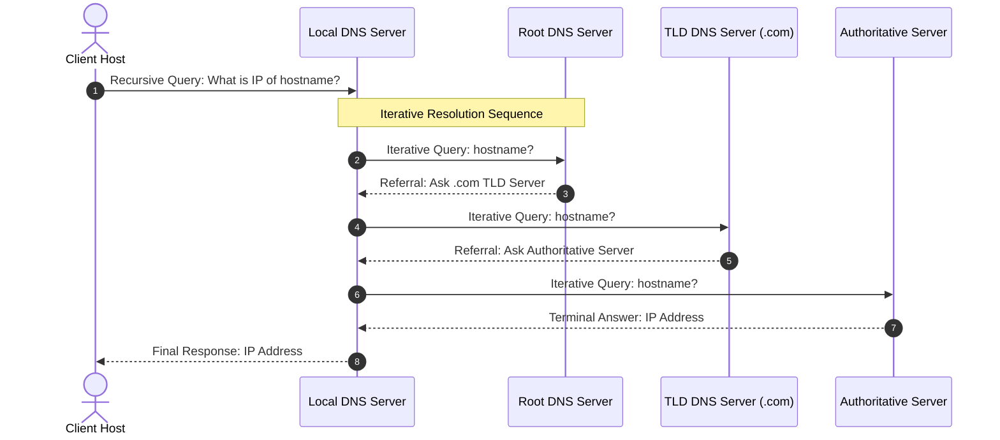

When a host queries DNS to resolve a domain name, resolution proceeds through two distinct algorithmic methods depending on server capability and configuration[cite: 1].

> [!definition] Recursive vs. Iterative Query Resolution
> * **Recursive Query**: The queried DNS server assumes complete responsibility for obtaining the final IP address mapping on behalf of the client, communicating with other servers as needed and returning only the terminal answer (or an error) back to the requester[cite: 1].
> * **Iterative Query**: The queried server does not resolve the full request; instead, if it does not hold the exact record, it returns a referral containing the IP address of the next-level name server down the hierarchy that is closer to the answer[cite: 1].

### Hybrid Resolution Flow
In standard network deployments, the client host makes a **recursive query** to its Local DNS Server[cite: 1]. The Local DNS Server then executes a series of **iterative queries** up and down the global DNS hierarchy until the authoritative server is queried[cite: 1].

> [!trap] DNS Server Caching
> Intermediate DNS servers cache retrieved mappings locally along with a Time-To-Live (TTL) value[cite: 1]. If a cached entry is valid, the Local DNS Server answers subsequent queries directly without traversing the Root or TLD servers, bypassing root-level bottlenecks[cite: 1].
