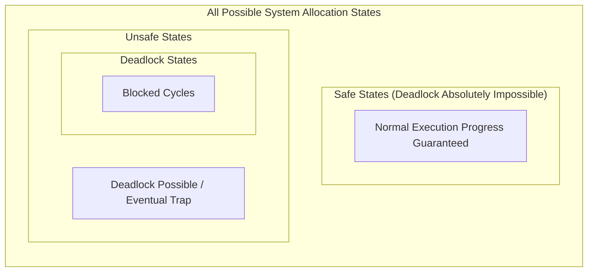

> [!definition] Deadlock Avoidance
> Deadlock avoidance is a dynamic technique where the operating system evaluates every resource request before granting it.
> * Does not attack the Coffman conditions directly (cycles can theoretically form if unmanaged).
> * **A Priori Requirement**: Requires that each process declare in advance its **maximum demand** of each resource type for its entire execution.
> * The OS dynamically ensures that the system **never transitions into an Unsafe State**.

> [!definition] Safe State vs. Unsafe State
> * **Safe State**: A system state is safe if there exists at least one **Safe Sequence** $\langle P_1, P_2, \dots, P_n \rangle$ of processes such that for each $P_i$, the maximum resources $P_i$ can still request can be satisfied by the currently available resources plus the resources already held by all preceding processes $P_j$ ($j < i$).
> * **Unsafe State**: A state where no safe sequence exists. An unsafe state is **not** necessarily a deadlock state, but it contains the potential to lead to a deadlock if processes demand their declared maximums simultaneously.

> [!theorem] State Relationship Invariants
> 1. $\text{Safe State} \implies \text{No Deadlock}$.
> 2. $\text{Unsafe State} \centernot\implies \text{Deadlock}$ (A system in an unsafe state can avoid deadlock if processes do not invoke their peak maximum claims simultaneously before finishing).
> 3. $\text{Deadlock State} \implies \text{Unsafe State}$ (Deadlock is a strict subset of the unsafe region).
> 4. **Avoidance Goal**: Maintain the system invariant $\text{State} \in \text{Safe}$ across all dynamic requests.

> [!question] 1-Resource Safe State Walkthrough
> System has $12$ total tape drives. Current state:
> 
> | Process | Allocated | Max Need | Remaining Need |
> | :--- | :--- | :--- | :--- |
> | $P_0$ | $5$ | $10$ | $5$ |
> | $P_1$ | $2$ | $4$ | $2$ |
> | $P_2$ | $2$ | $9$ | $7$ |
> 
> * **Available Resources**:
>   $$\text{Available} = 12 - (5 + 2 + 2) = 12 - 9 = 3$$
> * **Evaluation for Safe Sequence**:
>   1. With $\text{Available} = 3$, check who can be satisfied:
>      * $P_0$ requires $5 \le 3$ (False)
>      * $P_1$ requires $2 \le 3$ (**True**) $\implies$ Run $P_1$.
>   2. $P_1$ completes and releases its $2$ held units:
>      $$\text{Available}' = 3 + 2 = 5$$
>   3. With $\text{Available}' = 5$, check remaining:
>      * $P_0$ requires $5 \le 5$ (**True**) $\implies$ Run $P_0$.
>   4. $P_0$ completes and releases its $5$ held units:
>      $$\text{Available}'' = 5 + 5 = 10$$
>   5. With $\text{Available}'' = 10$, $P_2$ requires $7 \le 10$ (**True**) $\implies$ Run $P_2$.
> * Safe Sequence $\langle P_1, P_0, P_2 \rangle$ exists $\implies$ **System is in a Safe State**.
