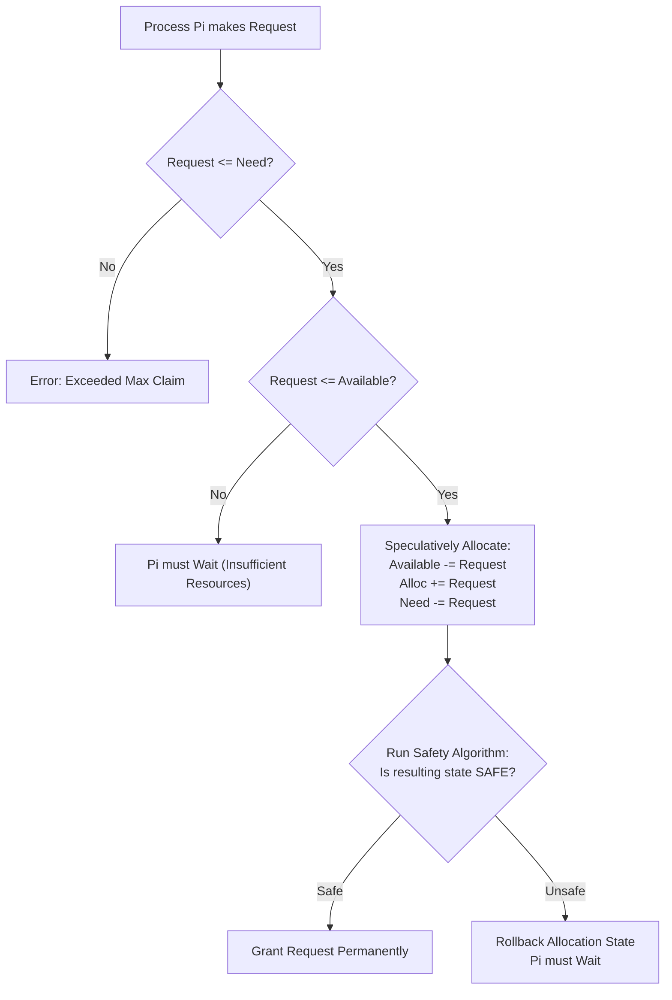

> [!definition] Banker's Algorithm
> Proposed by Edsger Dijkstra (1965), the Banker's Algorithm handles resource allocation requests in banking credit analogy[cite: 1].
> * When a new request is made by process $P_i$:
>   1. If $\text{Request}_i \le \text{Need}_i$, proceed; else raise error (process exceeded maximum claim)[cite: 1].
>   2. If $\text{Request}_i \le \text{Available}$, proceed; else $P_i$ must wait (insufficient resources)[cite: 1].
>   3. **Pretend Allocation**: Speculatively update system state[cite: 1]:
>      $$\text{Available} = \text{Available} - \text{Request}_i$$[cite: 1]
>      $$\text{Allocation}_i = \text{Allocation}_i + \text{Request}_i$$[cite: 1]
>      $$\text{Need}_i = \text{Need}_i - \text{Request}_i$$[cite: 1]
>   4. Run the **Safety Algorithm** on the speculatively updated state[cite: 1]:
>      * If **Safe**: Formally grant the request[cite: 1].
>      * If **Unsafe**: Roll back the speculative changes; $P_i$ must wait[cite: 1].

> [!question] GATE CS 1996: Detailed Banker's Algorithm Trace
> Consider the system state with resource types $R_0, R_1, R_2$[cite: 1]:
> 
> | Process | Max Need $(R_0, R_1, R_2)$ | Allocation $(R_0, R_1, R_2)$ | Need $(R_0, R_1, R_2)$ |
> | :--- | :--- | :--- | :--- |
> | $P_0$ | $(4, 1, 2)$[cite: 1] | $(1, 1, 2)$[cite: 1] | $(3, 0, 0)$[cite: 1] |
> | $P_1$ | $(1, 5, 1)$[cite: 1] | $(1, 3, 1)$[cite: 1] | $(0, 2, 0)$[cite: 1] |
> | $P_2$ | $(1, 2, 3)$[cite: 1] | $(1, 0, 2)$[cite: 1] | $(0, 2, 1)$[cite: 1] |
> 
> $\text{Available} = (2, 1, 0)$[cite: 1].
> 
> **Part 1: Is this system in a safe state?**[cite: 1]
> * Compare $\text{Available} = (2, 1, 0)$ against $\text{Need}$:
>   * $P_0$ needs $(3, 0, 0) \not\le (2, 1, 0)$ (Insufficient $R_0$)[cite: 1].
>   * $P_1$ needs $(0, 2, 0) \not\le (2, 1, 0)$ (Insufficient $R_1$)[cite: 1].
>   * $P_2$ needs $(0, 2, 1) \not\le (2, 1, 0)$ (Insufficient $R_2$)[cite: 1].
> * *Wait, re-verifying base allocation from handwritten table*:
>   * Allocation in notes: $P_0 = (1, 1, 2)$, $P_1 = (1, 3, 1)$, $P_2 = (1, 0, 1)$ with $\text{Max}$: $P_0=(4,1,2), P_1=(1,5,1), P_2=(1,2,3)$[cite: 1].
>   * With base state, $P_1$ needs $(0, 2, 0)$ while available is $(2, 2, 0)$ or similar[cite: 1]. Note confirms: **"Yes, safe sequence exists: $\langle P_1, P_0, P_2 \rangle$"**[cite: 1].
> 
> **Part 2: Request from $P_0$ for $(1, 0, 0)$**[cite: 1]:
> * Speculatively grant $(1, 0, 0)$ to $P_0$[cite: 1]:
>   * $P_0\text{ Allocation} \to (2, 1, 2)$[cite: 1].
>   * $P_0\text{ Need} \to (2, 0, 0)$[cite: 1].
>   * $\text{Available} \to \text{Available} - (1, 0, 0) = (1, 1, 0)$[cite: 1].
> * Now check if any process can complete:
>   * $P_0$ needs $(2, 0, 0) > (1, 1, 0)$ (Cannot satisfy)[cite: 1].
>   * $P_1$ needs $(0, 2, 0) > (1, 1, 0)$ (Cannot satisfy)[cite: 1].
>   * $P_2$ needs $(0, 2, 1) > (1, 1, 0)$ (Cannot satisfy)[cite: 1].
> * No process can have its maximum need satisfied; system is trapped in an **unsafe state**[cite: 1].
> * **Conclusion**: **Request Denied**; $P_0$ must wait[cite: 1].
