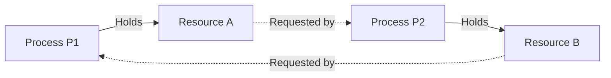

> [!definition] Deadlock
> Deadlock is a pathological condition in an operating system where a set of blocked processes are each holding a resource and waiting to acquire another resource that is currently held by another process in that same set.
> * Under deadlock, none of the involved processes can ever make progress, execute, or release their held resources.
> * **Fundamental Cause**: Lack of sufficient resources to satisfy the simultaneous peak requests of competing processes.

> [!question] Motivating Semaphore Deadlock Example
> Consider two processes $P_1$ and $P_2$ contending for two binary semaphores (or mutually exclusive resources) $A$ and $B$, initialized to $1$:
> 
> ```c
> // Process P1
> wait(A);
> wait(B);
> // Critical Section
> signal(B);
> signal(A);
> ```
> 
> ```c
> // Process P2
> wait(B);
> wait(A);
> // Critical Section
> signal(A);
> signal(B);
> ```
> 
> * **Interleaved Execution Trace**:
>   1. $P_1$ executes `wait(A)` $\implies A$ is acquired by $P_1$ ($A=0$).
>   2. Context switch occurs to $P_2$.
>   3. $P_2$ executes `wait(B)` $\implies B$ is acquired by $P_2$ ($B=0$).
>   4. $P_1$ attempts `wait(B)` $\implies$ blocks indefinitely, waiting for $P_2$ to release $B$.
>   5. $P_2$ attempts `wait(A)` $\implies$ blocks indefinitely, waiting for $P_1$ to release $A$.
>   * Both processes enter an unresolvable circular deadlock.



> [!theorem] The Four Coffman Necessary Conditions
> A deadlock can occur if and only if all four of the following conditions hold simultaneously in the system:
> 1. **Mutual Exclusion**: At least one resource must be held in a non-shareable mode (only one process can use the resource at any given instant).
> 2. **Hold and Wait**: A process must currently hold at least one resource while waiting to acquire additional resources that are held by other processes.
> 3. **No Preemption**: Resources cannot be preempted forcibly from a process; a resource can be released only voluntarily by the process holding it after task completion.
> 4. **Circular Wait**: A closed chain of processes $\{P_0, P_1, \dots, P_n\}$ exists such that $P_0$ is waiting for a resource held by $P_1$, $P_1$ is waiting for a resource held by $P_2$, $\dots$, and $P_n$ is waiting for a resource held by $P_0$.

> [!trap] Necessary vs. Sufficient Distinction
> * The four Coffman conditions are **necessary conditions**, but they are **not individually or collectively sufficient** for multi-instance resource systems.
> * Like the four legs of a table: if even **one condition is broken/negated**, deadlock is mathematically impossible.
> * If all four conditions are satisfied:
>   * For single-instance resource systems: Deadlock definitely occurs.
>   * For multi-instance resource systems: Deadlock **may or may not** occur.
