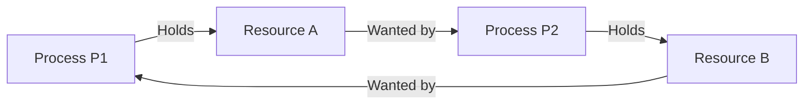

> [!definition] Deadlock
> A deadlock is a state where a set of blocked processes are trapped because each process is holding at least one resource and simultaneously waiting to acquire another resource currently held by another process in that same set[cite: 1].
> * Under this state, none of the involved processes can make progress, consume CPU, or release their held resources without external intervention[cite: 1].
> * **Fundamental Cause**: Lack of sufficient resources to satisfy the peak simultaneous demands of all competing processes[cite: 1].

> [!theorem] Classical Examples of Deadlock Situations
> 1. **System Disk Example**: Consider a system with $2$ disk drives and two concurrent processes $P_1$ and $P_2$[cite: 1]. Each process holds one disk drive and requests the second one[cite: 1]. Neither can proceed until the other releases its drive, creating an unresolvable stalemate[cite: 1].
> 2. **Binary Semaphore Deadlock**: A classic programmatic synchronization deadlock occurs when binary semaphores are requested in reverse order[cite: 1]:
>    
>    | Process $P_1$ | Process $P_2$ |
>    | :--- | :--- |
>    | `wait(A);`[cite: 1] | `wait(B);`[cite: 1] |
>    | `wait(B);`[cite: 1] | `wait(A);`[cite: 1] |
>    
>    If $P_1$ executes `wait(A)` and context switches to $P_2$ which executes `wait(B)`, $P_1$ blocks waiting on `B` while $P_2$ blocks waiting on `A`[cite: 1].

