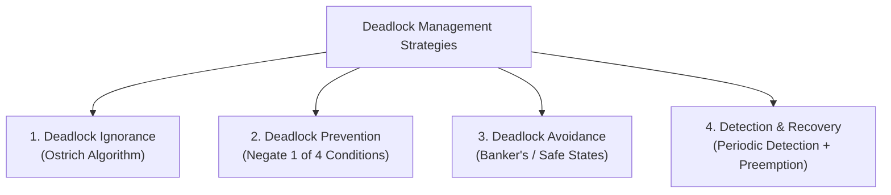

> [!definition] High-Level Deadlock Handling Strategies
> Operating systems handle deadlocks through four primary paradigms[cite: 1]:
> 1. **Deadlock Ignorance (The Ostrich Algorithm)**: Ignore the problem altogether[cite: 1]. If deadlocks occur rarely, it is cheaper to ignore them and manually reboot rather than incur continuous runtime overhead[cite: 1]. Used by most general-purpose operating systems, including Unix, Linux, and Windows[cite: 1].
> 2. **Deadlock Prevention**: Constrain resource requests by designing protocols that systematically negate at least one of the four necessary Coffman conditions[cite: 1].
> 3. **Deadlock Avoidance**: Dynamically track resource allocation states using a priori information about maximum claims (e.g., Banker's Algorithm) to ensure the system never enters an unsafe state[cite: 1].
> 4. **Deadlock Detection and Recovery**: Allow deadlocks to occur freely, detect them periodically using graph algorithms or matrix reduction, and recover via process termination or resource preemption[cite: 1].

