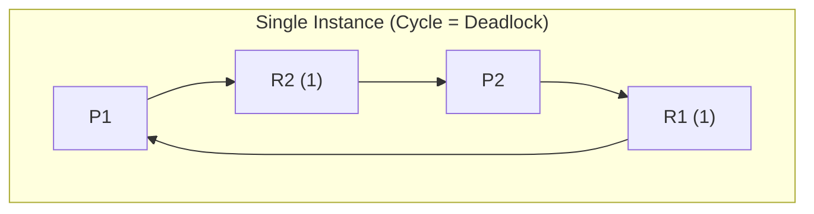

> [!definition] Resource Allocation Graph (RAG)
> A directed graph $G = (V, E)$ used to visually and formally track resource allocation and pending requests:
> * **Vertices ($V$)**: Partitioned into two sets:
>   * Process nodes $P = \{P_1, P_2, \dots, P_n\}$ (represented as circles).
>   * Resource nodes $R = \{R_1, R_2, \dots, R_m\}$ (represented as rectangles, with dots inside representing resource instances).
> * **Edges ($E$)**:
>   * **Request Edge ($P_i \to R_j$)**: A directed edge from process $P_i$ to resource $R_j$, indicating that $P_i$ has requested an instance of $R_j$ and is currently waiting.
>   * **Assignment Edge ($R_j \to P_i$)**: A directed edge from an instance dot inside resource $R_j$ to process $P_i$, indicating that an instance of $R_j$ has been allocated to $P_i$.

> [!theorem] Cycle Invariant in Resource Allocation Graphs
> 1. **No Cycle**: If the Resource Allocation Graph contains no directed cycle, the system is **guaranteed to have no deadlock** (because circular wait cannot exist).
> 2. **Cycle Present + Single-Instance Resources**: If every resource type has exactly one instance, a directed cycle is a **necessary and sufficient** condition for deadlock (Cycle $\iff$ Deadlock).
> 3. **Cycle Present + Multi-Instance Resources**: If resource types contain multiple instances, a cycle is a **necessary but not sufficient** condition (Cycle $\implies$ May or may not be in deadlock).

> [!question] Graph Case Walkthroughs
> **Case 1: Single-Instance with Cycle (Deadlock)**
> * $P_1$ holds $R_1$, requests $R_2$.
> * $P_2$ holds $R_2$, requests $R_1$.
> * Cycle: $P_1 \to R_2 \to P_2 \to R_1 \to P_1$.
> * Result: Single instance per resource type with a cycle $\implies$ **Definitive Deadlock**.
> 
> **Case 2: Multi-Instance with Cycle (No Deadlock)**
> * $R_1$ and $R_2$ each have $2$ instances.
> * $P_1$ holds $R_2$, requests $R_1$.
> * $P_3$ holds $R_1$, requests $R_2$.
> * A cycle exists between $P_1 \to R_1 \to P_3 \to R_2 \to P_1$.
> * However, non-involved external processes exist: $P_2$ holds an instance of $R_1$, and $P_4$ holds an instance of $R_2$ without requesting anything.
> * Sequence: $P_2$ and $P_4$ complete their execution and release their held instances. The freed instances break the cycle, allowing $P_1$ and $P_3$ to proceed.
> * Result: **No Deadlock** (Valid completion order: $P_2, P_4, P_1, P_3$ or $P_2, P_4, P_3, P_1$).
> 
> **Case 3: Multi-Instance with Cycle and No External Threads (Deadlock)**
> * All instances of the involved resource types are fully tied within cyclic chains.
> * No active process can proceed or voluntarily release resources without first receiving its pending requests.
> * Result: **Deadlock**.

