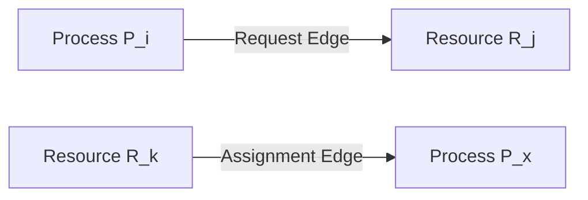
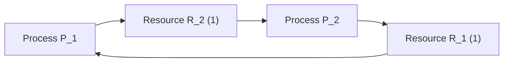

A **Resource Allocation Graph (RAG)** is a directed graph $G = (V, E)$ used to visually and formally track resource allocation and pending requests.

## Graph Components

### Vertices ($V$)
Partitioned into two disjoint sets:
* **Process Nodes ($P$)**: $P = \{P_1, P_2, \dots, P_n\}$, represented as circles.
* **Resource Nodes ($R$)**: $R = \{R_1, R_2, \dots, R_m\}$, represented as rectangles. Dots inside indicate the number of identical instances of that resource type.

### Edges ($E$)
* **Request Edge ($P_i \to R_j$)**: A directed edge from process $P_i$ to resource $R_j$, indicating that $P_i$ has requested an instance of $R_j$ and is currently waiting.
* **Assignment Edge ($R_j \to P_i$)**: A directed edge from an instance dot inside resource $R_j$ to process $P_i$, indicating that an instance of $R_j$ has been allocated to $P_i$.

---

## Cycle Invariant in Resource Allocation Graphs

* **No Cycle**: If the graph contains no directed cycle, the system is guaranteed to have **no deadlock** (circular wait cannot exist).
* **Cycle Present + Single-Instance Resources**: If every resource type in the graph has exactly one instance, a directed cycle is a **necessary and sufficient** condition for deadlock:
  $$\text{Cycle} \iff \text{Deadlock}$$
* **Cycle Present + Multi-Instance Resources**: If any resource type contains multiple instances, a cycle is a **necessary but not sufficient** condition:
  $$\text{Cycle} \centernot\implies \text{Deadlock}$$
  The system may or may not be in deadlock depending on available instances and external processes.

---

## Analyzing RAGs and Deadlock Detection

### Reduction Algorithm Principle
To determine whether a graph with cycles and multi-instance resources is in deadlock:
1. Locate unblocked processes that have no pending requests, or whose requests can be completely satisfied by currently free resource instances.
2. Grant their requests and simulate their execution to completion.
3. Once finished, reclaim all their held resources and return them to the available pool.
4. Repeat this reduction step. If all processes can be eliminated, the system is **not deadlocked**. If a subset of processes remains perpetually blocked and cannot be satisfied, that remaining subset is **deadlocked**.

### Case Walkthroughs

#### 1. Single-Instance with Cycle
When processes form a directed cycle where every resource involved has only a single instance:
* The cycle is tight: each process holds one resource and waits for the next.
* There are no alternative instances available.
* Result: **Definite Deadlock**.

#### 2. Multi-Instance with External Processes (No Deadlock)
A cycle exists within a subset of processes, but one or more resources involved in the cycle have extra instances held by processes **outside** the cycle:
* The external processes have no pending requests.
* They complete execution independently and release their instances back to the pool.
* These newly freed instances satisfy the blocked processes inside the cycle, breaking the circular wait.
* Result: **No Deadlock**.

#### 3. Multi-Instance with Cycle and No External Freeing (Deadlock)
A cycle exists across multi-instance resources, but all instances of the cycle's resources are locked inside the cycle itself, or external holding processes are also blocked waiting on the cycle:
* No free instances exist.
* No holding process can finish or release resources voluntarily.
* Result: **Deadlock**.