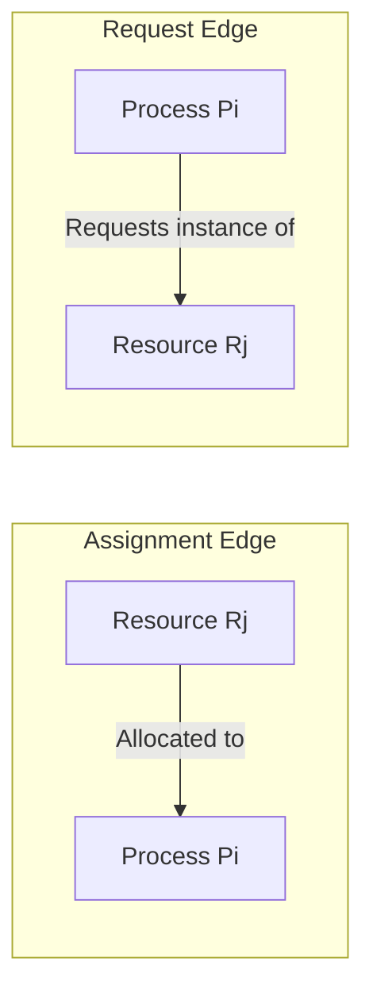
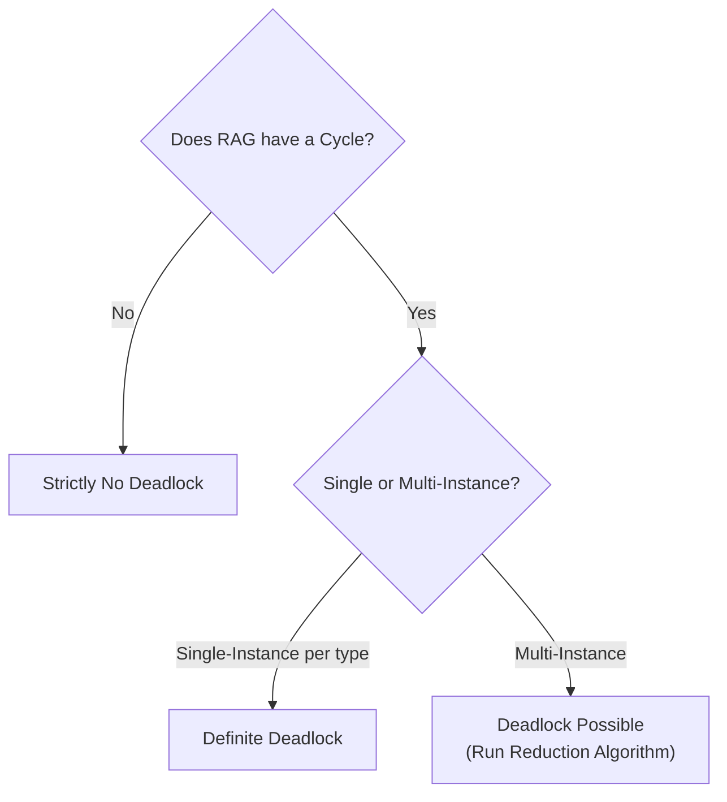

> [!definition] Resource Allocation Graph (RAG)
> A directed graph $G = (V, E)$ describing the resource allocation state[cite: 1].
> * **Vertices ($V$)**: Partitioned into two sets:
>   * Processes: $P = \{P_1, P_2, \dots, P_n\}$ (represented by circles)[cite: 1].
>   * Resources: $R = \{R_1, R_2, \dots, R_m\}$ (represented by rectangles containing dots for instances)[cite: 1].
> * **Edges ($E$)**:
>   * **Request Edge**: Directed edge $P_i \to R_j$ denotes that process $P_i$ has requested an instance of resource type $R_j$ and is currently waiting[cite: 1].
>   * **Assignment (Allocation) Edge**: Directed edge $R_j \to P_i$ denotes that an instance of resource type $R_j$ has been allocated to process $P_i$[cite: 1].

> [!theorem] Cycle and Deadlock Equivalence Invariants
> 1. **No Cycle**: If the Resource Allocation Graph contains **no cycle**, the system is **guaranteed to have no deadlock** (due to the absence of circular wait)[cite: 1].
> 2. **Cycle with Single-Instance Resources**: If every resource type in the graph has exactly **one instance**, a cycle is a **necessary and sufficient** condition for deadlock ($\text{Cycle} \iff \text{Deadlock}$)[cite: 1].
> 3. **Cycle with Multi-Instance Resources**: If resource types contain **multiple instances**, a cycle is only a **necessary condition**, not sufficient[cite: 1]. A cycle **may or may not** indicate a deadlock[cite: 1].

> [!question] RAG Cycle Analysis Walkthrough
> * **Scenario A (Single Instance with Cycle)**: $P_1$ holds $R_1$ and requests $R_2$; $P_2$ holds $R_2$ and requests $R_1$[cite: 1].
>   * Cycle exists: $P_1 \to R_2 \to P_2 \to R_1 \to P_1$[cite: 1].
>   * Since resources are single-instance, this system is in **deadlock**[cite: 1].
> * **Scenario B (Multi-Instance with Cycle but No Deadlock)**:
>   * $R_1$ has $2$ instances; $R_2$ has $2$ instances[cite: 1].
>   * $P_1$ holds an instance of $R_2$ and requests $R_1$[cite: 1].
>   * $P_3$ holds an instance of $R_1$ and requests $R_2$[cite: 1].
>   * Cycle: $P_1 \to R_1 \to P_3 \to R_2 \to P_1$[cite: 1].
>   * But $R_1$ also has an instance allocated to an unblocked process $P_2$, and $R_2$ has an instance allocated to an unblocked process $P_4$[cite: 1].
>   * **Resolution**: $P_4$ or $P_2$ finishes, releases its instance, breaking the cycle[cite: 1]. Execution sequence $\langle P_4, P_3, P_1, P_2 \rangle$ is possible[cite: 1]. Thus, **no deadlock exists**[cite: 1].
