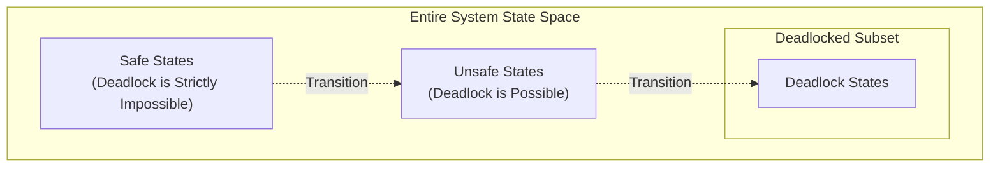

> [!definition] Safe State
> A state is **safe** if there exists at least one **Safe Sequence** of processes $\langle P_1, P_2, \dots, P_n \rangle$ such that for each process $P_i$, the maximum remaining resources that $P_i$ can request can be satisfied by the currently available resources plus the resources held by all preceding processes $P_j$ (where $j < i$)[cite: 1].
> * **Safe State**: Deadlock is **strictly impossible**[cite: 1].
> * **Unsafe State**: Deadlock is **possible** (the system *may* enter deadlock if processes exercise their worst-case claims simultaneously)[cite: 1].
> * An unsafe state is **not equivalent to deadlock**; however, every deadlocked state is an unsafe state[cite: 1].

> [!question] Safe State Verification Walkthrough
> A system has $12$ total magnetic tape drives[cite: 1]. Current allocation state:
> 
> | Process | Current Allocation | Maximum Need | Remaining Need |
> | :--- | :--- | :--- | :--- |
> | $P_0$ | $5$[cite: 1] | $10$[cite: 1] | $5$[cite: 1] |
> | $P_1$ | $2$[cite: 1] | $4$[cite: 1] | $2$[cite: 1] |
> | $P_2$ | $2$[cite: 1] | $9$[cite: 1] | $7$[cite: 1] |
> 
> Total Allocated $= 5 + 2 + 2 = 9$[cite: 1].
> $\text{Available} = 12 - 9 = 3\text{ tape drives}$[cite: 1].
> 
> **Execution Trace**:
> 1. With $\text{Available} = 3$, $P_1$ needs $2 \le 3$. Allocate $2$ to $P_1$[cite: 1].
> 2. $P_1$ finishes and releases its $4$ drives $\implies \text{Available} = 3 + 2 = 5$[cite: 1].
> 3. Now $P_0$ needs $5 \le 5$. Allocate $5$ to $P_0$[cite: 1].
> 4. $P_0$ finishes and releases its $5$ drives $\implies \text{Available} = 5 + 5 = 10$[cite: 1].
> 5. Finally, $P_2$ needs $7 \le 10$. Allocate $7$ to $P_2$, which finishes[cite: 1].
> 
> Safe sequence found: $\mathbf{\langle P_1, P_0, P_2 \rangle}$[cite: 1]. The system is in a **Safe State**[cite: 1].
