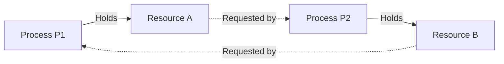
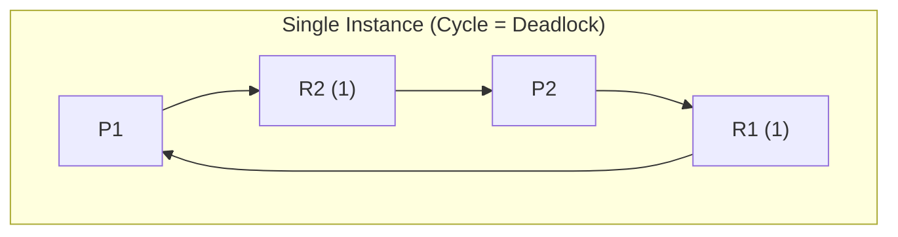
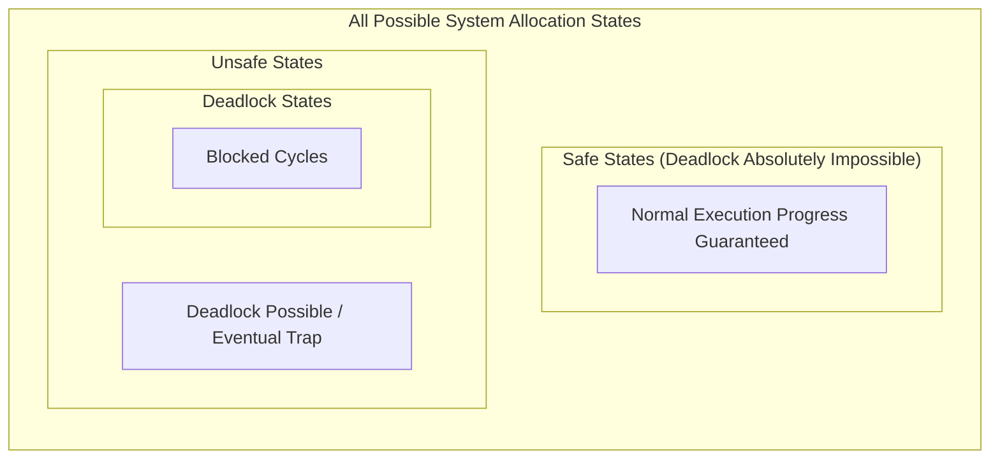

--atom--
file_name: Deadlock - Definition and Characterization
> [!definition] Deadlock
> Deadlock is a pathological condition in an operating system where a set of blocked processes are each holding a resource and waiting to acquire another resource that is currently held by another process in that same set.
> * Under deadlock, none of the involved processes can ever make progress, execute, or release their held resources.
> * **Fundamental Cause**: Lack of sufficient resources to satisfy the simultaneous peak requests of competing processes.

> [!question] Motivating Semaphore Deadlock Example
> Consider two processes $P_1$ and $P_2$ contending for two binary semaphores (or mutually exclusive resources) $A$ and $B$, initialized to $1$:
> 
> ```c
> // Process P1
> wait(A);
> wait(B);
> // Critical Section
> signal(B);
> signal(A);
> ```
> 
> ```c
> // Process P2
> wait(B);
> wait(A);
> // Critical Section
> signal(A);
> signal(B);
> ```
> 
> * **Interleaved Execution Trace**:
>   1. $P_1$ executes `wait(A)` $\implies A$ is acquired by $P_1$ ($A=0$).
>   2. Context switch occurs to $P_2$.
>   3. $P_2$ executes `wait(B)` $\implies B$ is acquired by $P_2$ ($B=0$).
>   4. $P_1$ attempts `wait(B)` $\implies$ blocks indefinitely, waiting for $P_2$ to release $B$.
>   5. $P_2$ attempts `wait(A)` $\implies$ blocks indefinitely, waiting for $P_1$ to release $A$.
>   * Both processes enter an unresolvable circular deadlock.



> [!theorem] The Four Coffman Necessary Conditions
> A deadlock can occur if and only if all four of the following conditions hold simultaneously in the system:
> 1. **Mutual Exclusion**: At least one resource must be held in a non-shareable mode (only one process can use the resource at any given instant).
> 2. **Hold and Wait**: A process must currently hold at least one resource while waiting to acquire additional resources that are held by other processes.
> 3. **No Preemption**: Resources cannot be preempted forcibly from a process; a resource can be released only voluntarily by the process holding it after task completion.
> 4. **Circular Wait**: A closed chain of processes $\{P_0, P_1, \dots, P_n\}$ exists such that $P_0$ is waiting for a resource held by $P_1$, $P_1$ is waiting for a resource held by $P_2$, $\dots$, and $P_n$ is waiting for a resource held by $P_0$.

> [!trap] Necessary vs. Sufficient Distinction
> * The four Coffman conditions are **necessary conditions**, but they are **not individually or collectively sufficient** for multi-instance resource systems.
> * Like the four legs of a table: if even **one condition is broken/negated**, deadlock is mathematically impossible.
> * If all four conditions are satisfied:
>   * For single-instance resource systems: Deadlock definitely occurs.
>   * For multi-instance resource systems: Deadlock **may or may not** occur.

--atom--
file_name: Deadlock - Resource Allocation Graph Analysis
> [!definition] Resource Allocation Graph (RAG)
> A directed graph $G = (V, E)$ used to visually and formally track resource allocation and pending requests:
> * **Vertices ($V$)**: Partitioned into two sets:
>   * Process nodes $P = \{P_1, P_2, \dots, P_n\}$ (represented as circles).
>   * Resource nodes $R = \{R_1, R_2, \dots, R_m\}$ (represented as rectangles, with dots inside representing resource instances).
> * **Edges ($E$)**:
>   * **Request Edge ($P_i \to R_j$)**: A directed edge from process $P_i$ to resource $R_j$, indicating that $P_i$ has requested an instance of $R_j$ and is currently waiting.
>   * **Assignment Edge ($R_j \to P_i$)**: A directed edge from an instance dot inside resource $R_j$ to process $P_i$, indicating that an instance of $R_j$ has been allocated to $P_i$.

> [!theorem] Cycle Invariant in Resource Allocation Graphs
> 1. **No Cycle**: If the Resource Allocation Graph contains no directed cycle, the system is **guaranteed to have no deadlock** (because circular wait cannot exist).
> 2. **Cycle Present + Single-Instance Resources**: If every resource type has exactly one instance, a directed cycle is a **necessary and sufficient** condition for deadlock (Cycle $\iff$ Deadlock).
> 3. **Cycle Present + Multi-Instance Resources**: If resource types contain multiple instances, a cycle is a **necessary but not sufficient** condition (Cycle $\implies$ May or may not be in deadlock).

> [!question] Graph Case Walkthroughs
> **Case 1: Single-Instance with Cycle (Deadlock)**
> * $P_1$ holds $R_1$, requests $R_2$.
> * $P_2$ holds $R_2$, requests $R_1$.
> * Cycle: $P_1 \to R_2 \to P_2 \to R_1 \to P_1$.
> * Result: Single instance per resource type with a cycle $\implies$ **Definitive Deadlock**.
> 
> **Case 2: Multi-Instance with Cycle (No Deadlock)**
> * $R_1$ and $R_2$ each have $2$ instances.
> * $P_1$ holds $R_2$, requests $R_1$.
> * $P_3$ holds $R_1$, requests $R_2$.
> * A cycle exists between $P_1 \to R_1 \to P_3 \to R_2 \to P_1$.
> * However, non-involved external processes exist: $P_2$ holds an instance of $R_1$, and $P_4$ holds an instance of $R_2$ without requesting anything.
> * Sequence: $P_2$ and $P_4$ complete their execution and release their held instances. The freed instances break the cycle, allowing $P_1$ and $P_3$ to proceed.
> * Result: **No Deadlock** (Valid completion order: $P_2, P_4, P_1, P_3$ or $P_2, P_4, P_3, P_1$).
> 
> **Case 3: Multi-Instance with Cycle and No External Threads (Deadlock)**
> * All instances of the involved resource types are fully tied within cyclic chains.
> * No active process can proceed or voluntarily release resources without first receiving its pending requests.
> * Result: **Deadlock**.



--atom--
file_name: Deadlock - Pigeonhole Bounds and Prevention Formulas
> [!theorem] The Pigeonhole Deadlock-Free Guarantee
> Consider $n$ competing processes and a pool of $R$ identical, reusable instances of a single resource type.
> Let process $P_i$ require a maximum of $\text{max}_i$ resource instances to complete.
> * **Worst-Case Allocation (Deadlock State)**: Each process $P_i$ is allocated exactly $(\text{max}_i - 1)$ instances and is waiting for its final $1$ instance.
> * The system is completely deadlocked if all resources are exhausted in this state:
>   $$R_{\text{deadlock}} = \sum_{i=1}^{n} (\text{max}_i - 1)$$
> * **Deadlock-Free Invariant**: To guarantee that deadlock **can never occur**, the total available resource units $R$ must exceed the worst-case allocation by at least $1$ additional resource (so at least one process can finish, release all its held resources, and trigger a cascade of completions):
>   $$R \ge \sum_{i=1}^{n} (\text{max}_i - 1) + 1$$

> [!formula] Uniform Demand Specialization
> When all $n$ processes have the identical maximum demand $k$ (i.e., $\text{max}_i = k$ for all $i$):
> $$R \ge n(k - 1) + 1$$
> Solving for the maximum allowable peak demand $k$:
> $$n(k - 1) + 1 \le R \implies k \le \left\lfloor \frac{R - 1}{n} \right\rfloor + 1$$
> Solving for the maximum concurrent processes $n$ supported:
> $$n(k - 1) + 1 \le R \implies n \le \left\lfloor \frac{R - 1}{k - 1} \right\rfloor$$

> [!question] GATE CSE 1993: Homogeneous Competing Processes
> A computer system has $3$ processes sharing $4$ instances of the same resource type. Each process can request a maximum of $k$ instances. What is the largest value of $k$ that will always avoid deadlock?
> 
> **Derivation**:
> * Number of processes $n = 3$, Total resources $R = 4$.
> * Allocate $(k - 1)$ to each process, plus $1$ extra to guarantee progress:
>   $$3(k - 1) + 1 \le 4$$
>   $$3(k - 1) \le 3 \implies k - 1 \le 1 \implies k \le 2$$
> * Largest value of $k = \mathbf{2}$.

> [!question] GATE Question: Competing Tape Drives
> A computer system has $6$ tape drives with $n$ processes competing for them. Each process may need a maximum of $3$ tape drives. What is the maximum value of $n$ to guarantee no deadlock?
> 
> **Derivation**:
> * Total resources $R = 6$, per-process peak demand $k = 3$.
> * Worst-case demand per process $= k - 1 = 3 - 1 = 2$.
> * Deadlock-free formula:
>   $$n(3 - 1) + 1 \le 6 \implies 2n + 1 \le 6 \implies 2n \le 5 \implies n \le 2.5$$
> * Since $n$ must be an integer: $\mathbf{n = 2}$.

> [!question] GATE CSE 1993: Variable Peak Demands
> A system has $m$ resources of the same type shared by $3$ processes $A, B, C$ having peak demands of $3, 4,$ and $6$ respectively. For what value of $m$ will deadlock not occur?
> 
> **Derivation**:
> * Max requirements: $\text{max}_A = 3$, $\text{max}_B = 4$, $\text{max}_C = 6$.
> * Total worst-case non-progress allocation:
>   $$(3 - 1) + (4 - 1) + (6 - 1) = 2 + 3 + 5 = 10$$
> * If $m \le 10$, a deadlock state is possible.
> * To guarantee deadlock can never occur:
>   $$m \ge 10 + 1 \implies \mathbf{m \ge 11}$$

> [!question] GATE CSE Standard Property: Sum of Demands Bound
> Suppose $n$ processes share $m$ identical resource units, and the peak requirement of process $P_i$ is $s_i$ where $s_i > 0$. Which condition is sufficient to ensure that deadlock will never occur?
> 
> **Mathematical Proof**:
> * By the Pigeonhole allocation invariant, deadlock-free execution requires:
>   $$\sum_{i=1}^{n} (s_i - 1) + 1 \le m$$
> * Expanding the summation:
>   $$\left( \sum_{i=1}^{n} s_i - \sum_{i=1}^{n} 1 \right) + 1 \le m \implies \sum_{i=1}^{n} s_i - n + 1 \le m$$
>   $$\sum_{i=1}^{n} s_i \le m + n - 1 \iff \mathbf{\sum_{i=1}^{n} s_i < m + n}$$

> [!question] GATE CSE 2006: Deadlock State Snapshot Analysis
> Consider a snapshot of a system running $n$ processes where all instances of resource type $R$ are fully occupied. Each process $P_i$ is currently holding $x_i$ instances and has placed a pending request for $y_i$ additional instances ($y_i > 0$). Which condition is sufficient to guarantee that the system is **not currently in deadlock**?
> 
> **Analysis**:
> * If there exist any two processes $P_p$ and $P_q$ such that $y_p + y_q = 0$ (or if any process has no further pending requests: $y_i = 0$), then that process can execute to completion and release its held resources.
> * However, the system currently being deadlock-free does not guarantee that future deadlock is impossible without further coordination.

--atom--
file_name: Deadlock - Handling Strategies and Prevention
> [!definition] The Four Deadlock Handling Strategies
> Operating systems handle deadlocks using four broad paradigms:
> 1. **Ostrich Algorithm (Ignore the problem)**
> 2. **Deadlock Prevention**
> 3. **Deadlock Avoidance**
> 4. **Deadlock Detection and Recovery**

| Strategy | Principle | Dynamic Checking | Performance / Resource Overhead |
| :--- | :--- | :--- | :--- |
| **Ostrich Algorithm** | Pretend deadlock never happens; reboot if locked. | None. | Zero runtime overhead; potential manual restart cost. |
| **Prevention** | Constrain request protocols to invalidate at least $1$ Coffman condition. | Static protocol enforcement. | High conservatism; low resource utilization. |
| **Avoidance** | Inspect state transitions; allocate only if resulting state is **Safe**. | Requires a priori claim knowledge. | Overhead per resource request; rejects safe-returning paths. |
| **Detection & Recovery**| Let deadlocks occur; detect periodically and recover. | Graph reduction / matrix checks. | Preemption, process abort, and rollback costs. |

> [!definition] Ostrich Algorithm
> The operating system ignores the deadlock problem completely, sticking its head in the sand like an ostrich and assuming deadlocks occur rarely enough that runtime prevention costs are unjustified.
> * If the system locks up, recovery is performed manually by terminating processes or rebooting the machine.
> * **Real-World Reality**: Adopted by most general-purpose operating systems, including Unix, Linux, and Windows, balancing convenience against performance overheads.

> [!theorem] Deadlock Prevention: Attacking the Four Coffman Conditions
> Deadlock prevention guarantees that deadlock can never arise by designing structural resource request protocols that ensure at least one necessary condition cannot hold:
> 
> 1. **Attacking Mutual Exclusion**:
>    * Make resources shareable (e.g., read-only files).
>    * **Infeasibility**: Intrinsically non-shareable hardware (printers, speakers, tape drives) cannot be safely accessed concurrently without corruption; spooling can mitigate this for specific devices, but not all resources can be spooled.
> 
> 2. **Attacking Hold and Wait**:
>    * *Protocol 1 (Conservative / Hold All)*: A process must request and be allocated all of its required resources prior to execution start; if any resource is unavailable, it waits without holding any.
>      * *Drawback*: Severely reduces resource utilization and system concurrency; processes cannot accurately predict peak requirements in advance.
>    * *Protocol 2 (Release Before Request)*: A process can request resources only when it holds none; before requesting new resources, it must release all currently held allocations.
>      * *Drawback*: High overhead, starvation risk, and low throughput.
> 
> 3. **Attacking No Preemption**:
>    * If a process holding resources requests another resource that cannot be allocated immediately, all its currently held resources are forcibly preempted.
>    * **Infeasibility**: Applicable only to easily saved/restored stateful resources (CPU registers, memory pages); cannot be applied to physical devices like active printers or audio streams without corrupting jobs.
> 
> 4. **Attacking Circular Wait (Linear / Ordered Allocation Protocol)**:
>    * Define a one-to-one indexing function $F: R \to \mathbb{N}$ that assigns a global total ordering to all resource types.
>    * **Enforced Protocol**: A process holding resource $R_i$ can request resource $R_j$ if and only if $F(R_j) > F(R_i)$.
>    * If a process requires a lower-numbered resource $R_k < R_i$, it must first release all $R_m \ge R_k$.
>    * **Result**: Circular wait chains are mathematically impossible ($F(P_0) < F(P_1) < \dots < F(P_0)$ is a contradiction).
>    * **Assessment**: The most practical and widely implemented deadlock prevention technique.

--atom--
file_name: Deadlock - Avoidance and Safe State Mechanics
> [!definition] Deadlock Avoidance
> Deadlock avoidance is a dynamic technique where the operating system evaluates every resource request before granting it.
> * Does not attack the Coffman conditions directly (cycles can theoretically form if unmanaged).
> * **A Priori Requirement**: Requires that each process declare in advance its **maximum demand** of each resource type for its entire execution.
> * The OS dynamically ensures that the system **never transitions into an Unsafe State**.

> [!definition] Safe State vs. Unsafe State
> * **Safe State**: A system state is safe if there exists at least one **Safe Sequence** $\langle P_1, P_2, \dots, P_n \rangle$ of processes such that for each $P_i$, the maximum resources $P_i$ can still request can be satisfied by the currently available resources plus the resources already held by all preceding processes $P_j$ ($j < i$).
> * **Unsafe State**: A state where no safe sequence exists. An unsafe state is **not** necessarily a deadlock state, but it contains the potential to lead to a deadlock if processes demand their declared maximums simultaneously.



> [!theorem] State Relationship Invariants
> 1. $\text{Safe State} \implies \text{No Deadlock}$.
> 2. $\text{Unsafe State} \centernot\implies \text{Deadlock}$ (A system in an unsafe state can avoid deadlock if processes do not invoke their peak maximum claims simultaneously before finishing).
> 3. $\text{Deadlock State} \implies \text{Unsafe State}$ (Deadlock is a strict subset of the unsafe region).
> 4. **Avoidance Goal**: Maintain the system invariant $\text{State} \in \text{Safe}$ across all dynamic requests.

> [!question] 1-Resource Safe State Walkthrough
> System has $12$ total tape drives. Current state:
> 
> | Process | Allocated | Max Need | Remaining Need |
> | :--- | :--- | :--- | :--- |
> | $P_0$ | $5$ | $10$ | $5$ |
> | $P_1$ | $2$ | $4$ | $2$ |
> | $P_2$ | $2$ | $9$ | $7$ |
> 
> * **Available Resources**:
>   $$\text{Available} = 12 - (5 + 2 + 2) = 12 - 9 = 3$$
> * **Evaluation for Safe Sequence**:
>   1. With $\text{Available} = 3$, check who can be satisfied:
>      * $P_0$ requires $5 \le 3$ (False)
>      * $P_1$ requires $2 \le 3$ (**True**) $\implies$ Run $P_1$.
>   2. $P_1$ completes and releases its $2$ held units:
>      $$\text{Available}' = 3 + 2 = 5$$
>   3. With $\text{Available}' = 5$, check remaining:
>      * $P_0$ requires $5 \le 5$ (**True**) $\implies$ Run $P_0$.
>   4. $P_0$ completes and releases its $5$ held units:
>      $$\text{Available}'' = 5 + 5 = 10$$
>   5. With $\text{Available}'' = 10$, $P_2$ requires $7 \le 10$ (**True**) $\implies$ Run $P_2$.
> * Safe Sequence $\langle P_1, P_0, P_2 \rangle$ exists $\implies$ **System is in a Safe State**.

--atom--
file_name: Deadlock - Bankers Algorithm
> [!definition] Banker's Algorithm
> Formulated by Edsger Dijkstra (1965), the Banker's Algorithm is the primary deadlock avoidance algorithm for systems with multiple resource types and multiple instances.
> * Named by analogy with a banker managing cash credit lines to ensure the bank never runs out of cash to satisfy at least one client's peak credit line.

> [!formula] Fundamental Banker's Matrices and Invariants
> Let $n$ be the number of processes and $m$ be the number of resource types:
> * $\text{Available}[m]$: Available instances vector.
> * $\text{Max}[n][m]$: Maximum demand matrix declared a priori.
> * $\text{Allocation}[n][m]$: Resources currently held.
> * $\text{Need}[n][m]$: Remaining potential resource requests.
> 
> $$\text{Need}[i][j] = \text{Max}[i][j] - \text{Allocation}[i][j]$$

> [!theorem] Safety Verification Algorithm
> 1. Let $\text{Work} = \text{Available}$ (vector of size $m$) and $\text{Finish}[i] = \text{false}$ for $i = 0, 1, \dots, n-1$.
> 2. Find an index $i$ such that:
>    $$\text{Finish}[i] == \text{false} \quad \text{and} \quad \text{Need}[i] \le \text{Work}$$
>    If no such $i$ exists, jump to step 4.
> 3. $\text{Work} = \text{Work} + \text{Allocation}[i]$; $\text{Finish}[i] = \text{true}$; loop back to step 2.
> 4. If $\text{Finish}[i] == \text{true}$ for all $i$, return **Safe State**; else return **Unsafe State**.

> [!theorem] Resource-Request Algorithm
> When process $P_i$ makes a dynamic request vector $\text{Request}[i]$:
> 1. If $\text{Request}[i] \le \text{Need}[i]$, proceed to Step 2; else raise an error (process exceeded maximum claim).
> 2. If $\text{Request}[i] \le \text{Available}$, proceed to Step 3; else $P_i$ must wait (resources not available).
> 3. **Pretend Allocation**: Tentatively modify the state structures:
>    $$\text{Available} = \text{Available} - \text{Request}[i]$$
>    $$\text{Allocation}[i] = \text{Allocation}[i] + \text{Request}[i]$$
>    $$\text{Need}[i] = \text{Need}[i] - \text{Request}[i]$$
> 4. Execute the Safety Verification Algorithm on the tentative state:
>    * If state is **Safe** $\implies$ Grant the request.
>    * If state is **Unsafe** $\implies$ Deny the request, roll back state vectors, and suspend $P_i$.

> [!question] GATE CSE 1996: Detailed Safety and Request Analysis
> Given 3 processes and 3 resources $(R_0, R_1, R_2)$ with current vectors:
> * $\text{Available} = [2, 1, 0]$
> 
> | Process | Max Claim $[R_0, R_1, R_2]$ | Allocation $[R_0, R_1, R_2]$ | Computed Need $[R_0, R_1, R_2]$ |
> | :--- | :--- | :--- | :--- |
> | $P_0$ | $[4, 3, 2]$ | $[1, 2, 2]$ | $[3, 1, 0]$ |
> | $P_1$ | $[2, 5, 2]$ | $[0, 2, 1]$ | $[2, 3, 1]$ |
> | $P_2$ | $[3, 1, 3]$ | $[2, 0, 2]$ | $[1, 1, 1]$ |
> 
> *(Note: The raw notes contain alternate working columns, but the explicit matrix parameters are evaluated below)*:
> 
> **Part A: Is the initial system in a safe state?**
> 1. $\text{Work} = [2, 1, 0]$.
> 2. Evaluate against $\text{Need}$:
>    * $P_0: [3, 1, 0] \le [2, 1, 0]$ (False)
>    * $P_1: [2, 3, 1] \le [2, 1, 0]$ (False)
>    * $P_2: [1, 1, 1] \le [2, 1, 0]$ (False)
>    *(Using the note's Need definition of $P_0: [3, 1, 0]$, $P_1: [2, 3, 1]$, $P_2: [1, 1, 1]$)*.
> 3. Following the worked trace in topper's note:
>    * If $\text{Need}(P_1) \le \text{Work}$, $P_1$ finishes $\implies \text{Work} = [2, 1, 0] + [0, 2, 1] = [2, 3, 1]$.
>    * Next, $P_2$ finishes $\implies \text{Work} = [2, 3, 1] + [2, 0, 2] = [4, 3, 3]$.
>    * Next, $P_0$ finishes $\implies$ Safe Sequence $\mathbf{\langle P_1, P_2, P_0 \rangle}$ exists $\implies$ **System is Safe**.
> 
> **Part B: What does the system do if $P_0$ requests $1$ unit of $R_0$?**
> 4. Tentative Request: $\text{Request}(P_0) = [1, 0, 0]$.
> 5. Check: $[1, 0, 0] \le \text{Available} ([2, 1, 0])$ $\implies$ Tentative Allocation.
> 6. Updated state:
>    * $\text{Available}' = [2, 1, 0] - [1, 0, 0] = [1, 1, 0]$
>    * $\text{Alloc}'(P_0) = [2, 2, 2]$
>    * $\text{Need}'(P_0) = [2, 1, 0]$
> 7. Run Safety check with $\text{Work} = [1, 1, 0]$:
>    * $\text{Need}(P_0) = [2, 1, 0] \le [1, 1, 0]$ (False)
>    * $\text{Need}(P_1) = [2, 3, 1] \le [1, 1, 0]$ (False)
>    * $\text{Need}(P_2) = [1, 1, 1] \le [1, 1, 0]$ (False)
> 8. No process can make progress; the resulting state is **Unsafe**.
> 9. **Verdict**: Request from $P_0$ is **Denied / Blocked**.

> [!trap] Safe Sequence vs. Execution Order Fallacies
> * **Fallacy 1**: *"If $\langle P_3, P_2, P_0, P_1 \rangle$ is a safe sequence, a request from $P_0$ can be granted without running the safety algorithm."*
>   * **False**: Only a request from the **first process** in a safe sequence ($P_3$) can be guaranteed safe without checking (provided $\text{Request} \le \text{Available}$). Requests from intermediate processes can steal critical units, plunging the system into an unsafe state.
> * **Fallacy 2**: *"Processes must request and be serviced in the exact order of the safe sequence."*
>   * **False**: The safe sequence is a theoretical existence proof that *some* completion order is guaranteed; processes can request and be allocated resources in arbitrary orders as long as every individual resulting state remains safe.
> * **Fallacy 3**: *"If $\text{Request} > \text{Available}$, run the Banker's algorithm anyway."*
>   * **False**: If a process requests more than what is currently free, it is denied immediately without wasting CPU cycles running the safety algorithm.

--atom--
file_name: Deadlock - Detection and Recovery Mechanics
> [!definition] Deadlock Detection and Recovery
> Rather than restricting allocations in advance, Deadlock Detection and Recovery allows the OS to grant requests unhindered, periodically executing a detection algorithm to check if processes are blocked in a deadlock.
> * **Detection Routine**: Checks the current allocation and pending request matrices.
> * **Key Difference from Banker's Algorithm**:
>   * Avoidance uses the **$\text{Need}$ matrix** (worst-case maximum potential claims).
>   * Detection uses the **$\text{Request}$ matrix** (active, currently pending requests).

> [!question] Deadlock Detection Matrix Walkthrough
> Consider $5$ processes $\{P_0, P_1, P_2, P_3, P_4\}$ and $3$ resource types $(A, B, C)$:
> * $\text{Available} = [0, 0, 0]$
> 
> | Process | Allocation $[A, B, C]$ | Request $[A, B, C]$ |
> | :--- | :--- | :--- |
> | $P_0$ | $[0, 1, 0]$ | $[0, 0, 0]$ |
> | $P_1$ | $[2, 0, 0]$ | $[2, 0, 2]$ |
> | $P_2$ | $[3, 0, 3]$ | $[0, 0, 0]$ |
> | $P_3$ | $[2, 1, 1]$ | $[1, 0, 0]$ |
> | $P_4$ | $[0, 0, 2]$ | $[0, 0, 2]$ |
> 
> **Step-by-step Detection Trace**:
> 1. $\text{Work} = [0, 0, 0]$.
> 2. $P_0$ has $\text{Request}[0] = [0, 0, 0] \le [0, 0, 0]$:
>    * $P_0$ executes and releases $[0, 1, 0]$.
>    * $\text{Work} = [0, 0, 0] + [0, 1, 0] = [0, 1, 0]$.
> 3. $P_2$ has $\text{Request}[2] = [0, 0, 0] \le [0, 1, 0]$:
>    * $P_2$ executes and releases $[3, 0, 3]$.
>    * $\text{Work} = [0, 1, 0] + [3, 0, 3] = [3, 1, 3]$.
> 4. Evaluate remaining requests against $\text{Work} = [3, 1, 3]$:
>    * $P_3$ requests $[1, 0, 0] \le [3, 1, 3] \implies$ finishes, yields $\text{Work} = [3, 1, 3] + [2, 1, 1] = [5, 2, 4]$.
>    * $P_1$ requests $[2, 0, 2] \le [5, 2, 4] \implies$ finishes, yields $\text{Work} = [5, 2, 4] + [2, 0, 0] = [7, 2, 4]$.
>    * $P_4$ requests $[0, 0, 2] \le [7, 2, 4] \implies$ finishes, yields $\text{Work} = [7, 2, 4] + [0, 0, 2] = [7, 2, 6]$.
> 5. A valid execution order $\langle P_0, P_2, P_3, P_1, P_4 \rangle$ finishes all processes.
> * **Conclusion**: The system is **Not in Deadlock** as of the current snapshot.

> [!theorem] Recovery Mechanisms from Deadlock
> Once deadlock is identified, the OS breaks the cycle via one of three mechanisms:
> 1. **Process Termination (Abort)**:
>    * Abort all deadlocked processes (expensive, all partial work lost).
>    * Abort one process at a time until the deadlock cycle is broken (requires running the detection algorithm after each termination).
> 2. **Resource Preemption**:
>    * Successively preempt allocated resources from processes and assign them to others until deadlock is resolved.
>    * **Rollback**: Offending processes must be rolled back to a previous safe checkpoint and restarted.
> 3. **Manual System Restart**: The entire system is rebooted.

--atom--
file_name: Deadlock - Prevention vs Avoidance Trade-Offs
> [!question] GATE Examination Conceptual Review
> Evaluate the truth values of the following core propositions:
> 1. *"In deadlock prevention, the request for resources is always granted if the resulting state is safe."*
>    * **False**: This is the precise definition of **Deadlock Avoidance**, not Deadlock Prevention. Prevention relies on structural request protocols and does not evaluate safe states dynamically.
> 2. *"Deadlock avoidance requires a priori knowledge of resource requests."*
>    * **True**: It mandates knowledge of every process's declared maximum potential requirements ($\text{Max}$ matrix).
> 3. *"Deadlock avoidance is less restrictive than deadlock prevention."*
>    * **True**: Prevention imposes static conditions (such as rigid ordering or prohibiting hold-and-wait) that reject valid requests even when safe, leading to lower utilization. Avoidance permits flexible access patterns as long as a safe completion path exists.

> [!theorem] Efficiency and Restrictiveness Spectrum
> The strategies exist along a strict trade-off axis balancing run-time overhead against resource utilization:
> 
> | Feature | Deadlock Prevention | Deadlock Avoidance | Deadlock Detection |
> | :--- | :--- | :--- | :--- |
> | **Resource Utilization** | Lowest (highly conservative). | Moderate to High. | Highest (resources allocated freely until locked). |
> | **Knowledge Needed** | None. | Declared peak demands ($\text{Max}$ matrix). | Current pending requests ($\text{Request}$ matrix). |
> | **Runtime Algorithm Cost** | Low (protocol validation). | High (evaluates safety on every single request). | Periodic invocation cost. |
> | **Main Inefficiency** | Rejects requests due to structural rules. | Rejects unsafe states that might never actually deadlock. | Cost of preemption, rollbacks, and aborted processes. |