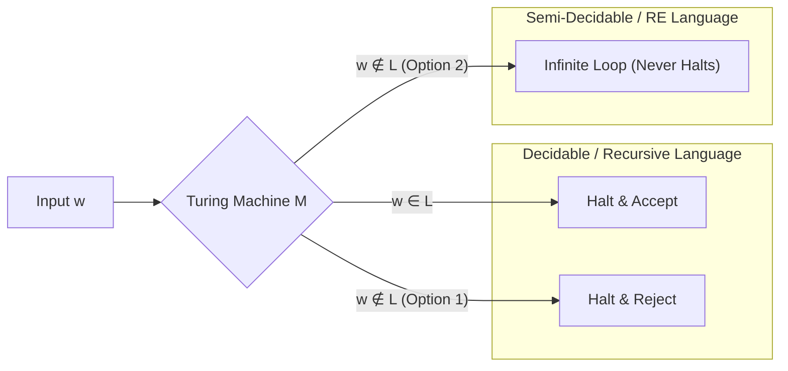

> [!definition]
> - **Decidable Language (Recursive):** A language $L$ for which there exists a Halting Turing Machine (HTM / Decider) that halts on every input string $w \in \Sigma^*$[cite: 1]:
>   - Halts in an accepting state if $w \in L$[cite: 1].
>   - Halts in a non-accepting state if $w \notin L$[cite: 1].
> - **Turing-Recognizable / Semi-Decidable (RE):** A language for which a TM halts and accepts if $w \in L$, but may run forever in an infinite loop if $w \notin L$[cite: 1].
> - **Undecidable Problem:** A decision problem for which no total halting algorithm (HTM) can be constructed[cite: 1].

> [!theorem]
> ### Halting Problem of Turing Machine
> The language $A_{\text{TM}} = \{\langle M, w \rangle \mid M \text{ is a TM that accepts } w\}$ and the generic Halting Problem $H_{\text{TM}} = \{\langle M, w \rangle \mid M \text{ halts on } w\}$ are:
> 1. **Recursively Enumerable (RE / Semi-Decidable)**[cite: 1].
> 2. **Undecidable** (proven via Cantor's diagonal argument)[cite: 1].
> 3. Their complements ($\overline{A_{\text{TM}}}, \overline{H_{\text{TM}}}$) are **strictly Non-RE** (Not recognized by any TM)[cite: 1].

> [!formula]
> ### Master Decidability Decision Matrix
> | Decision Problem | Regular (DFA/NFA) | DCFL | CFL | CSL / LBA | Recursive (HTM) | RE (TM) |
> | :--- | :---: | :---: | :---: | :---: | :---: | :---: |
> | **Membership ($w \in L$)** | **D**[cite: 1] | **D**[cite: 1] | **D** (CYK)[cite: 1] | **D**[cite: 1] | **D**[cite: 1] | **UD**[cite: 1] |
> | **Emptiness ($L = \emptyset$)** | **D**[cite: 1] | **D**[cite: 1] | **D**[cite: 1] | **UD**[cite: 1] | **UD**[cite: 1] | **UD**[cite: 1] |
> | **Finiteness ($|L| < \infty$)** | **D**[cite: 1] | **D**[cite: 1] | **D**[cite: 1] | **UD**[cite: 1] | **UD**[cite: 1] | **UD**[cite: 1] |
> | **Totality ($L = \Sigma^*$)** | **D**[cite: 1] | **D**[cite: 1] | **UD**[cite: 1] | **UD**[cite: 1] | **UD**[cite: 1] | **UD**[cite: 1] |
> | **Equivalence ($L_1 = L_2$)** | **D**[cite: 1] | **D**[cite: 1] | **UD**[cite: 1] | **UD**[cite: 1] | **UD**[cite: 1] | **UD**[cite: 1] |
> | **Disjointness ($L_1 \cap L_2 = \emptyset$)** | **D**[cite: 1] | **UD**[cite: 1] | **UD**[cite: 1] | **UD**[cite: 1] | **UD**[cite: 1] | **UD**[cite: 1] |
> | **Ambiguity Problem** | N/A (None) | N/A | **UD** | **UD** | **UD** | **UD** |

> [!trap]
> **The Decidability Boundary Traps:**
> 1. **Totality & Equivalence Transition:** Both Totality ($L = \Sigma^*$) and Equivalence ($L_1 = L_2$) are **Decidable for DCFL**, but immediately become **Undecidable for general CFL**[cite: 1].
> 2. **Disjointness Boundary:** Disjointness ($L_1 \cap L_2 = \emptyset$) is **Decidable for Regular**, but is **Undecidable for DCFL, CFL, and all higher classes**[cite: 1].

> [!question]
> **IOCL CBT Practice Question:**
> Which of the following problems is undecidable?
> (A) Checking if a given DFA accepts the empty string $\epsilon$
> (B) Determining if two minimal DFAs recognize the same language
> (C) Checking whether a given Context-Free Grammar is ambiguous
> (D) Determining whether a string $w$ belongs to a Context-Free Language
>
> **Answer:** (C)
> **Step-by-Step Explanation:**
> 1. (A) is a membership check on a DFA, which is decidable by running the DFA on $\epsilon$[cite: 1].
> 2. (B) is the DFA equivalence problem, which is decidable via symmetric difference ($L_1 \oplus L_2 = \emptyset$)[cite: 1].
> 3. (D) is the CFL membership problem, which is decidable in $O(n^3)$ time using the CYK (Cocke-Younger-Kasami) dynamic programming algorithm[cite: 1].
> 4. (C) Checking whether a general CFG is ambiguous is proven undecidable via reduction from the Post Correspondence Problem (PCP).
