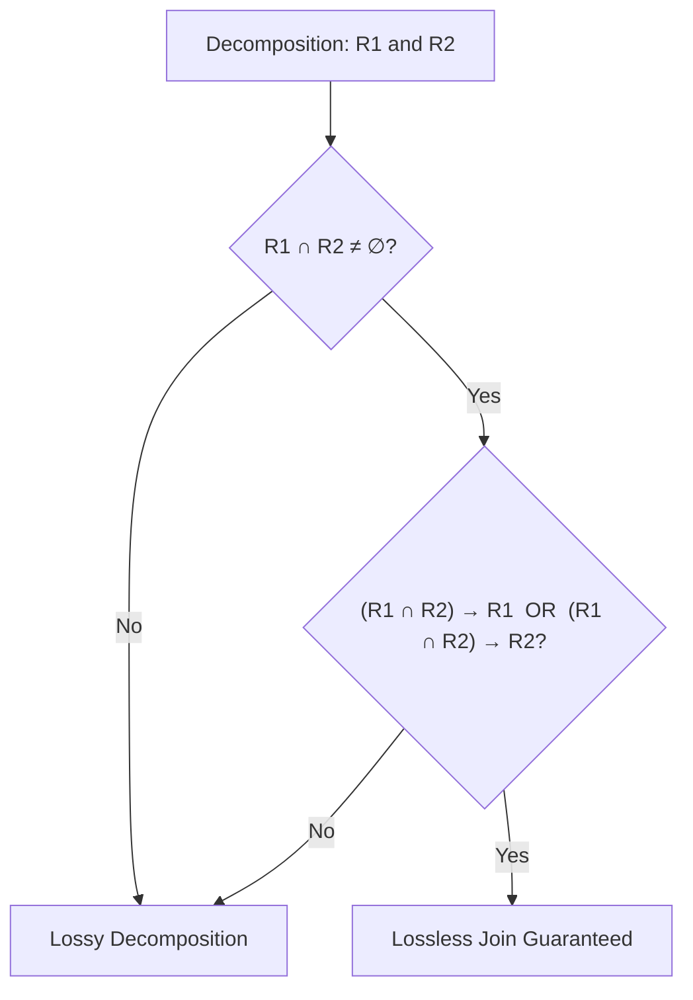

> [!definition]
> Let relation $R$ be decomposed into sub-relations $R_1, R_2, \dots, R_k$[cite: 2].
> 1. **Lossless Join Decomposition:** The decomposition is lossless if the natural join of projections reconstructs the original instance without spurious tuples[cite: 2]:
>    $$R_1 \bowtie R_2 \bowtie \dots \bowtie R_k = R$$[cite: 2]
> 2. **Dependency Preservation:** If $F$ is the set of FDs on $R$, and $F_i$ is the projection of $F$ onto $R_i$, the decomposition preserves dependencies if[cite: 2]:
>    $$(F_1 \cup F_2 \cup \dots \cup F_k)^+ = F^+$$[cite: 2]

> [!theorem]
> **Lossless Condition for Binary Decomposition ($R \rightarrow R_1, R_2$):**
> A decomposition of $R$ into $R_1$ and $R_2$ is lossless if and only if[cite: 2]:
> 1. $R_1 \cup R_2 = R$[cite: 2]
> 2. $R_1 \cap R_2 \neq \emptyset$[cite: 2]
> 3. $(R_1 \cap R_2) \rightarrow R_1 \quad \lor \quad (R_1 \cap R_2) \rightarrow R_2$[cite: 2]
> *(The common attribute set must form a super key of at least one sub-relation)*[cite: 2].

> [!question]
> **GATE / IOCL Practice Drill:**
> Let $R(A, B, C, D)$ have FDs $F = \{A \rightarrow B, B \rightarrow C, C \rightarrow D, D \rightarrow B\}$[cite: 1]. Consider the decomposition into $R_1(A, B)$, $R_2(B, C)$, and $R_3(B, D)$[cite: 1].
> Verify whether the decomposition is (i) Lossless Join, and (ii) Dependency Preserving[cite: 1].
>
> **Step-by-Step Resolution:**
> 1. **Lossless Test via Successive Binary Joins:**
>    * Join $R_2(B, C)$ and $R_3(B, D)$:
>      $$R_2 \cap R_3 = \{B\}$$[cite: 1]
>      From $F$, $B^+ = \{B, C, D\}$. Thus, $B \rightarrow BCD$, meaning $B \rightarrow R_2$ and $B \rightarrow R_3$[cite: 1].
>      Since $B$ is a super key of both, merging $R_2$ and $R_3$ yields $R_{23}(B, C, D)$ losslessly[cite: 1, 2].
>    * Join $R_1(A, B)$ and $R_{23}(B, C, D)$:
>      $$R_1 \cap R_{23} = \{B\}$$[cite: 1]
>      In $R_{23}$, does $B \rightarrow R_{23}$ hold?
>      Yes, $B^+ = \{B, C, D\} = R_{23}$[cite: 1].
>      Therefore, $R_1 \cap R_{23}$ is a super key of $R_{23}$, making the entire decomposition **Lossless**[cite: 1, 2].
> 2. **Dependency Preservation Test:**
>    * $A \rightarrow B$ can be tested in $R_1(A, B)$[cite: 1].
>    * $B \rightarrow C$ can be tested in $R_2(B, C)$[cite: 1].
>    * $D \rightarrow B$ can be tested in $R_3(B, D)$[cite: 1].
>    * Testing $C \rightarrow D$: Attribute $C$ is in $R_2$ and $D$ is in $R_3$[cite: 1]. Neither relation contains both $C$ and $D$[cite: 1].
>    * Compute $C^+$ using only preserved dependencies $F' = \{A \rightarrow B, B \rightarrow C, D \rightarrow B\}$:
>      $$C^+ = \{C\}$$[cite: 1]
>      $D$ cannot be derived from $C$ using $F'$ alone[cite: 1]. Hence, $C \rightarrow D$ is **lost**[cite: 1].
>
> **Conclusion:** The decomposition is **Lossless join but NOT dependency preserving**[cite: 1].
