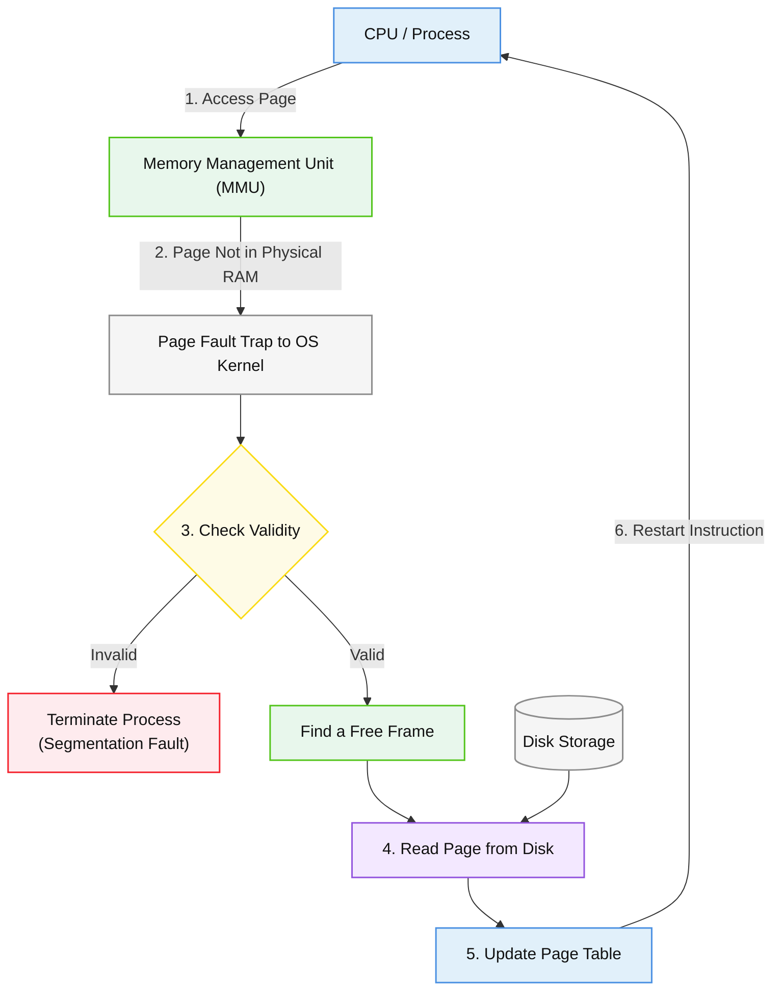

## Demand Paging
In demand paging, pages are brought into physical main memory only when they are referenced (demanded) by the CPU during execution[cite: 1, 2].
* **Pure Demand Paging**: Execution starts with zero pages of the process in main memory; all pages reside initially on disk.
* Even if only a single page frame of memory is allocated, execution can proceed, bringing pages on demand.

## Page Fault Interrupt
When the CPU generates an address for a page that is marked invalid or absent from physical main memory, the hardware MMU triggers a special internal hardware trap/interrupt called a **Page Fault Interrupt**[cite: 2, 6].

### Complete Page Fault Handling Flow #revision
When a virtual address referencing an unmapped page is issued:
1. **Virtual Address Inspection**: CPU generates a virtual address $(\text{Page Number } p, \text{Offset } d)$[cite: 2, 6].
2. **Page Table Lookup**: The MMU checks the corresponding Page Table Entry (PTE). The valid/invalid bit is set to $0$ (Invalid/Not Present)[cite: 1, 2, 6].
3. **Trap to OS**: MMU issues a page fault interrupt, shifting control to the OS page fault handler routine[cite: 2, 6].
4. **Free Frame Check & Allocation**:
   * If a free frame exists in physical RAM, allocate it[cite: 3].
   * If no free frame exists, a **Page Replacement Algorithm** selects a victim page[cite: 3, 6].
5. **Dirty Bit Evaluation**: If the victim page's dirty (modified) flag is $1$ (True), write it back to secondary storage (disk); if $0$ (False), overwrite without disk write[cite: 3, 6].
6. **Invalidate Old Entry**: Mark the victim page's PTE as invalid and flush any matching TLB entries[cite: 3, 6].
7. **Disk I/O Transfer**: Bring the required page from disk into the allocated physical frame[cite: 2, 3, 6].
8. **Update PTE**: Write the new frame number into the PTE, set valid bit to $1$, and update TLB[cite: 1, 3, 6].
9. **Restart Instruction**: Return control to the user process and restart the faulting instruction from scratch[cite: 2, 6].

